# PDAM Pump Sentinel: Platform MLOps untuk Predictive Maintenance Pompa Distribusi Air berbasis Framework MQTT RouteMQ

**Jenis Kegiatan:** Laporan Akhir Tugas Besar Project AI/IoT  
**Tim:** [Nama Anggota 1], [Nama Anggota 2]  
**Kelas:** [Kelas]  
**Dosen Pengampu:** [Dosen Pengampu]  
**Tanggal:** Juni 2026

---

## ABSTRAK

PDAM Pump Sentinel dikembangkan sebagai platform pemantauan kondisi pompa distribusi air berbasis MQTT, anomaly detection, dan MLOps. Proyek ini memakai dataset publik SKAB sebagai surrogate sistem pompa air, bukan data operasional PDAM nyata. Fokus rekayasa dibagi menjadi dua bagian: RouteMQ dan DevOps sebagai jalur ingestion, serta AI/ML dan MLOps sebagai jalur deteksi anomali dan pengelolaan model. Sistem yang dibangun menerima telemetry SKAB melalui topic MQTT `factory/skab/{station}/telemetry`, memprosesnya melalui RouteMQ, menjalankan inference sinkron di controller, menerbitkan hasil anomali ke `factory/skab/{station}/anomaly`, lalu menyimpan data ke Redis dan ClickHouse. Model yang diterapkan mencakup PCA Hotelling T²/Q sebagai champion, LSTM Autoencoder, Isolation Forest, XGBoost, dan LightGBM. MLflow dipakai untuk tracking dan registry model, sedangkan Evidently dipakai untuk pemeriksaan drift yang dapat memicu retraining. Evaluasi dilaporkan dengan strategi jujur: hasil novel-fault PCA-spectral F1 0.58 dipisahkan dari hasil supervised in-distribution XGBoost 0.909 dan LightGBM 0.905. Point-adjustment tidak digunakan agar metrik tidak membesar secara tidak wajar. Hasil akhir menunjukkan bahwa sistem berhasil menjadi prototipe akademik yang menghubungkan ingestion MQTT, deteksi anomali multivariat, dashboard operator, observability, dan loop MLOps secara terpadu.

**Kata Kunci:** PDAM, predictive maintenance, MQTT, RouteMQ, anomaly detection, PCA Hotelling T²/Q, LSTM Autoencoder, MLflow, Evidently, SKAB.

---

## DAFTAR ISI

- [ABSTRAK](#abstrak)
- [DAFTAR GAMBAR](#daftar-gambar)
- [DAFTAR TABEL](#daftar-tabel)
- [BAB I PENDAHULUAN](#bab-i-pendahuluan)
  - [1.1 Latar Belakang](#11-latar-belakang)
  - [1.2 Rumusan Masalah](#12-rumusan-masalah)
  - [1.3 Tujuan](#13-tujuan)
  - [1.4 Manfaat](#14-manfaat)
  - [1.5 Batasan Masalah](#15-batasan-masalah)
  - [1.6 Sistematika Penulisan](#16-sistematika-penulisan)
- [BAB II LANDASAN TEORI](#bab-ii-landasan-teori)
  - [2.1 Predictive Maintenance dan Multivariate Anomaly Detection](#21-predictive-maintenance-dan-multivariate-anomaly-detection)
  - [2.2 PCA Hotelling T²/SPE-Q](#22-pca-hotelling-t2spe-q)
  - [2.3 LSTM Autoencoder](#23-lstm-autoencoder)
  - [2.4 Model Pembanding](#24-model-pembanding)
  - [2.5 MQTT dan Framework RouteMQ](#25-mqtt-dan-framework-routemq)
  - [2.6 MLOps dan Continuous Training](#26-mlops-dan-continuous-training)
  - [2.7 Drift Detection dengan Evidently](#27-drift-detection-dengan-evidently)
  - [2.8 Dataset SKAB](#28-dataset-skab)
- [BAB III METODOLOGI DAN PERANCANGAN SISTEM](#bab-iii-metodologi-dan-perancangan-sistem)
  - [3.1 Metodologi Pengembangan](#31-metodologi-pengembangan)
  - [3.2 Arsitektur 3-Pilar](#32-arsitektur-3-pilar)
  - [3.3 Alur Data End-to-End](#33-alur-data-end-to-end)
  - [3.4 Perancangan RouteMQ](#34-perancangan-routemq)
  - [3.5 Perancangan MLOps Loop](#35-perancangan-mlops-loop)
  - [3.6 Perancangan Dashboard](#36-perancangan-dashboard)
  - [3.7 Stack Teknologi](#37-stack-teknologi)
  - [3.8 Skema Evaluasi Model](#38-skema-evaluasi-model)
- [BAB IV IMPLEMENTASI](#bab-iv-implementasi)
  - [4.1 Lingkungan dan Stack](#41-lingkungan-dan-stack)
  - [4.2 Pipeline Ingestion RouteMQ](#42-pipeline-ingestion-routemq)
  - [4.3 Model Anomaly Detection](#43-model-anomaly-detection)
  - [4.4 MLOps Loop](#44-mlops-loop)
  - [4.5 Observability](#45-observability)
  - [4.6 Dashboard Operator Streamlit](#46-dashboard-operator-streamlit)
- [BAB V PENGUJIAN DAN HASIL](#bab-v-pengujian-dan-hasil)
  - [5.1 Strategi Pengujian](#51-strategi-pengujian)
  - [5.2 Hasil Unit dan Integration Test](#52-hasil-unit-dan-integration-test)
  - [5.3 Hasil E2E Demo](#53-hasil-e2e-demo)
  - [5.4 Hasil Evaluasi Model](#54-hasil-evaluasi-model)
  - [5.5 Bukti Observability](#55-bukti-observability)
  - [5.6 Bukti Dashboard](#56-bukti-dashboard)
  - [5.7 Pembahasan](#57-pembahasan)
- [BAB VI KESIMPULAN DAN SARAN](#bab-vi-kesimpulan-dan-saran)
  - [6.1 Kesimpulan](#61-kesimpulan)
  - [6.2 Keterbatasan](#62-keterbatasan)
  - [6.3 Saran](#63-saran)
- [DAFTAR PUSTAKA](#daftar-pustaka)
- [LAMPIRAN A: Tangkapan Layar Lengkap](#lampiran-a-tangkapan-layar-lengkap)
- [LAMPIRAN B: Struktur Repository](#lampiran-b-struktur-repository)
- [LAMPIRAN C: Ringkasan 5 ADR](#lampiran-c-ringkasan-5-adr)

## DAFTAR GAMBAR

- Gambar 4.1. Halaman awal MLflow Tracking yang menjadi pusat pencatatan eksperimen model.
- Gambar 4.2. Daftar eksperimen MLflow, termasuk eksperimen yang dipakai untuk training dan pembandingan model.
- Gambar 4.3. Registered model `PumpAD` dengan pola alias untuk memilih champion.
- Gambar 4.4. Detail model `PumpAD`, versi model, dan alias yang mendukung proses champion selection.
- Gambar 4.5. Eksperimen pembandingan lintas famili model melalui `pump_sentinel_model_comparison`.
- Gambar 4.6. Dashboard Grafana RouteMQ Observability dengan uid `pumpad-observability`.
- Gambar 4.7. Dashboard Grafana MLOps Loop dengan uid `pumpad-mlops`.
- Gambar 4.8. Dashboard Grafana System Health dengan uid `pumpad-system-health`.
- Gambar 4.9. Dashboard Grafana MQTT Broker dengan uid `pumpad-mqtt-broker`.
- Gambar 4.10. Halaman awal Streamlit untuk mengakses dashboard PDAM Pump Sentinel.
- Gambar 4.11. Halaman Overview yang merangkum status sistem dan pilihan station.
- Gambar 4.12. Halaman Live Sensors untuk melihat telemetry dan anomaly status terbaru.
- Gambar 4.13. Halaman Anomaly History untuk membaca riwayat alert dan detail kejadian.
- Gambar 4.14. Halaman Model Registry yang memperlihatkan champion aktif dan versi model.
- Gambar 4.15. Halaman Drift Reports untuk membaca hasil drift check dan aktivitas training.
- Gambar 4.16. Halaman System Health untuk memantau probes dan status layanan.
- Gambar 4.17. Halaman Runbook untuk panduan operasional saat terjadi anomali.

## DAFTAR TABEL

- Tabel 1.1. Penerima Manfaat Proyek.
- Tabel 3.1. Stack Teknologi PDAM Pump Sentinel.
- Tabel 4.1. Alur Implementasi Ingestion RouteMQ.
- Tabel 5.1. Ringkasan Hasil Unit dan Integration Test.
- Tabel 5.2. Fase E2E Demo.
- Tabel 5.3. Honest-Eval Spectrum.
- Tabel A.1. Daftar Tangkapan Layar Lengkap.
- Tabel C.1. Ringkasan 5 ADR.

---

# BAB I PENDAHULUAN

## 1.1 Latar Belakang

Pompa distribusi air merupakan salah satu aset penting dalam layanan air bersih.
Pada lingkungan PDAM, gangguan pada pompa dapat menurunkan tekanan, menghambat distribusi, dan meningkatkan biaya perbaikan darurat.
Sistem pemantauan konvensional sering memakai batas minimum dan maksimum per sensor.
Pendekatan tersebut mudah dibuat, tetapi tidak cukup kuat untuk membaca gangguan yang muncul dari kombinasi sensor.

Contoh sederhana dapat ditemukan pada kondisi ketika tekanan masih berada pada rentang normal, tetapi arus motor dan getaran meningkat bersamaan.
Sistem threshold tunggal bisa tidak memberi peringatan, padahal pola gabungan tersebut dapat menunjukkan awal degradasi.
Untuk itu, pemantauan pompa membutuhkan pendekatan multivariate time-series anomaly detection.
Literatur time-series anomaly detection juga menunjukkan bahwa tidak ada satu metode yang selalu unggul pada semua jenis data dan semua metrik [5].

PDAM Pump Sentinel dibangun untuk menjawab kebutuhan tersebut dalam skala tugas besar akademik.
Proyek ini menghubungkan MQTT, RouteMQ, anomaly detection, MLflow Model Registry, Evidently drift monitoring, Prometheus, Grafana, dan Streamlit.
Dataset yang dipakai adalah SKAB, yaitu Skoltech Anomaly Benchmark, sebuah dataset publik dari water-circulation testbed [1], [2].
Dataset ini dipakai sebagai surrogate karena mencakup sensor getaran, arus, tekanan, suhu, tegangan, dan flow.
Proyek ini tidak mengklaim memakai data operasional PDAM nyata.

Pekerjaan proyek dibagi ke dalam dua kontribusi utama.
Bagian pertama adalah RouteMQ dan DevOps, sekitar 40 persen, yang menangani ingestion, routing topic, middleware, controller, storage, cache, dan observability.
Bagian kedua adalah AI/ML dan MLOps, sekitar 60 persen, yang menangani model anomaly detection, registry model, drift check, retraining, dan evaluasi.
Pembagian tersebut membuat proyek tidak hanya menunjukkan model, tetapi juga menunjukkan bagaimana model dapat hidup dalam sistem aplikasi yang dapat diamati.

## 1.2 Rumusan Masalah

Rumusan masalah yang dibahas dalam laporan ini adalah sebagai berikut.

1. Bagaimana membangun platform pemantauan pompa berbasis MQTT yang dapat menerima telemetry SKAB melalui RouteMQ?
2. Bagaimana menerapkan deteksi anomali multivariat pada sensor pompa dengan PCA Hotelling T²/Q dan model pembanding lain?
3. Bagaimana menata MLflow Model Registry agar model aktif dapat dipilih melalui alias `@champion`?
4. Bagaimana menjalankan drift detection dan retraining dalam cakupan MVP tanpa membuat klaim otomatisasi yang belum dibangun?
5. Bagaimana mengevaluasi model secara jujur agar hasil supervised tinggi tidak disalahartikan sebagai kemampuan novel-fault Day-1?
6. Bagaimana menyajikan observability dan dashboard operator agar kondisi sistem, model, drift, dan alert dapat dibaca selama demo?

## 1.3 Tujuan

Tujuan pelaksanaan proyek PDAM Pump Sentinel adalah sebagai berikut.

1. Membangun pipeline ingestion telemetry dari replay dataset SKAB ke MQTT dan RouteMQ.
2. Menyimpan pembacaan terbaru ke Redis dan telemetry historis ke ClickHouse.
3. Menjalankan inference anomali secara sinkron pada controller aplikasi.
4. Menerapkan lima famili model: PCA Hotelling T²/Q, LSTM Autoencoder, Isolation Forest, XGBoost, dan LightGBM.
5. Menyediakan tiga mode fitur, yaitu raw, spectral, dan enriched, dengan batasan bahwa live PCA inference melayani raw features saja.
6. Menghubungkan training dan model registry melalui MLflow, termasuk alias `@champion` dan local fallback.
7. Menggunakan Evidently untuk data drift report dan pemicu retraining job.
8. Membangun dashboard operator Streamlit dengan tujuh halaman utama.
9. Menyajikan evaluasi model dengan strategi split yang jujur dan tidak memakai point-adjustment.

## 1.4 Manfaat

Manfaat proyek dapat dilihat dari sisi akademik, teknis, dan operasional.

**Tabel 1.1. Penerima Manfaat Proyek.**

| Pihak | Manfaat |
|---|---|
| Mahasiswa pengembang | Memahami integrasi MQTT, framework aplikasi, anomaly detection, MLOps, observability, dan dashboard. |
| Dosen pengampu | Mendapat artefak tugas besar yang memperlihatkan hubungan antara rekayasa perangkat lunak dan machine learning. |
| Operator sistem air | Mendapat contoh tampilan awal untuk memantau sensor, anomaly score, alert, dan runbook. |
| Engineer maintenance | Mendapat gambaran pola data yang berkaitan dengan valve closing, leak, rotor imbalance, dan cavitation pada surrogate dataset. |
| Data scientist | Mendapat contoh registry, tracking, drift report, dan champion challenger gate yang dapat diaudit. |

Manfaat tersebut dibatasi pada konteks prototipe akademik.
Sistem ini belum menjadi sistem produksi PDAM.
Namun, struktur yang dibangun dapat menjadi acuan awal untuk diskusi sistem pemantauan pompa yang lebih matang.

## 1.5 Batasan Masalah

Batasan masalah dalam proyek ini adalah sebagai berikut.

1. Dataset utama adalah SKAB, bukan data PDAM asli.
2. SKAB dipakai sebagai surrogate akademik dan tidak dipakai untuk mengklaim performa lapangan PDAM.
3. Replay CSV dipakai sebagai sumber telemetry, bukan sensor fisik ESP32, PLC, atau SCADA nyata.
4. Deployment memakai satu compose file, yaitu `infra/docker-compose.dev.yml`.
5. Tidak ada compose produksi dan tidak ada Dockerfile aplikasi produksi dalam scope laporan ini.
6. Inference online berjalan sinkron di `app/controllers/anomaly_controller.py` melalui `get_inference_service().observe()`.
7. Inference online bukan pola Queue ke Worker.
8. Tidak ada `AnomalyDetectionJob` pada implementasi akhir.
9. Infrastruktur queue dan job hanya dipakai untuk pekerjaan MLOps, yaitu `app/jobs/drift_report_job.py` dan `app/jobs/retraining_job.py`.
10. Live PCA inference pada `ml/inference/pca_inference.py` melayani raw features saja.
11. Mode spectral dan enriched dipakai untuk evaluasi offline, bukan live serving.
12. Scheduled retraining bersifat PCA-only dan berbasis path dataset SKAB, bukan rolling window dari ClickHouse.
13. Tidak ada runtime MLflow alias polling.
14. Alias `@champion` diselesaikan saat cold start, dengan fallback lokal.
15. Operator ack, mute, dan note pada dashboard menulis key Redis saja.
16. Tidak ada ClickHouse label table dan tidak ada label controller.
17. ClickHouse hanya memiliki tabel `telemetry_observations`.

## 1.6 Sistematika Penulisan

Laporan ini disusun dalam enam bab utama, daftar pustaka, dan lampiran.

BAB I menjelaskan latar belakang, rumusan masalah, tujuan, manfaat, batasan, dan sistematika.

BAB II menjelaskan landasan teori yang mendukung predictive maintenance, anomaly detection, PCA Hotelling T²/Q, LSTM Autoencoder, model pembanding, MQTT, RouteMQ, MLOps, drift detection, dan dataset SKAB.

BAB III menjelaskan metodologi dan rancangan sistem, termasuk arsitektur 3-pilar, alur data, rancangan RouteMQ, rancangan MLOps loop, rancangan dashboard, stack teknologi, dan skema evaluasi.

BAB IV menjelaskan implementasi aktual yang dibangun.
Bab ini menekankan perbedaan antara rancangan awal dan hasil akhir, terutama pada keputusan inference sinkron dan batasan retraining.

BAB V menyajikan strategi pengujian, hasil unit dan integration test, hasil demo E2E, hasil evaluasi model, bukti observability, bukti dashboard, dan pembahasan.

BAB VI berisi kesimpulan, keterbatasan, dan saran pengembangan lanjutan.

Daftar pustaka memuat referensi dengan gaya IEEE bernomor.

Lampiran memuat daftar tangkapan layar, struktur repository, dan ringkasan lima ADR.

---

# BAB II LANDASAN TEORI

## 2.1 Predictive Maintenance dan Multivariate Anomaly Detection

Predictive maintenance adalah pendekatan perawatan yang berusaha memperkirakan kondisi aset sebelum terjadi kegagalan.
Dalam konteks pompa distribusi air, predictive maintenance tidak hanya melihat apakah satu sensor melewati batas tertentu.
Sistem perlu membaca hubungan antara tekanan, arus, getaran, suhu, tegangan, dan flow.
Kondisi tersebut masuk ke dalam masalah multivariate time-series anomaly detection.

Multivariate anomaly detection memeriksa pola beberapa variabel sekaligus.
Anomali dapat berbentuk nilai ekstrem, perubahan kolektif, atau pergeseran distribusi yang terjadi perlahan.
Schmidl et al. menjelaskan bahwa evaluasi time-series anomaly detection sangat dipengaruhi oleh dataset, metrik, dan bentuk anomali [5].
Garg et al. juga menunjukkan bahwa evaluasi diagnosis dan deteksi pada multivariate time series memerlukan kehati-hatian agar hasil tidak dibaca terlalu umum [12].

Dalam proyek ini, predictive maintenance ditempatkan sebagai framing aplikasi.
Model tidak langsung memutuskan tindakan perawatan.
Model hanya memberi indikasi anomali dan skor yang dapat dibaca operator.
Keputusan maintenance tetap memerlukan validasi manusia dan data operasional nyata.

## 2.2 PCA Hotelling T2/SPE-Q

Principal Component Analysis atau PCA mengubah data multivariat ke ruang komponen utama.
Pada process monitoring, PCA sering digabungkan dengan dua statistik: Hotelling T² dan Squared Prediction Error, yang sering disebut SPE atau Q statistic.
Hotelling T² mengukur deviasi pada subspace komponen utama.
SPE-Q mengukur residual di luar subspace tersebut.

Bakdi et al. memakai PCA dan adaptive threshold untuk skema fault detection pada process monitoring [3], [15].
Pendekatan ini cocok untuk sistem pompa karena sensor proses saling berhubungan.
Jika satu kombinasi sensor menyimpang dari pola normal, skor T² atau Q dapat meningkat walaupun setiap sensor belum melewati threshold mandiri.

Dalam PDAM Pump Sentinel, PCA Hotelling T²/Q dipilih sebagai model champion karena tiga alasan.
Pertama, model ini cepat untuk inference.
Kedua, skor T² dan Q dapat dijelaskan melalui grafik kepada operator.
Ketiga, SKAB menyediakan referensi leaderboard yang mencatat pendekatan T²+Q sebagai baseline kuat untuk outlier detection [2].

## 2.3 LSTM Autoencoder

Long Short-Term Memory Autoencoder atau LSTM-AE merupakan model neural network untuk sequence data.
Model belajar merekonstruksi window sensor normal.
Jika window berisi pola abnormal, reconstruction error diharapkan meningkat.
Githinji et al. menerapkan deep LSTM Autoencoder pada time-series sensor data di domain sensor air [4].
Maleki et al. juga membahas LSTM autoencoder untuk anomaly detection tanpa supervisi dengan filtering statistik [13].

Dalam proyek ini, LSTM-AE diposisikan sebagai challenger.
Model ini dapat membaca pola temporal nonlinier, tetapi biaya training lebih besar dan interpretasinya tidak sesederhana PCA.
Karena itu, LSTM-AE tidak otomatis menjadi champion.
Model harus melewati evaluasi dan gate promosi terlebih dahulu.

## 2.4 Model Pembanding

Selain PCA dan LSTM-AE, proyek menerapkan Isolation Forest, XGBoost, dan LightGBM.
Isolation Forest menjadi pembanding unsupervised klasik.
XGBoost dan LightGBM menjadi pembanding supervised ketika label anomaly tersedia pada eksperimen offline.

Perbandingan ini tidak boleh dibaca sebagai klaim bahwa model supervised siap dipakai sejak hari pertama.
Hasil supervised yang tinggi membutuhkan contoh berlabel dari tiap fault type di train dan test.
Pada kondisi PDAM awal, label fault biasanya belum lengkap.
Karena itu, laporan ini membedakan hasil novel-fault dari hasil in-distribution.

## 2.5 MQTT dan Framework RouteMQ

MQTT adalah protokol publish-subscribe yang umum dipakai pada sistem IoT.
Protokol ini cocok untuk telemetry sensor karena ringan dan berbasis topic.
Namun, MQTT saja belum memberi struktur aplikasi.
Pengembang tetap memerlukan routing topic, validasi payload, middleware, controller, storage, queue, dan observability.

RouteMQ dipakai sebagai framework aplikasi MQTT untuk kebutuhan tersebut [10].
Dalam proyek ini, RouteMQ mengelola topic `factory/skab/{station}/telemetry`, controller ingestion, publikasi anomaly topic, dan hook metrics.
Peran RouteMQ mirip kerangka aplikasi backend, tetapi konteks transportnya MQTT, bukan HTTP.

## 2.6 MLOps dan Continuous Training

MLOps membahas pengelolaan siklus hidup model machine learning setelah training.
Kreuzberger et al. merangkum MLOps sebagai praktik yang mencakup development, deployment, monitoring, dan operasi model [6].
Zaharia et al. memperkenalkan MLflow sebagai platform untuk mempercepat lifecycle machine learning melalui tracking, project packaging, dan model management [7].
Sculley et al. menunjukkan bahwa sistem machine learning memiliki technical debt tersembunyi jika pipeline, data, dan model tidak dikelola secara disiplin [14].

Dalam proyek ini, continuous training diterapkan sebagai MVP.
Komponen yang dibangun mencakup MLflow tracking, model registry `PumpAD`, alias `@champion`, drift report, retraining job, dan champion challenger gate.
Namun, continuous training tersebut belum berarti semua bagian berjalan otomatis secara default.
Scheduler tersedia di balik environment flags dan tidak diaktifkan secara default pada compose.

## 2.7 Drift Detection dengan Evidently

Drift detection memeriksa apakah distribusi data saat ini berbeda dari distribusi referensi.
Perubahan distribusi dapat muncul karena sensor menua, pola operasi berubah, atau data input tidak lagi sama dengan data training.
Evidently menyediakan komponen DataDriftPreset yang dapat dipakai untuk membuat laporan drift [9].

PDAM Pump Sentinel memakai `DataDriftPreset` pada `ml/monitoring/drift_check.py`.
Hasil drift dapat dikemas menjadi `DriftResult` dan dapat memicu `RetrainingJob` melalui job MLOps.
Dalam laporan ini, drift diperlakukan sebagai sinyal monitoring, bukan bukti mutlak bahwa model lama gagal.

## 2.8 Dataset SKAB

SKAB atau Skoltech Anomaly Benchmark merupakan dataset publik untuk anomaly detection pada water-circulation testbed [1], [2].
Dataset ini mencakup 35 file CSV dan berisi sensor seperti `Accelerometer1RMS`, `Accelerometer2RMS`, `Current`, `Pressure`, `Temperature`, `Thermocouple`, `Voltage`, dan `Volume Flow RateRMS`.
Label `anomaly` dan `changepoint` disediakan untuk evaluasi, bukan sebagai fitur input.

Skenario fault SKAB mencakup valve closing, leak, rotor imbalance, cavitation, dan gangguan fluida lain.
Karena berasal dari testbed laboratorium, label SKAB lebih bersih daripada label produksi nyata.
Implikasinya, hasil SKAB harus dibaca sebagai bukti akademik dan teknis, bukan klaim bahwa performa yang sama akan terjadi pada PDAM.

---

# BAB III METODOLOGI DAN PERANCANGAN SISTEM

## 3.1 Metodologi Pengembangan

Pengembangan dilakukan dengan pendekatan iteratif berbasis vertical slice.
Setiap slice harus menghubungkan sumber data, aplikasi RouteMQ, model, storage, dashboard, dan bukti observability.
Pendekatan ini dipilih karena risiko utama proyek bukan hanya model, tetapi integrasi banyak komponen.

Tahap pengembangan dibagi sebagai berikut.

1. Menetapkan dataset SKAB sebagai surrogate dan mendefinisikan kolom sensor yang valid.
2. Membuat jalur replay telemetry ke MQTT.
3. Membuat route dan controller RouteMQ untuk topic telemetry.
4. Menyimpan latest reading di Redis dan telemetry historis di ClickHouse.
5. Melatih model anomaly detection dan mencatat run ke MLflow.
6. Menghubungkan inference service dengan controller.
7. Menambahkan drift report dan retraining job untuk MLOps.
8. Menambahkan dashboard Streamlit dan observability Grafana.
9. Menjalankan evaluasi model dengan split yang berlabel jujur.
10. Menyusun ADR agar keputusan teknis dapat diaudit.

## 3.2 Arsitektur 3-Pilar

Rancangan awal proyek memakai arsitektur 3-pilar yang terdiri atas DevOps layer, RouteMQ application, dan MLOps layer.
Diagram berikut berasal dari dokumen rancangan proyek.

```text
┌─────────────────────────────────────────────────────────────┐
│                      DEVOPS LAYER                            │
│   Docker Compose · GitHub Actions CI · .env · Healthcheck   │
│   Prometheus + Grafana observability                        │
└─────────────────────────────────────────────────────────────┘
        │
        ↓
┌─────────────────────────────────────────────────────────────┐
│                  ROUTEMQ APPLICATION                         │
│  Router → Middleware → Controller → Queue → Worker          │
│  + observability hooks → Prometheus → Grafana               │
└─────────────────────────────────────────────────────────────┘
        ↑                                       ↓
        │ inference                             │ metrics
        │                                       │
┌─────────────────────────────────────────────────────────────┐
│                      MLOPS LAYER                             │
│                                                              │
│  Offline:   SKAB training data                              │
│             ↓                                                │
│             Feature pipeline                                 │
│             ↓                                                │
│             Train PCA T²/Q + LSTM-AE → MLflow tracking      │
│             ↓                                                │
│             Model Registry (MLflow @champion/@challenger)   │
│                                                              │
│  Online:    InferenceJob loads model from registry           │
│             ↓                                                │
│             Score + drift check (Evidently)                  │
│             ↓                                                │
│             Publish anomaly + drift metrics                  │
│                                                              │
│  Loop:      Scheduled retrain (30m) → champion-challenger    │
│             → if F1↑ promote v+1 → hot-swap via Redis        │
└─────────────────────────────────────────────────────────────┘
```

Diagram tersebut dipakai sebagai blueprint konseptual.
Namun, implementasi akhir membuat perubahan penting.
Inference online tidak memakai pola Queue ke Worker.
Inference berjalan sinkron di controller melalui `get_inference_service().observe()`.
Queue dan job tetap dipakai, tetapi hanya untuk pekerjaan MLOps seperti drift report dan retraining.

## 3.3 Alur Data End-to-End

Alur data aktual pada versi laporan ini adalah sebagai berikut.

```text
SKAB CSV replay
  -> MQTT publish factory/skab/{station}/telemetry
  -> Eclipse Mosquitto
  -> RouteMQ router
  -> middleware dan controller
  -> app/controllers/anomaly_controller.py
  -> get_inference_service().observe()
  -> Redis latest reading dan state operator
  -> ClickHouse telemetry_observations
  -> MQTT publish factory/skab/{station}/anomaly
  -> Streamlit dashboard dan Grafana observability
```

Alur ini menunjukkan bahwa inference merupakan bagian dari request handling RouteMQ.
Keputusan tersebut mengurangi kompleksitas worker untuk MVP.
Sebagai konsekuensi, skalabilitas inference worker terpisah belum menjadi bagian implementasi akhir.

## 3.4 Perancangan RouteMQ

RouteMQ dirancang sebagai framework aplikasi MQTT yang memberi struktur pada topic handler.
Komponen utama yang dipakai dalam proyek adalah router, middleware, controller, Redis integration, ClickHouse telemetry adapter, dan observability hook.

Perancangan RouteMQ untuk proyek ini mengikuti prinsip berikut.

1. Topic telemetry memiliki pola `factory/skab/{station}/telemetry`.
2. Topic anomaly memiliki pola `factory/skab/{station}/anomaly`.
3. Controller bertanggung jawab atas validasi domain, pemanggilan inference service, persistence, dan publish hasil anomaly.
4. Redis menyimpan latest reading, state model, serta ack, mute, dan note operator.
5. ClickHouse menyimpan telemetry historis pada tabel `telemetry_observations` saja.
6. Prometheus metrics diekspos melalui endpoint aplikasi pada port 8080.
7. Queue dan worker tidak dipakai untuk inference online.
8. Queue dan worker dipertahankan untuk job MLOps yang berjalan di luar alur telemetry langsung.

## 3.5 Perancangan MLOps Loop

MLOps loop dirancang untuk menghubungkan training, registry, drift, retraining, dan promosi model.
MLflow dipakai sebagai pusat tracking dan registry [8].
Alias `@champion` dipakai sebagai pointer model aktif.
ADR 0004 menetapkan alias sebagai pola pilihan karena MLflow 3.x sudah mengarah ke alias, bukan stage lama.

Rancangan loop aktual dapat diringkas sebagai berikut.

```text
training atau retraining
  -> log run ke MLflow
  -> register model PumpAD
  -> set alias challenger atau champion
  -> evaluate champion dan challenger
  -> should_promote(f1_margin=0.02, far_guard=1.05)
  -> jika lolos, pindahkan alias champion
  -> set_inference_service() untuk hot-swap process-local
```

Hot-swap yang tersedia adalah process-local melalui `set_inference_service()`.
Tidak ada runtime polling terhadap perubahan alias MLflow.
Alias `@champion` diselesaikan saat cold start dan didukung local fallback.

Drift check memakai Evidently DataDriftPreset.
Jika drift terdeteksi dan konfigurasi mengizinkan, `DriftReportJob` dapat dispatch `RetrainingJob`.
Scheduler retraining dan drift tersedia pada `ml/monitoring/scheduler.py` di balik environment flags seperti `ENABLE_DRIFT_SCHEDULER` dan `DRIFT_INTERVAL_MINUTES`.
Flags tersebut tidak aktif secara default di compose.

## 3.6 Perancangan Dashboard

Dashboard operator dirancang dengan Streamlit.
Tujuannya adalah memberi satu tempat bagi operator dan reviewer untuk melihat kondisi sistem.
Dashboard akhir memiliki tujuh halaman utama.

1. Overview.
2. Live Sensors dengan autorefresh 5 detik.
3. Anomaly History.
4. Model Registry.
5. Drift Reports.
6. System Health dengan autorefresh 10 detik.
7. Runbook.

Dashboard juga menyediakan aksi ack, mute, dan note untuk operator.
Pada versi ini, aksi tersebut menulis Redis keys saja.
Tidak ada label table di ClickHouse, tidak ada label controller, dan tidak ada pipeline supervised retraining dari feedback operator.

## 3.7 Stack Teknologi

Stack teknologi yang dipakai dalam proyek ditunjukkan pada tabel berikut.

**Tabel 3.1. Stack Teknologi PDAM Pump Sentinel.**

| Lapisan | Teknologi | Peran |
|---|---|---|
| Dataset | SKAB | Surrogate telemetry pompa air untuk demo akademik. |
| MQTT broker | Eclipse Mosquitto | Broker publish-subscribe telemetry dan anomaly event. |
| Application framework | RouteMQ, Python 3.12+ | Router, controller, middleware, jobs, dan observability hook. |
| Cache | Redis 7 | Latest reading, state inference, state operator, dan job backend MLOps. |
| Telemetry store | ClickHouse 24 | Tabel `telemetry_observations` untuk riwayat sensor. |
| ML champion | PCA Hotelling T²/Q | Deteksi anomali multivariat yang cepat dan dapat dijelaskan. |
| ML challenger | LSTM Autoencoder | Deteksi pola temporal berbasis reconstruction error. |
| ML pembanding | Isolation Forest, XGBoost, LightGBM | Eksperimen offline untuk pembanding keluarga model. |
| Feature mode | raw, spectral, enriched | Raw untuk live PCA inference, spectral dan enriched untuk evaluasi offline. |
| MLOps | MLflow 3.12, Evidently | Tracking, registry, alias, dataset cards, dan drift report. |
| Observability | Prometheus, Grafana, mosquitto-exporter | Metrics aplikasi, broker, dan loop MLOps. |
| Dashboard | Streamlit | Antarmuka operator dan reviewer. |
| Orchestration | `infra/docker-compose.dev.yml` | Satu compose file untuk lingkungan development demo. |

## 3.8 Skema Evaluasi Model

Evaluasi model dirancang untuk mencegah klaim performa yang berlebihan.
ADR 0001 menetapkan bahwa headline score harus memakai cross-group novel-fault split.
In-distribution score boleh dilaporkan hanya sebagai upper bound yang membutuhkan label tiap fault type.

Metrik event-based dipakai karena operator peduli pada event fault, false alarm, dan detection delay.
ADR 0002 menolak point-adjustment karena konvensi tersebut dapat membesarkan skor ketika satu prediksi kecil di dalam window anomaly diberi kredit untuk seluruh window [11].
Karena itu, laporan ini menyatakan secara eksplisit bahwa point-adjustment tidak digunakan.

Strategi split yang dipakai dalam pembahasan adalah sebagai berikut.

1. Normal-only train untuk unsupervised PCA.
2. Cross-group split untuk menguji novel-fault generalization.
3. File-level stratified split sebagai konteks menengah.
4. In-distribution chrono 80/20 sebagai upper bound supervised.
5. Random-window split hanya sebagai contoh leakage maksimum, bukan klaim valid.

---

# BAB IV IMPLEMENTASI

## 4.1 Lingkungan dan Stack

Implementasi dijalankan pada repository `pdam-pump-sentinel`.
Lingkungan demo disusun melalui satu compose file, yaitu `infra/docker-compose.dev.yml`.
Stack inti yang dipakai mencakup Mosquitto, Redis, ClickHouse, MLflow, Prometheus, Grafana, mosquitto-exporter, aplikasi RouteMQ, dan Streamlit.

Komponen yang berkaitan dengan model berada di folder `ml/`.
Komponen aplikasi berada di folder `app/`.
Dashboard berada di folder `dashboard/`.
Konfigurasi observability berada di folder `infra/`.
Struktur repository lengkap disajikan pada Lampiran B.

Lingkungan ini dibuat untuk demo tugas besar.
Tidak ada compose produksi dan tidak ada Dockerfile aplikasi produksi pada scope laporan ini.
Dengan batasan tersebut, laporan tidak mengklaim kesiapan production deployment.

## 4.2 Pipeline Ingestion RouteMQ

Pipeline ingestion menerima telemetry dari replay SKAB melalui MQTT.
Setiap row sensor dipublikasikan ke topic `factory/skab/{station}/telemetry`.
Mosquitto meneruskan pesan ke aplikasi RouteMQ.
RouteMQ mencocokkan topic, menjalankan middleware, dan memanggil controller terkait.

Implementasi aktual untuk inference berada di `app/controllers/anomaly_controller.py`.
Controller memanggil `get_inference_service().observe()` secara sinkron.
Hasil observasi kemudian dipakai untuk membuat anomaly event.
Event tersebut dipublikasikan ke `factory/skab/{station}/anomaly`.
Data juga disimpan ke Redis dan ClickHouse.

Keputusan sinkron ini menjadi perbedaan utama dari rancangan awal.
Rancangan awal menyebut Queue ke Worker untuk inference.
Namun, implementasi akhir tidak memakai pola tersebut.
Tidak ada `AnomalyDetectionJob`.
Queue dan job hanya dipakai untuk MLOps jobs.

Alur implementasi ingestion dapat diringkas sebagai berikut.

**Tabel 4.1. Alur Implementasi Ingestion RouteMQ.**

| Langkah | Komponen | Hasil |
|---|---|---|
| 1 | SKAB replayer | Mengirim telemetry ke MQTT. |
| 2 | Mosquitto | Menerima topic `factory/skab/{station}/telemetry`. |
| 3 | RouteMQ router | Meneruskan pesan ke controller. |
| 4 | Anomaly controller | Menjalankan inference sinkron. |
| 5 | Redis | Menyimpan latest reading dan state ringan. |
| 6 | ClickHouse | Menyimpan telemetry pada `telemetry_observations`. |
| 7 | MQTT anomaly topic | Menerbitkan hasil anomali. |
| 8 | Dashboard | Membaca status dan riwayat untuk operator. |

## 4.3 Model Anomaly Detection

Implementasi model mencakup lima famili.

1. PCA Hotelling T²/Q.
2. LSTM Autoencoder.
3. Isolation Forest.
4. XGBoost.
5. LightGBM.

Tiga mode fitur yang tersedia adalah raw, spectral, dan enriched.
Mode raw menjadi jalur live inference PCA.
Mode spectral dan enriched dipakai pada evaluasi offline.
Pembatasan ini penting karena laporan tidak boleh menyatakan bahwa spectral atau enriched sudah dilayani pada live serving.

PCA Hotelling T²/Q menjadi champion karena cepat, interpretatif, dan cocok sebagai normal-baseline detector.
LSTM-AE menjadi challenger untuk membaca pola temporal.
Isolation Forest dipakai sebagai pembanding unsupervised.
XGBoost dan LightGBM dipakai sebagai pembanding supervised untuk melihat upper bound ketika label tersedia.

Output live inference berisi skor dan status anomali.
Skor PCA berasal dari raw features pada `ml/inference/pca_inference.py`.
Jika window belum cukup atau model belum tersedia, service harus tetap menjaga kontrak agar aplikasi tidak mengklaim hasil yang belum dapat dihitung.

## 4.4 MLOps Loop

MLOps loop menghubungkan MLflow, Evidently, retraining job, dan champion challenger gate.
MLflow Tracking menyimpan run, metrics, artifacts, model versions, dataset cards, dan alias.
Gambar 4.1 sampai Gambar 4.5 menunjukkan bukti registry dan tracking yang dipakai pada proyek.

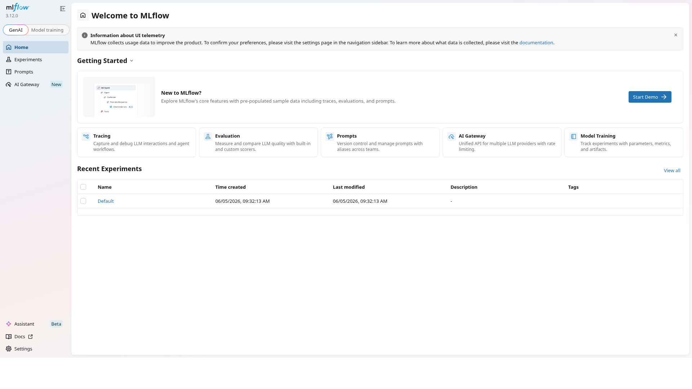

**Gambar 4.1.** Halaman awal MLflow Tracking yang menjadi pusat pencatatan eksperimen model.

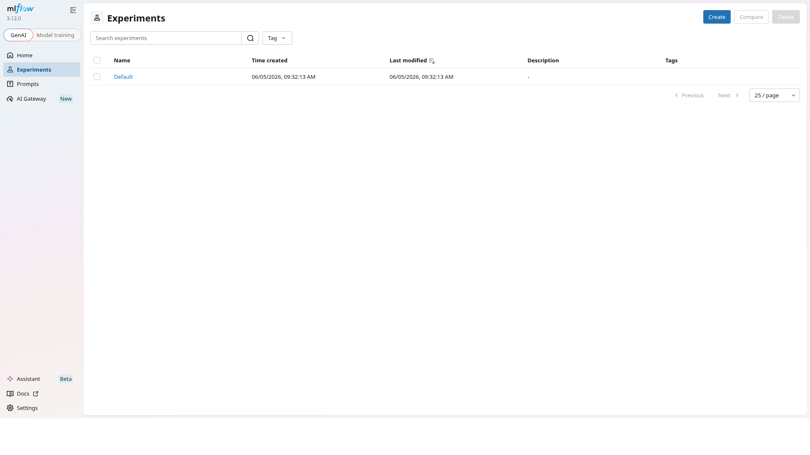

**Gambar 4.2.** Daftar eksperimen MLflow, termasuk eksperimen yang dipakai untuk training dan pembandingan model.

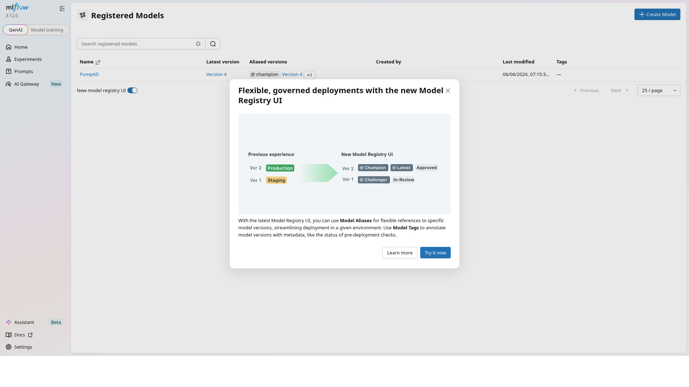

**Gambar 4.3.** Registered model `PumpAD` dengan pola alias untuk memilih champion.

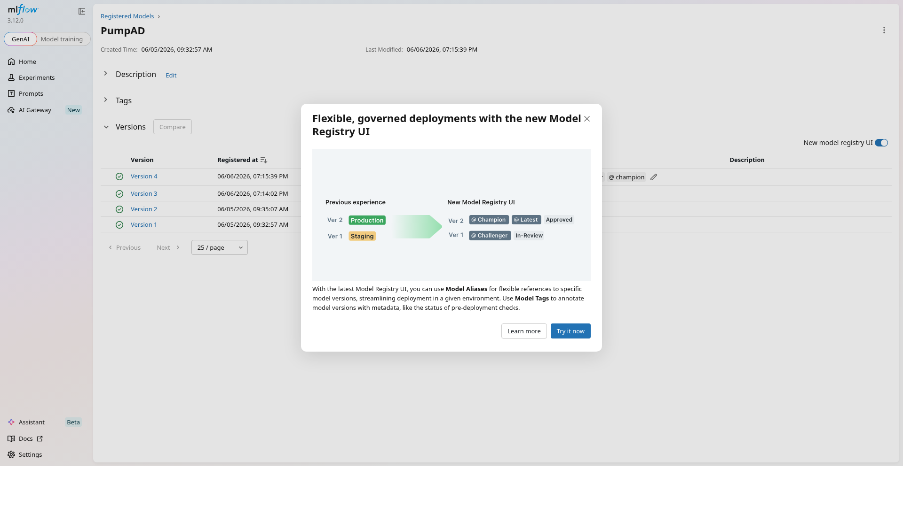

**Gambar 4.4.** Detail model `PumpAD`, versi model, dan alias yang mendukung proses champion selection.

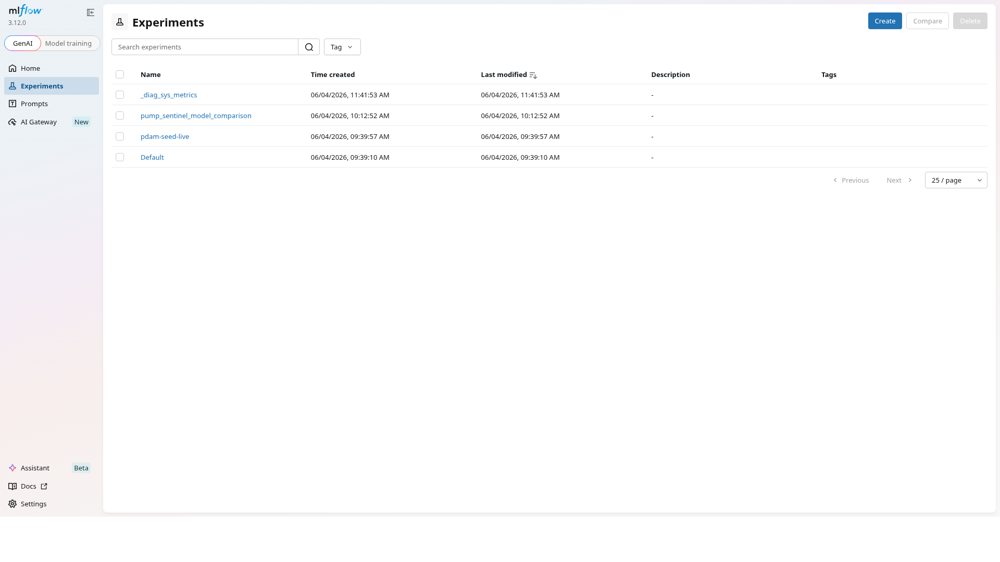

**Gambar 4.5.** Eksperimen pembandingan lintas famili model melalui `pump_sentinel_model_comparison`.

Alias `@champion` dipakai sebagai pointer model aktif.
ADR 0004 menetapkan bahwa alias MLflow dipakai karena stage lama MLflow 3.x tidak lagi menjadi arah utama registry.
Pada implementasi, resolusi alias terjadi saat cold start.
Jika MLflow tidak dapat menyelesaikan alias, aplikasi memiliki local fallback.

MLflow 3.12 memiliki kendala ketika `registered_model_version` dapat bernilai `None`.
Proyek mengatasi hal tersebut dengan version-resolution workaround melalui pencarian model version berbasis `run_id`.
Workaround ini menjaga agar versi model tetap dapat dicatat untuk registry dan audit.

Promosi model memakai gate `should_promote(f1_margin=0.02, far_guard=1.05)`.
Challenger hanya dapat dipromosikan jika F1 lebih tinggi dari champion dengan margin 0.02 dan false alarm rate tidak naik lebih dari faktor 1.05.
Gate ini mengikuti ADR 0003.

Hot-swap yang dibangun bersifat process-local melalui `set_inference_service()`.
Tidak ada runtime alias polling.
Artinya, perubahan alias MLflow tidak otomatis dipantau terus menerus oleh proses live.
Kondisi ini dicatat sebagai keterbatasan dan saran pengembangan.

Drift detection memakai Evidently DataDriftPreset pada `ml/monitoring/drift_check.py`.
`DriftReportJob` dapat dispatch `RetrainingJob`.
Scheduler retraining dan drift ada pada `ml/monitoring/scheduler.py` dan dikendalikan environment flags.
Compose tidak mengaktifkannya secara default.

Scheduled retraining bersifat PCA-only dan SKAB-path-driven.
Retraining tidak mengambil rolling window dari ClickHouse.
Retraining juga belum melakukan alternating training antara LSTM dan model supervised.

## 4.5 Observability

Observability proyek terdiri atas Prometheus, Grafana, mosquitto-exporter, dan ringkasan status operator di Streamlit.
Prometheus melakukan scrape ke `app:8080/metrics` dan `mosquitto-exporter:9234/metrics`.
Empat dashboard Grafana disiapkan untuk membaca RouteMQ, MLOps, system health, dan MQTT broker.
Endpoint metrics aplikasi menggabungkan metrik RouteMQ dan metrik `pumpad_*`, termasuk inference events, persistence writes, anomaly severity, telemetry freshness, drift report age, retrain duration, active model age, dan schema/build marker observability.
Prometheus juga memuat local alert rules untuk app scrape health, telemetry freshness, inference errors, persistence write errors, drift report age, dan active model age.

Seperti ditunjukkan pada Gambar 4.6, dashboard RouteMQ Observability memantau lifecycle telemetry, queue depth, dan service up.
Pada implementasi akhir, queue depth tidak dipakai untuk inference online, tetapi tetap relevan untuk job MLOps.

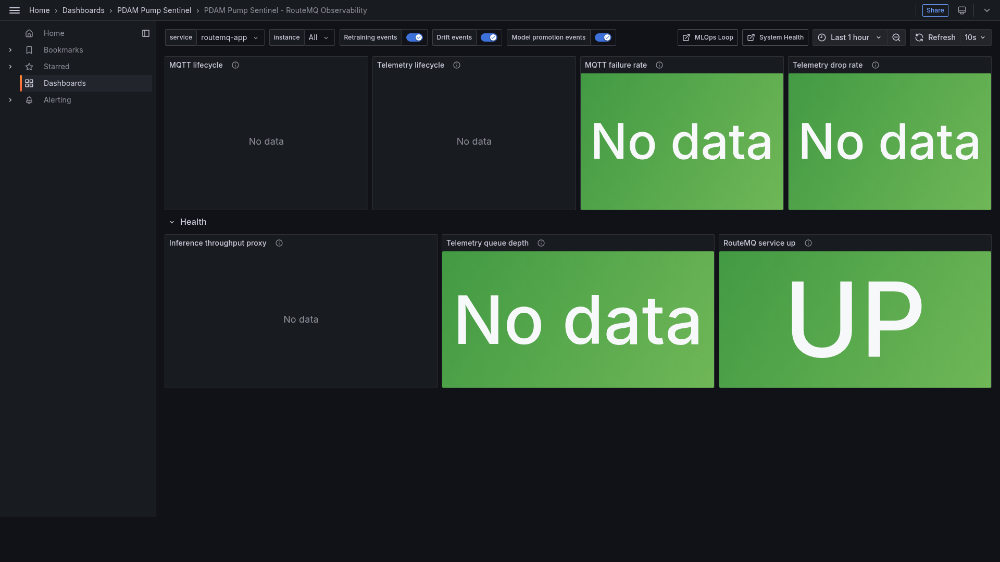

**Gambar 4.6.** Dashboard Grafana RouteMQ Observability dengan uid `pumpad-observability`.

Gambar 4.7 menunjukkan dashboard MLOps Loop.
Panel ini membantu melihat model info, latency, anomaly heatmap, drift gauge, dan retraining counter.

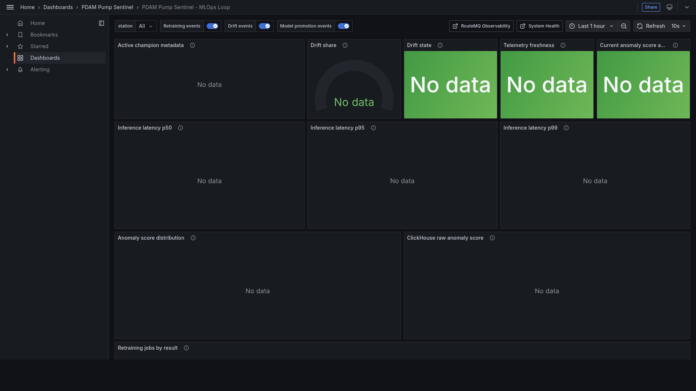

**Gambar 4.7.** Dashboard Grafana MLOps Loop dengan uid `pumpad-mlops`.

Gambar 4.8 menunjukkan System Health.
Dashboard ini berguna untuk memeriksa scrape targets, freshness telemetry, dan health exporter.

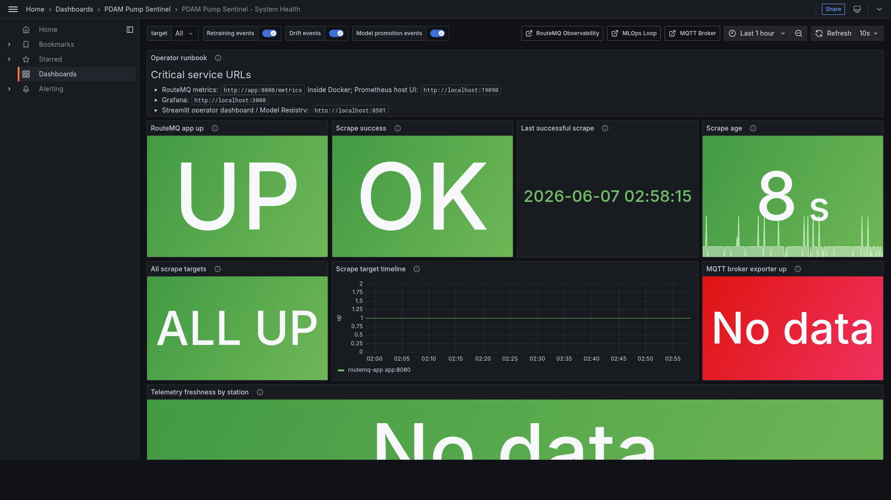

**Gambar 4.8.** Dashboard Grafana System Health dengan uid `pumpad-system-health`.

Gambar 4.9 menunjukkan MQTT Broker dashboard.
Panel broker membantu membaca clients, message rate, throughput, dan uptime.

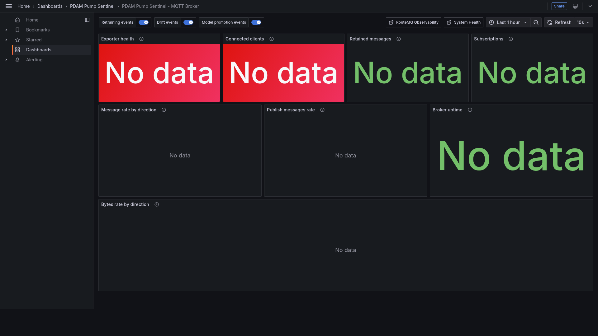

**Gambar 4.9.** Dashboard Grafana MQTT Broker dengan uid `pumpad-mqtt-broker`.

Streamlit melengkapi Grafana melalui Overview `Observability Snapshot`, System Health app metric freshness, service checks, dan Runbook triage berbasis metrik.
ClickHouse pada proyek ini hanya memiliki tabel `telemetry_observations`.
Tidak ada tabel label operator.
Dengan demikian, observability fokus pada telemetry, inference, broker, dan MLOps signals.

## 4.6 Dashboard Operator Streamlit

Dashboard operator dibangun dengan Streamlit.
Halaman landing ditunjukkan pada Gambar 4.10.

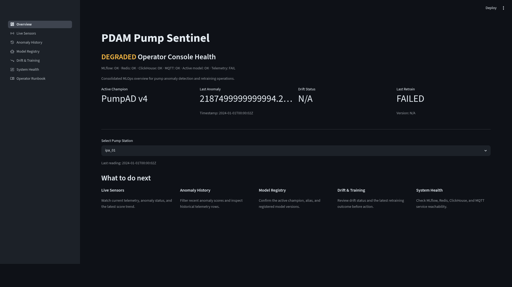

**Gambar 4.10.** Halaman awal Streamlit untuk mengakses dashboard PDAM Pump Sentinel.

Halaman Overview ditunjukkan pada Gambar 4.11.
Halaman ini menampilkan MLOps health pill, KPI tiles, dan station picker.

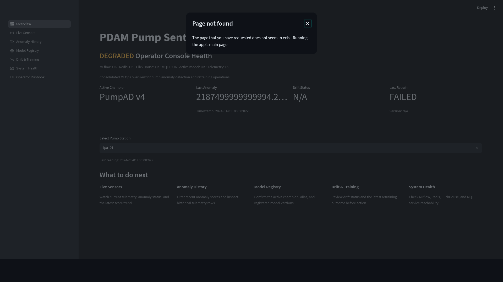

**Gambar 4.11.** Halaman Overview yang merangkum status sistem dan pilihan station.

Halaman Live Sensors ditunjukkan pada Gambar 4.12.
Halaman ini memiliki autorefresh 5 detik dan menampilkan anomaly score serta status sensor.

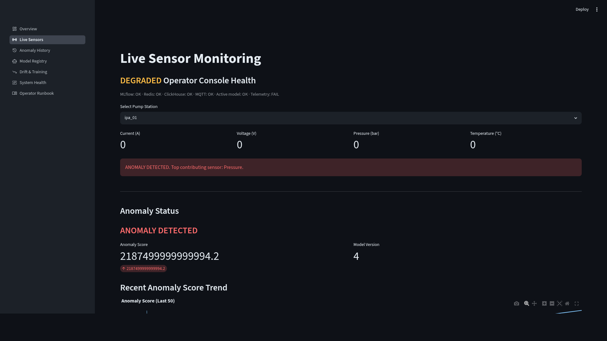

**Gambar 4.12.** Halaman Live Sensors untuk melihat telemetry dan anomaly status terbaru.

Halaman Anomaly History ditunjukkan pada Gambar 4.13.
Halaman ini menampilkan timeline, severity buckets, dan drilldown.

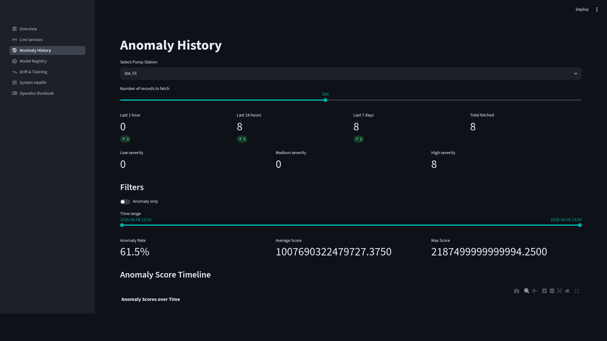

**Gambar 4.13.** Halaman Anomaly History untuk membaca riwayat alert dan detail kejadian.

Halaman Model Registry ditunjukkan pada Gambar 4.14.
Halaman ini menampilkan active champion dan tabel versi model.

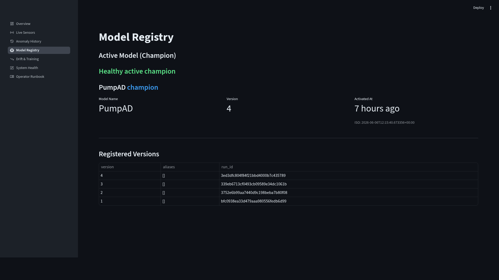

**Gambar 4.14.** Halaman Model Registry yang memperlihatkan champion aktif dan versi model.

Halaman Drift Reports ditunjukkan pada Gambar 4.15.
Halaman ini merangkum drift dan training page.

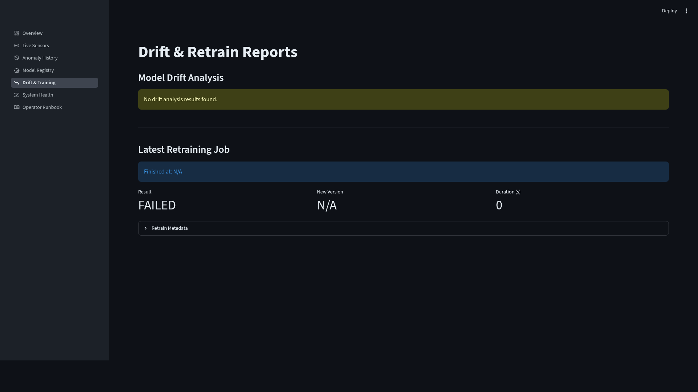

**Gambar 4.15.** Halaman Drift Reports untuk membaca hasil drift check dan aktivitas training.

Halaman System Health ditunjukkan pada Gambar 4.16.
Halaman ini memiliki autorefresh 10 detik dan menampilkan probes sistem.

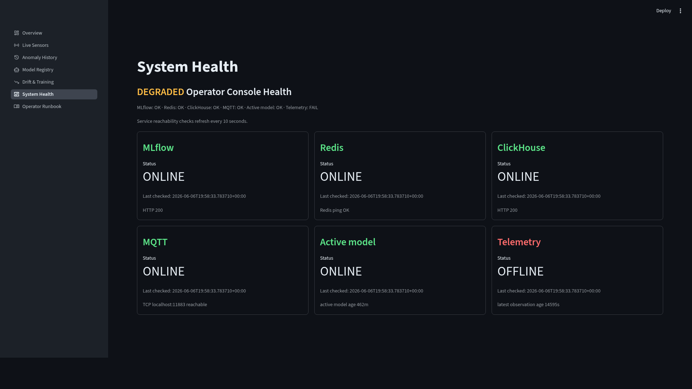

**Gambar 4.16.** Halaman System Health untuk memantau probes dan status layanan.

Halaman Runbook ditunjukkan pada Gambar 4.17.
Halaman ini membantu operator membaca langkah tindak lanjut saat alert muncul.

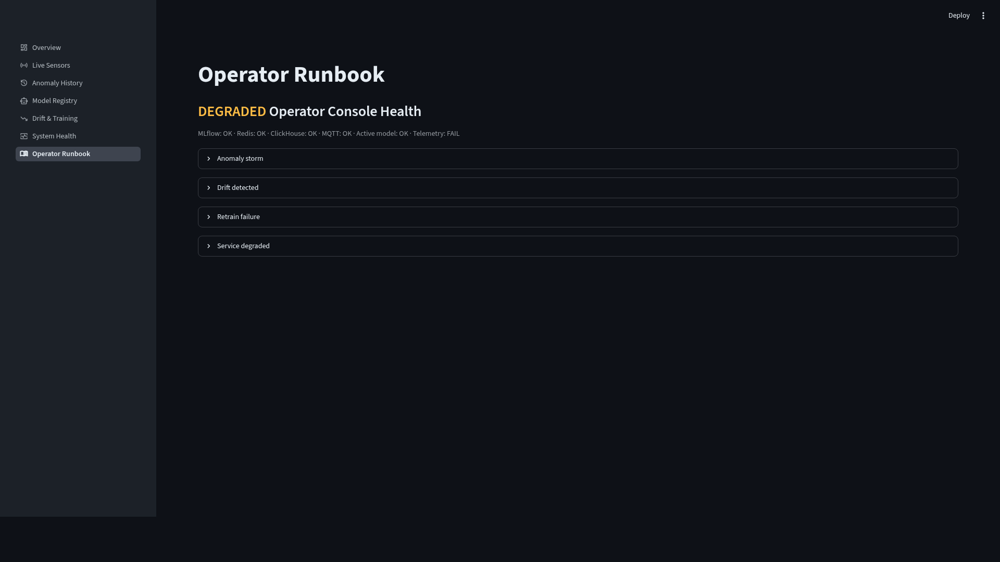

**Gambar 4.17.** Halaman Runbook untuk panduan operasional saat terjadi anomali.

Aksi operator pada dashboard, seperti ack, mute, dan note, menulis Redis keys saja.
Aksi tersebut belum menjadi label training.
Keterbatasan ini sengaja dinyatakan agar dashboard tidak dibaca sebagai supervised labeling pipeline.

---

# BAB V PENGUJIAN DAN HASIL

## 5.1 Strategi Pengujian

Pengujian dibagi menjadi empat kelompok.

Pertama, unit test memeriksa fungsi kecil seperti event metrics, promotion gate, registry helper, dan kontrak domain.
Kedua, integration test memeriksa integrasi MLflow round-trip dan LSTM curve.
Ketiga, E2E demo memakai `scripts/run_e2e_demo.py` untuk menjalankan sembilan fase utama dan optional T+9 observability evidence.
Keempat, bukti visual dikumpulkan melalui Streamlit, MLflow, dan Grafana.

Strategi pengujian offline tidak membutuhkan server untuk unit contract tests.
E2E demo dan screenshot evidence dijalankan hanya saat stack lokal memang dinyalakan.

## 5.2 Hasil Unit dan Integration Test

Inventaris pengujian otomatis terdiri atas 46 file pytest.
Komposisinya adalah 44 unit test, 2 integration test, dan 0 e2e pytest.
E2E coverage disediakan melalui script demo, bukan file pytest.

**Tabel 5.1. Ringkasan Hasil Unit dan Integration Test.**

| Kelompok | Jumlah file | Cakupan |
|---|---:|---|
| Unit test | 44 | Kontrak fungsi, event metrics, champion challenger gate, registry, inference, dan komponen domain. |
| Integration test | 2 | MLflow round-trip dan LSTM curve. |
| E2E pytest | 0 | Tidak tersedia sebagai pytest. |
| E2E demo script | 1 | `scripts/run_e2e_demo.py` dengan 9 fase utama dan optional T+9 observability evidence. |

Hasil unit dan integration test menunjukkan bahwa proyek tidak hanya bergantung pada demo visual.
Ada kontrak yang memeriksa keputusan metodologis, terutama event metrics tanpa point-adjustment dan promotion gate berbasis F1 plus false alarm guard.

## 5.3 Hasil E2E Demo

E2E demo disusun dalam sembilan fase utama.
Fase ini memperlihatkan jalur dari baseline sampai hot-swap process-local, dengan optional T+9 untuk memeriksa bukti observability Redis/MLflow pada run yang sama.

**Tabel 5.2. Fase E2E Demo.**

| Fase | Nama fase | Tujuan |
|---:|---|---|
| 1 | Baseline precondition | Memastikan baseline sistem dan model siap sebelum replay. |
| 2 | Replay normal | Mengirim data normal dan memeriksa skor rendah. |
| 3 | Replay anomalous | Mengirim segmen anomali dan memeriksa alert. |
| 4 | Inject drift | Menyisipkan drift sintetis untuk memicu perubahan distribusi. |
| 5 | Evidently DriftResult | Membuat hasil drift dari Evidently. |
| 6 | Inline RetrainingJob | Menjalankan retraining job dalam alur demo. |
| 7 | MLflow challenger version | Mendaftarkan atau membaca versi challenger pada registry. |
| 8 | Dynamic alias promotion | Mempromosikan alias sesuai gate. |
| 9 | In-process hot-swap + replay assert | Mengganti inference service dalam proses dan memeriksa replay ulang. |
| Optional T+9 | Observability evidence | Memeriksa Redis drift/retrain evidence, active model freshness, dan latest telemetry/anomaly pada run yang sama. |

E2E demo mendukung cerita MLOps, tetapi tetap berada pada cakupan MVP.
Dynamic alias promotion dalam demo tidak berarti aplikasi melakukan runtime alias polling.
Hot-swap yang ditunjukkan adalah in-process melalui service setter.

## 5.4 Hasil Evaluasi Model

Evaluasi model dilaporkan dengan dua kategori yang harus dibedakan.
Kategori pertama adalah hasil deployable Day-1 atau novel-fault, yang relevan untuk kondisi awal tanpa label lengkap.
Kategori kedua adalah hasil in-distribution atau upper bound, yang relevan untuk melihat kapasitas supervised ketika label tersedia.

Tabel berikut dipakai sebagai honest-eval spectrum.

**Tabel 5.3. Honest-Eval Spectrum.**

| Setting | Split | F1 | Catatan |
|---|---|---|---|
| Unsupervised PCA-spectral (champion) | train=normal-only, test=valve2+other | 0.58 | Deployable Day-1, generalisasi novel-fault |
| Supervised cross-group | train = normal-only atau satu fault group, test = fault group berbeda | 0.60 (AUC 0.937) | Generalisasi novel-fault |
| Supervised file-level stratified | - | 0.70 | - |
| Supervised in-distribution (chrono 80/20, Kaggle-comparable) | semua fault type di train DAN test | XGB 0.909 / LGBM 0.905 | Butuh contoh berlabel tiap fault type (upper-bound) |
| Supervised random-window (max leakage) | - | 0.985 | BUKAN klaim generalisasi valid |

Tabel tersebut harus dibaca dengan hati-hati.
Nilai sekitar 0.90 dari XGBoost dan LightGBM bukan klaim novel-fault detection.
Nilai tersebut membutuhkan contoh berlabel tiap fault type pada train dan test.
Nilai 0.985 pada random-window bukan klaim generalisasi valid karena memiliki risiko leakage maksimum.

Reference SKAB leaderboard dipakai hanya untuk perbandingan konteks.
Angka yang tercatat pada sumber proyek adalah PCA T²+Q 0.76, LSTM-AE 0.74, Conv-AE 0.78, dan Isolation Forest 0.29 [2].
Angka tersebut tidak dibandingkan langsung sebagai klaim akhir karena protokol evaluasi proyek memakai strategi split dan aturan tanpa point-adjustment yang berbeda.

Point-adjustment tidak digunakan.
Keputusan ini mengikuti ADR 0002 dan kritik Kim et al. terhadap inflasi metrik anomaly detection [11].
Hasil SKAB juga tidak menjadi klaim performa PDAM nyata karena SKAB adalah surrogate dataset [1].

Bukti eksperimen pembandingan lintas famili model pada MLflow telah ditampilkan pada Gambar 4.5.
Gambar tersebut mendukung pelacakan hasil, model, versi, dan eksperimen pembanding.

## 5.5 Bukti Observability

Bukti observability ditunjukkan melalui empat dashboard Grafana yang sudah disajikan pada BAB IV.
Untuk pembacaan hasil, keempat dashboard tersebut memiliki peran yang berbeda.

Bukti observability MLOps loop telah ditampilkan pada Gambar 4.7.

1. RouteMQ Observability memperlihatkan lifecycle telemetry dan status aplikasi.
2. MLOps Loop memperlihatkan model info, latency, inference events, anomaly severity, drift age, active model age, dan retraining duration.
3. System Health memperlihatkan scrape targets, telemetry freshness, persistence write health, dependency status, dan exporter health.
4. MQTT Broker memperlihatkan clients, message rate, throughput, dan uptime.

Gambar 4.6 sampai Gambar 4.9 menjadi bukti bahwa observability tidak hanya berada pada aplikasi, tetapi juga pada broker dan loop MLOps.
Hal ini penting karena kegagalan demo dapat berasal dari broker, exporter, aplikasi, registry, atau dashboard.
Observability ini tetap dibatasi pada stack lokal dan dashboard/SLO-style panels; belum ada routing notifikasi eksternal atau incident management produksi.

## 5.6 Bukti Dashboard

Bukti dashboard ditunjukkan melalui halaman Streamlit pada Gambar 4.10 sampai Gambar 4.17.
Halaman Overview memberi ringkasan sistem.
Live Sensors memberi tampilan telemetry dan status anomali.
Anomaly History memberi riwayat alert.
Model Registry menampilkan champion aktif.
Drift Reports menampilkan status drift dan training.
System Health menampilkan probes.
Runbook memberi panduan operator.

Bukti dashboard operator pada halaman Overview telah ditampilkan pada Gambar 4.11.
Registry model dapat dilihat kembali pada Gambar 4.3 dan mendukung pembacaan halaman Model Registry pada Gambar 4.14.

Gambar MLflow pada Gambar 4.1 sampai Gambar 4.5 juga mendukung pembacaan dashboard.
Dashboard operator dapat membaca status champion, tetapi sumber kebenaran model tetap berada pada MLflow registry dan local fallback.
Dengan demikian, dashboard tidak menjadi alat promosi manual penuh atau tombol rollback model.

## 5.7 Pembahasan

Hasil proyek menunjukkan bahwa integrasi RouteMQ, MQTT, anomaly detection, MLflow, Evidently, observability, dan Streamlit dapat dibangun dalam satu prototipe akademik.
Keputusan untuk memakai inference sinkron membuat sistem lebih sederhana untuk MVP.
Namun, keputusan tersebut juga membatasi skalabilitas inference jika beban telemetry meningkat.

PCA Hotelling T²/Q cocok sebagai champion awal karena dapat dilatih dari data normal dan tidak membutuhkan label fault lengkap.
Pilihan ini sejalan dengan strategi normal-baseline-first.
Hasil PCA-spectral F1 0.58 pada novel-fault split lebih rendah dari hasil in-distribution supervised, tetapi lebih jujur untuk kondisi Day-1.

XGBoost dan LightGBM menunjukkan kapasitas supervised yang tinggi pada in-distribution split.
Namun, hasil tersebut tidak boleh dipakai sebagai klaim bahwa sistem dapat mendeteksi fault baru yang belum pernah dilabeli.
Perbedaan ini menjadi inti evaluasi jujur proyek.

MLOps loop berhasil mencakup registry, alias, drift report, retraining job, dan promotion gate.
Namun, otomatisasi belum penuh.
Scheduler tersedia di balik flags, bukan aktif secara default.
Runtime alias polling belum ada.
Scheduled retraining masih PCA-only dan SKAB-path-driven.

Dashboard operator sudah memberi halaman yang cukup untuk demo.
Aksi ack, mute, dan note membantu skenario operasional, tetapi belum menjadi sumber label training.
Hal ini perlu dipisahkan agar pembaca tidak mengira sistem telah memiliki active learning atau supervised feedback loop.

---

# BAB VI KESIMPULAN DAN SARAN

## 6.1 Kesimpulan

Berdasarkan implementasi dan pengujian, kesimpulan proyek adalah sebagai berikut.

1. PDAM Pump Sentinel berhasil dibangun sebagai prototipe akademik yang menghubungkan MQTT, RouteMQ, Redis, ClickHouse, MLflow, Evidently, Prometheus, Grafana, dan Streamlit.
2. Inference online berhasil ditempatkan secara sinkron di controller melalui `get_inference_service().observe()`.
3. Sistem menerbitkan hasil anomali ke topic `factory/skab/{station}/anomaly` dan menyimpan data ke Redis serta ClickHouse.
4. Lima famili model berhasil masuk ke cakupan implementasi, yaitu PCA Hotelling T²/Q, LSTM-AE, Isolation Forest, XGBoost, dan LightGBM.
5. MLflow registry dengan alias `@champion` memberi mekanisme pemilihan model yang dapat diaudit.
6. Evidently DataDriftPreset memberi dasar drift check yang dapat memicu retraining job.
7. Champion challenger gate memakai F1 margin 0.02 dan false alarm guard 1.05 agar promosi model tidak hanya mengejar F1.
8. Dashboard Streamlit tujuh halaman dan empat dashboard Grafana menyediakan bukti visual bahwa sistem dapat dipantau.
9. Evaluasi model telah dipisahkan antara novel-fault deployment claim dan in-distribution upper bound.
10. Point-adjustment tidak dipakai agar hasil evaluasi tidak membesar secara tidak wajar.

## 6.2 Keterbatasan

Keterbatasan proyek adalah sebagai berikut.

1. Dataset yang dipakai adalah SKAB sebagai surrogate, bukan data PDAM asli.
2. Live inference hanya melayani PCA raw features, sedangkan spectral dan enriched masih offline-eval only.
3. Inference online tidak memakai Queue ke Worker.
4. Tidak ada `AnomalyDetectionJob`.
5. Queue dan job hanya dipakai untuk MLOps jobs.
6. Runtime MLflow alias polling belum tersedia.
7. Hot-swap masih process-local melalui `set_inference_service()`.
8. Scheduled retraining masih PCA-only dan berbasis path SKAB.
9. Retraining belum memakai rolling window dari ClickHouse.
10. Dashboard ack, mute, dan note belum menjadi label training.
11. Tidak ada ClickHouse label table dan tidak ada label controller.
12. Scheduler drift dan retraining tidak aktif secara default di compose.
13. Deployment produksi, Dockerfile produksi, Kubernetes, dan cloud deployment tidak termasuk scope.
14. Evaluasi memakai label SKAB yang berasal dari fault injection laboratorium, sehingga belum mewakili noise label produksi PDAM.
15. Observability masih berupa local metrics, dashboards, dan runbook; belum mencakup PagerDuty-style alert routing, distributed tracing, atau centralized log correlation.

## 6.3 Saran

Saran pengembangan lanjutan adalah sebagai berikut.

1. Menambahkan label intake operator secara eksplisit melalui dashboard triage, controller label, dan tabel label terpisah.
2. Menghubungkan feedback operator ke supervised training setelah label cukup matang.
3. Menambahkan runtime MLflow alias polling agar perubahan champion dapat diterapkan tanpa restart atau trigger process-local manual.
4. Memperluas retraining agar dapat memakai rolling window ClickHouse dengan kebijakan data quality yang jelas.
5. Memperluas retraining dari PCA-only ke LSTM-AE, XGBoost, dan LightGBM dengan gate yang sama.
6. Menambahkan minimum validation sample count sebelum `should_promote` boleh memutuskan promosi.
7. Menambahkan production compose atau container image yang terpisah dari development demo.
8. Menguji sistem pada data pompa nyata jika kerja sama dengan PDAM tersedia.
9. Menambahkan model Conv-AE atau model lain sebagai challenger baru, dengan tetap memakai split jujur dan tanpa point-adjustment.
10. Menambahkan runbook deployment dan incident response untuk kondisi broker down, MLflow down, Redis down, atau telemetry stale.

---

# DAFTAR PUSTAKA

[1] I. D. Katser dan V. O. Kozitsin, "Skoltech Anomaly Benchmark (SKAB)," Kaggle, DOI: 10.34740/KAGGLE/DSV/1693952.
[2] waico, "SKAB: Skoltech Anomaly Benchmark," GitHub repository, https://github.com/waico/SKAB.
[3] A. Bakdi et al., "An improved plant-wide fault detection scheme based on PCA and adaptive threshold for reliable process monitoring," Journal of Chemometrics, 2018. Available: https://consensus.app/papers/details/25e7d9d1d1d358c68af8f960f2535ba1/.
[4] J. Githinji et al., "Anomaly Detection on Time Series Sensor Data Using Deep LSTM-Autoencoder," IEEE AFRICON, 2023. Available: https://consensus.app/papers/details/b118e85c341e55778ed624ded460411c/.
[5] S. Schmidl, P. Wenig, dan T. Papenbrock, "Anomaly Detection in Time Series: A Comprehensive Evaluation," Proceedings of the VLDB Endowment, 2022, DOI: 10.14778/3538598.3538602.
[6] M. Kreuzberger, N. Kühl, dan S. Hirschl, "Machine Learning Operations (MLOps): Overview, Definition, and Architecture," IEEE Access, 2022. Available: https://consensus.app/papers/details/51bd196a657551beb31942ecca8d2c0f/.
[7] M. Zaharia et al., "Accelerating the Machine Learning Lifecycle with MLflow," IEEE Data Engineering Bulletin, 2018. Available: https://people.eecs.berkeley.edu/~matei/papers/2018/ieee_mlflow.pdf.
[8] MLflow, "Model Registry Documentation," https://mlflow.org/docs/latest/model-registry.html.
[9] Evidently AI, "Evidently Documentation," https://docs.evidentlyai.com.
[10] RouteMQ Framework, GitHub repository, https://github.com/ardzz/RouteMQ.
[11] S. Kim et al., "Towards a Rigorous Evaluation of Time-Series Anomaly Detection," arXiv:2109.05257, 2022. Available: https://arxiv.org/abs/2109.05257.
[12] S. Garg et al., "An Evaluation of Anomaly Detection and Diagnosis in Multivariate Time Series," IEEE Transactions on Neural Networks and Learning Systems, 2021. Available: https://consensus.app/papers/details/e6f62a5e92065cdca4ab474429b8662f/.
[13] A. Maleki et al., "Unsupervised anomaly detection with LSTM autoencoders using statistical data-filtering," Applied Soft Computing, 2021. Available: https://consensus.app/papers/details/94e182cfe37d54c2a9d27e184c38bf9b/.
[14] D. Sculley et al., "Hidden Technical Debt in Machine Learning Systems," NeurIPS, 2015. Available: https://papers.nips.cc/paper_files/paper/2015/file/86df7dcfd896fcaf2674f757a2463eba-Paper.pdf.
[15] A. Harrou et al., "Amalgamation of anomaly-detection indices for enhanced process monitoring," Journal of Loss Prevention in the Process Industries, 2016. Available: https://consensus.app/papers/details/5508b6fee62358b1b4d601ef0bca964d/.

---

# LAMPIRAN A: Tangkapan Layar Lengkap

**Tabel A.1. Daftar Tangkapan Layar Lengkap.**

| No. | Berkas | Caption |
|---:|---|---|
| 1 | `assets/laporan-grafana-routemq.png` | Grafana RouteMQ Observability, MQTT dan telemetry lifecycle, queue depth, service up. |
| 2 | `assets/laporan-grafana-mlops.png` | Grafana MLOps Loop, model info, latency p50/p95/p99, anomaly heatmap, drift gauge, retraining counter. |
| 3 | `assets/laporan-grafana-system-health.png` | Grafana System Health, scrape targets, telemetry freshness, exporter health. |
| 4 | `assets/laporan-grafana-mqtt-broker.png` | Grafana MQTT Broker, clients, message rate, throughput, uptime. |
| 5 | `assets/laporan-mlflow-home.png` | MLflow tracking home. |
| 6 | `assets/laporan-mlflow-experiments.png` | MLflow experiments list. |
| 7 | `assets/laporan-mlflow-models.png` | MLflow registered models, termasuk `PumpAD` dan champion alias. |
| 8 | `assets/laporan-mlflow-pumpad.png` | Detail model `PumpAD`, versi, dan aliases. |
| 9 | `assets/laporan-mlflow-compare-experiments.png` | Eksperimen pembandingan lintas model `pump_sentinel_model_comparison`. |
| 10 | `assets/laporan-streamlit-home.png` | Streamlit landing. |
| 11 | `assets/laporan-streamlit-overview.png` | Overview, MLOps health pill, KPI tiles, station picker. |
| 12 | `assets/laporan-streamlit-live-sensors.png` | Live Sensors, anomaly score dan status sensor. |
| 13 | `assets/laporan-streamlit-anomaly-history.png` | Anomaly History, timeline, severity buckets, drilldown. |
| 14 | `assets/laporan-streamlit-model-registry.png` | Model Registry, active champion dan tabel version. |
| 15 | `assets/laporan-streamlit-drift-reports.png` | Drift dan Training page. |
| 16 | `assets/laporan-streamlit-system-health.png` | System Health probes. |
| 17 | `assets/laporan-streamlit-runbook.png` | Operator runbook. |

---

# LAMPIRAN B: Struktur Repository

Struktur repository yang relevan untuk laporan ini adalah sebagai berikut.

```text
pdam-pump-sentinel/
├── app/                         # controller, jobs MLOps, service inference
│   └── controllers/anomaly_controller.py; jobs/drift_report_job.py; jobs/retraining_job.py; services/inference.py
├── bootstrap/app.py
├── dashboard/                    # Streamlit app dan 7 halaman operator
├── docs/
│   └── adr/; laporan/assets/; plans/design.md; presentation/labeling-strategy-notes.md; research/ai-methodology.md; proposal.md
├── infra/
│   └── docker-compose.dev.yml; grafana/; prometheus/; mosquitto/
├── ml/
│   └── evaluation/; features/; inference/pca_inference.py; monitoring/; registry/mlflow_client.py; training/
├── scripts/{run_e2e_demo.py,train_all_for_comparison.py}
├── tests/{unit,integration}/
└── README.md
```

Catatan batasan struktur: compose yang dipakai adalah `infra/docker-compose.dev.yml`; tidak ada compose produksi, Dockerfile produksi, atau `AnomalyDetectionJob`; job MLOps yang relevan adalah `drift_report_job.py` dan `retraining_job.py`; ClickHouse hanya memakai tabel `telemetry_observations`.

---

# LAMPIRAN C: Ringkasan 5 ADR

**Tabel C.1. Ringkasan 5 ADR.**

| ADR | Judul | Keputusan Utama | Dampak ke Laporan |
|---|---|---|---|
| ADR 0001 | Honest Evaluation Split Strategy | Headline memakai cross-group novel-fault, sedangkan in-distribution dilaporkan sebagai upper bound. | BAB III dan BAB V memisahkan F1 0.58, 0.60, 0.70, 0.909/0.905, dan 0.985 sesuai konteks. |
| ADR 0002 | Reject Point-Adjustment Convention | Point-adjustment tidak dipakai untuk headline metric. | BAB III dan BAB V menyatakan event-based metrics dan tidak memakai PA. |
| ADR 0003 | Champion Challenger Promotion Gate | Promosi memakai F1 margin 0.02 dan false alarm guard 1.05. | BAB IV menjelaskan `should_promote(f1_margin=0.02, far_guard=1.05)`. |
| ADR 0004 | MLflow Alias Pattern | Alias MLflow `@champion` menjadi pola pemilihan model aktif. | BAB IV membedakan cold-start alias resolution, local fallback, dan tidak adanya runtime polling. |
| ADR 0005 | MLflow Datasets and Traceability Tags | Training run harus menyimpan dataset cards, manifest digest, dan traceability tags. | BAB IV dan BAB V memakai MLflow sebagai bukti audit eksperimen dan pembandingan model. |

Kelima ADR tersebut membuat laporan ini bersifat retrospektif dan dapat diaudit, sehingga rancangan, implementasi aktual, hasil evaluasi, dan keterbatasan tetap dibedakan dengan jelas.
