# Belajar Menghitung PCA T2-Q Manual dengan Fitur Spektral

Catatan ini adalah panduan pelan-pelan untuk menghitung **PCA Hotelling T2 dan Q atau SPE** dengan fitur spektral. Tujuannya bukan menulis program. Tujuannya adalah bisa duduk dengan kertas, kalkulator biasa, dan tabel kecil, lalu paham angka model berasal dari mana.

Kita akan mulai dari nol. Benar-benar nol. Mulai dari jumlah, rata-rata, selisih, kuadrat, varians, standar deviasi, lalu naik sedikit demi sedikit sampai PCA, T2, Q/SPE, threshold, dan keputusan anomali.

Konteksnya tetap **PDAM Pump Sentinel**. Sistem ini memantau kondisi pompa distribusi air. Data sensor pompa dipotong menjadi window, window diubah menjadi fitur spektral, lalu PCA T2/Q membaca apakah window itu masih mirip pola normal atau sudah mencurigakan.

Catatan penting proyek: **SKAB adalah surrogate data dari water circulation testbed, bukan data operasional PDAM nyata**. Jadi angka dan contoh di catatan ini dipakai untuk belajar dan demo akademik. Jangan membaca angka contoh sebagai klaim performa lapangan PDAM.

## Cara membaca catatan ini

Jangan lompat dulu ke rumus PCA. PCA kelihatan menakutkan karena banyak simbol. Padahal isi kecilnya hanya beberapa gerakan sederhana:

1. kurangi angka dengan rata-rata,
2. bagi dengan standar deviasi,
3. kalikan angka lalu jumlahkan,
4. buat garis utama pola normal,
5. lihat titik baru jauh atau tidak dari pola itu,
6. lihat titik baru masih bisa digambar ulang oleh pola itu atau tidak.

Kalau kamu lupa matematika, itu tidak apa-apa. Catatan ini memang ditulis untuk keadaan itu.

Yang perlu disiapkan:

| Alat | Dipakai untuk |
|---|---|
| Kertas | menulis tabel kecil |
| Kalkulator | menghitung kuadrat, akar, pembagian |
| Pensil | menggambar garis PC1 secara kasar |
| Kesabaran | karena PCA lebih mudah kalau tidak buru-buru |

Yang tidak akan dilakukan di sini:

| Tidak dilakukan | Kenapa |
|---|---|
| Tutorial Python | fokusnya hitung manual |
| Model keluarga lain | fokusnya PCA T2/Q spectral saja |
| Turunan control limit lanjutan | terlalu berat untuk jalur utama belajar manual |
| FFT besar lengkap | tidak enak dihitung tangan, jadi kita sederhanakan |

## Gambaran besar dalam satu cerita

Bayangkan pompa normal punya kebiasaan. Saat energi getaran naik sedikit, frekuensi dominan juga ikut naik sedikit. Saat energi turun, frekuensi dominan juga turun. Polanya seperti titik-titik yang berbaris dekat satu garis miring.

PCA belajar garis miring itu. Garis itu disebut **principal component pertama**, atau **PC1**.

Setelah itu, window baru datang. PCA bertanya dua hal:

| Pertanyaan | Nama skor | Bahasa sederhana |
|---|---|---|
| Apakah titik baru terlalu jauh di sepanjang garis normal? | Hotelling T2 | jauh tetapi masih di jalan yang benar |
| Apakah titik baru jauh dari garis normal? | Q atau SPE | keluar dari jalan yang biasa |

Keputusan dasarnya:

```text
anomali jika T2 melewati ambang T2 atau Q melewati ambang Q
```

Dalam bentuk pendek:

$$
\mathrm{is\_anomaly}=(T^2>\text{threshold}_{T^2})\ \mathrm{OR}\ (Q>\text{threshold}_Q)
$$

Di sini $\mathrm{OR}$ berarti cukup salah satu benar. Kalau T2 tinggi, anomali. Kalau Q tinggi, anomali. Kalau dua-duanya tinggi, jelas anomali.

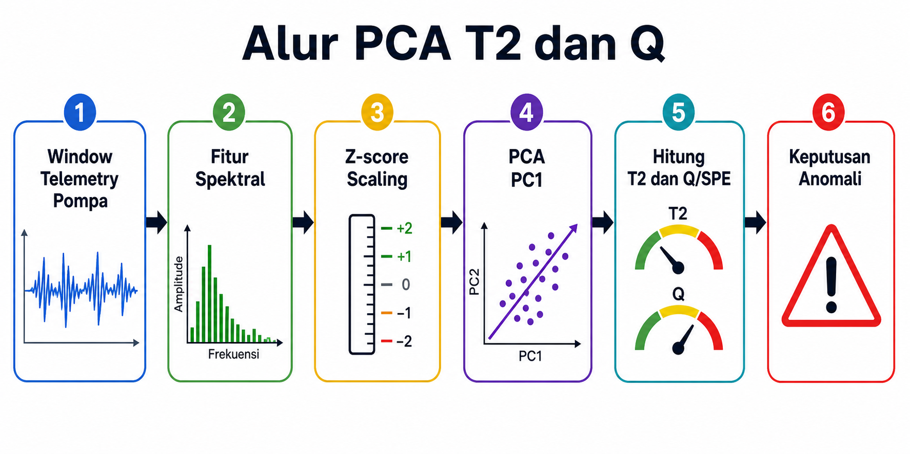

Gambar di atas adalah peta besar. Jangan hafalkan dulu semua kotaknya. Cukup lihat bahwa perjalanan model selalu dari kiri ke kanan: window sensor dibuat menjadi fitur, fitur dibuat adil dengan scaling, PCA membaca pola normal, lalu T2 dan Q dipakai untuk keputusan.

Kalau sudah paham bagian ini, kamu harus bisa menjawab:

| Pertanyaan | Jawaban pendek |
|---|---|
| T2 melihat apa? | jauh di arah pola normal PCA |
| Q/SPE melihat apa? | sisa error yang tidak bisa dijelaskan PCA |
| Kenapa pakai dua skor? | karena dua jenis keanehan bisa berbeda |

## Peta perjalanan belajar

Kita akan berjalan seperti tangga kecil.

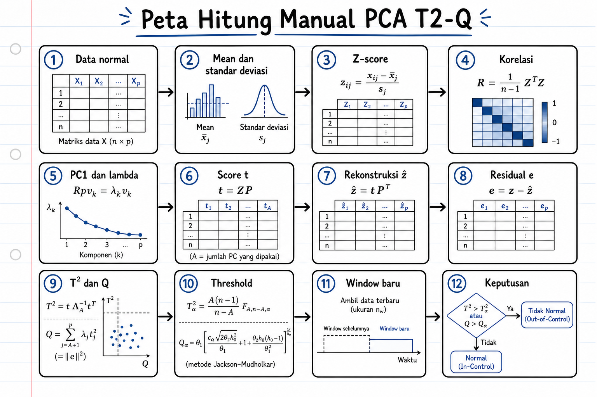

Gambar ini adalah versi visual dari urutan hitung di kertas. Kalau nanti bingung sedang berada di langkah mana, kembali ke gambar ini dan cari kotak yang sedang kamu kerjakan.

| Tangga | Isi | Tujuan |
|---:|---|---|
| 1 | aritmetika dasar | tidak takut angka |
| 2 | scaling | semua fitur dibuat sebanding |
| 3 | vektor dan dot product | paham proyeksi PCA |
| 4 | matrix dan transpose | paham bentuk tabel PCA |
| 5 | covariance dan correlation | paham fitur bergerak bersama |
| 6 | fitur spektral | paham asal fitur dari window sensor |
| 7 | eigenvector dan eigenvalue | paham arah PC dan besar variasi |
| 8 | PCA projection | menghitung score $t$ |
| 9 | reconstruction dan residual | menghitung bagian yang bisa dan tidak bisa dijelaskan |
| 10 | T2 | menghitung ekstrem di subspace PCA |
| 11 | Q/SPE | menghitung error residual |
| 12 | threshold | membuat batas normal |
| 13 | inference | memutuskan window baru normal atau anomali |

Kita pakai contoh utama yang kecil:

| Isi contoh | Nilai |
|---|---:|
| Window normal training | 5 window |
| Fitur spektral | 2 fitur |
| Principal component yang disimpan | 1 PC |
| Window baru untuk inferensi | 1 window |

## Bagian 1. Aritmetika dasar yang dibutuhkan

Bagian ini mungkin terasa sangat dasar. Tetap penting, karena PCA hanya menyusun ulang operasi kecil ini.

### 1.1 Angka dan data kecil

Misalkan kita punya lima angka energi getaran dari lima window normal:

```text
8, 9, 10, 11, 12
```

Setiap angka adalah satu nilai fitur. Kita belum bicara PCA. Kita hanya bertanya, angka-angka ini pusatnya di mana dan sebarannya seberapa lebar.

### 1.2 Sum atau jumlah

**Sum** artinya jumlahkan semua angka.

Kita akan pakai simbol $\mathrm{sum}$. Simbol $\mathrm{sum}$ berarti penjumlahan semua nilai dalam daftar.

Untuk data:

```text
8, 9, 10, 11, 12
```

Jumlahnya:

$$
\mathrm{sum}=8+9+10+11+12=50
$$

Bahasa bayinya: semua angka dimasukkan ke satu keranjang, lalu dihitung total isi keranjangnya.

Cara membacanya di kertas:

| Langkah kecil | Maksud |
|---|---|
| tulis semua angka | jangan ada yang hilang |
| beri tanda `+` di antara angka | artinya semua digabung |
| hitung totalnya | total itu disebut $\mathrm{sum}$ |

Jadi $\mathrm{sum}$ bukan operasi aneh. $\mathrm{sum}$ hanya nama pendek untuk "jumlahkan semua isi daftar".

### 1.3 Banyak data, simbol $n$

Kita akan pakai simbol $n$ untuk jumlah data.

Di contoh ini ada lima angka:

$$
n=5
$$

Jadi $n$ bukan nilai sensor. $n$ hanya jumlah baris atau jumlah window.

Bahasa bayinya: kalau data adalah antrean anak, $n$ adalah berapa anak yang berdiri di antrean. Bukan tinggi badan anak. Bukan berat anak. Hanya banyaknya anak.

Hati-hati membedakan dua huruf ini:

| Simbol | Dipakai untuk | Contoh |
|---|---|---|
| $n$ kecil | jumlah window atau jumlah baris data training | `n = 5` window normal |
| $N$ besar | jumlah sample di dalam satu window sensor | `N = 60` sample dalam window |

Di Bagian 1 sampai Bagian 4, kita lebih sering memakai $n$. Di bagian spektral, kita akan memakai $N$ untuk panjang window.

### 1.4 Mean atau rata-rata

**Mean** adalah pusat sederhana dari data.

Kita akan pakai simbol $\mu$ untuk mean. Huruf ini sering ditulis sebagai huruf Yunani, tetapi di catatan ini kita tulis $\mu$ agar mudah diketik dan dibaca.

Rumus mean:

$$
\mu = \frac{\mathrm{sum}}{n}
$$

Untuk data energi tadi:

$$
\mu = \frac{50}{5}=10
$$

Artinya pusat data `8, 9, 10, 11, 12` adalah `10`.

Bahasa bayinya: kalau semua angka diratakan supaya sama tinggi, semuanya menjadi `10`.

Mean juga bisa dibayangkan sebagai titik tengah keseimbangan. Angka `8` dan `9` menarik ke kiri atau ke bawah. Angka `11` dan `12` menarik ke kanan atau ke atas. Di tengahnya ada `10`.

Kalau data sensor pompa normal punya mean energi `10`, artinya energi normal biasanya berkumpul di sekitar `10`, walaupun tiap window boleh sedikit naik atau turun.

### 1.5 Deviation atau selisih dari rata-rata

**Deviation** adalah jarak satu angka dari mean.

Kita akan pakai simbol $d$ untuk deviation.

Rumusnya:

$$
d = x - \mu
$$

Di sini:

| Simbol | Arti |
|---|---|
| $x$ | satu angka data |
| $\mu$ | mean data |
| $d$ | selisih angka dari mean |

Untuk data energi:

| $x$ | $\mu$ | $d=x-\mu$ |
|---:|---:|---:|
| 8 | 10 | -2 |
| 9 | 10 | -1 |
| 10 | 10 | 0 |
| 11 | 10 | 1 |
| 12 | 10 | 2 |

Kalau $d$ negatif, angka berada di bawah rata-rata. Kalau $d$ positif, angka berada di atas rata-rata. Kalau $d$ nol, angka tepat di rata-rata.

Tanda deviation memberi arah:

| Nilai $d$ | Bahasa bayi | Contoh |
|---:|---|---|
| negatif | angka ada di bawah pusat | `8 - 10 = -2` |
| nol | angka pas di pusat | `10 - 10 = 0` |
| positif | angka ada di atas pusat | `12 - 10 = 2` |

Di PCA, deviation penting karena model tidak hanya melihat angka mentah. Model melihat angka itu berbeda seberapa jauh dari kebiasaan normal.

### 1.6 Square atau kuadrat

**Square** artinya angka dikalikan dengan dirinya sendiri.

Kita tulis $d^2$ untuk kuadrat dari $d$.

Contoh:

$$
(-2)^2=(-2)(-2)=4
$$

$$
(-1)^2=(-1)(-1)=1
$$

$$
0^2=0\cdot0=0
$$

$$
1^2=1\cdot1=1
$$

$$
2^2=2\cdot2=4
$$

Kenapa deviation dikuadratkan? Karena kalau langsung dijumlahkan, nilai negatif dan positif bisa saling menghapus.

Lihat ini:

$$
-2+(-1)+0+1+2=0
$$

Padahal data jelas menyebar. Supaya jarak tidak saling menghapus, kita kuadratkan.

Bahasa bayinya: kuadrat membuat jarak berubah menjadi angka positif. Jarak ke bawah dan jarak ke atas sama-sama dihitung sebagai besar jarak, bukan saling membatalkan.

Kuadrat juga memberi hukuman lebih besar untuk jarak yang besar:

| Jarak | Kuadrat | Rasa |
|---:|---:|---|
| 1 | 1 | kecil |
| 2 | 4 | bukan dua kali, tetapi empat kali |
| 3 | 9 | jauh makin terasa |

Karena itu T2 dan Q nanti juga memakai kuadrat. Model ingin jarak besar kelihatan jelas.

### 1.7 Variance atau varians

**Variance** adalah ukuran seberapa menyebar data dari mean.

Kita akan pakai simbol $s^2$ untuk sample variance.

Rumus sample variance:

$$
s^2 = \frac{\sum_{i=1}^{n} d_i^2}{n-1}
$$

Di sini:

| Simbol | Arti |
|---|---|
| $s^2$ | sample variance |
| $d$ | deviation dari mean |
| $d^2$ | deviation kuadrat |
| $n$ | jumlah data |
| $n-1$ | pembagi untuk sample variance |

Kenapa pakai $n-1$, bukan $n$? Untuk latihan ini, cukup ingat aturan praktisnya: saat kita memakai beberapa data normal sebagai contoh dari proses yang lebih besar, kita pakai pembagi $n-1$. Ini disebut sample variance.

Bahasa bayinya begini. Kita tidak punya semua kemungkinan kondisi pompa normal di dunia. Kita hanya punya beberapa contoh window normal. Karena contoh itu kecil, sebarannya mudah terlihat terlalu kecil. Pembagi $n-1$ sedikit membesarkan perkiraan sebaran agar lebih adil.

Untuk contoh lima window:

```text
n = 5
n - 1 = 4
```

Jadi kita membagi dengan `4`, bukan `5`.

Aturan pegangan:

| Situasi | Pembagi yang dipakai di catatan ini |
|---|---:|
| menghitung varians dari contoh training normal | $n-1$ |
| menghitung rata-rata biasa | $n$ |

Kalau kamu hanya ingin lulus hitungan manual catatan ini, jangan pusing dulu dengan bukti statistiknya. Pegang saja: varians sample memakai $n-1$.

Untuk energi:

| $x$ | $d$ | $d^2$ |
|---:|---:|---:|
| 8 | -2 | 4 |
| 9 | -1 | 1 |
| 10 | 0 | 0 |
| 11 | 1 | 1 |
| 12 | 2 | 4 |

Jumlah kuadrat deviation:

$$
\sum d^2 = 4 + 1 + 0 + 1 + 4 = 10
$$

Karena `n = 5`, maka `n - 1 = 4`.

$$
s^2 = \frac{10}{4}=2.5
$$

Jadi varians energi adalah `2.5`.

### 1.8 Standard deviation atau standar deviasi

**Standard deviation** adalah akar dari varians.

Kita akan pakai simbol $s$ untuk sample standard deviation.

Rumus:

$$
s = \sqrt{s^2}
$$

Di sini `sqrt` berarti akar kuadrat.

Untuk energi:

$$
s = \sqrt{2.5}=1.581
$$

Kenapa standar deviasi lebih enak dari varians? Karena satuannya kembali mirip satuan data asli. Kalau data energi satuannya unit energi, standar deviasi juga terasa seperti unit energi. Varians terasa seperti unit energi kuadrat, jadi kurang nyaman dibaca.

Bahasa bayinya: standar deviasi adalah ukuran satu langkah normal dari pusat. Kalau `s = 1.581`, maka beda sekitar `1.581` dari mean terasa seperti satu langkah sebaran normal.

Nanti z-score memakai standar deviasi sebagai penggaris:

```text
z = 1 berarti 1 langkah standar deviasi di atas mean
z = -1 berarti 1 langkah standar deviasi di bawah mean
z = 2 berarti 2 langkah standar deviasi di atas mean
```

### 1.9 Ringkasan aritmetika dasar

Untuk data `8, 9, 10, 11, 12`:

| Langkah | Hasil |
|---|---:|
| sum | 50 |
| n | 5 |
| mean $\mu$ | 10 |
| deviation | -2, -1, 0, 1, 2 |
| squared deviation | 4, 1, 0, 1, 4 |
| sample variance $s^2$ | 2.5 |
| sample standard deviation $s$ | 1.581 |
 
Kalau sudah paham bagian ini, kamu harus bisa:

| Kamu harus bisa | Contoh |
|---|---|
| menghitung jumlah | `8 + 9 + 10 + 11 + 12 = 50` |
| menghitung mean | `50 / 5 = 10` |
| menghitung deviation | `8 - 10 = -2` |
| menghitung kuadrat deviation | `(-2)^2 = 4` |
| menghitung standar deviasi | `sqrt(2.5) = 1.581` |

## Bagian 2. Kenapa scaling dibutuhkan sebelum PCA

PCA melihat angka. PCA tidak tahu arti satuan.

Misalkan kita punya dua fitur:

| Fitur | Contoh nilai | Satuan |
|---|---:|---|
| Energi getaran | 8 sampai 12 | unit energi |
| Frekuensi dominan | 29 sampai 32 | Hz |

Rentangnya tidak sama. Satu fitur bisa punya angka besar karena satuannya memang besar, bukan karena lebih penting.

Contoh yang lebih ekstrem:

| Fitur | Rentang |
|---|---:|
| Suhu | 25 sampai 35 |
| Energi FFT | 1000 sampai 9000 |

Kalau langsung PCA tanpa scaling, fitur energi FFT bisa mendominasi hanya karena angkanya besar. PCA bisa mengira energi FFT paling penting, padahal mungkin hanya beda satuan.

### 2.1 Ide scaling

Scaling membuat tiap fitur punya bahasa yang sama.

Kita akan memakai **z-score**.

Untuk satu nilai mentah $x$, mean training $\mu$, dan standar deviasi training $s$, z-score ditulis:

$$
z_i = \frac{x_i - \mu}{s}
$$

Di sini:

| Simbol | Arti |
|---|---|
| $x$ | nilai fitur mentah |
| $\mu$ | mean fitur dari data training normal |
| $s$ | standar deviasi fitur dari data training normal |
| $z$ | nilai fitur setelah scaling |

Bahasa bayinya:

1. $x-\mu$ bertanya, angka ini beda berapa dari rata-rata?
2. dibagi $s$ bertanya, beda itu berapa kali ukuran sebaran normal?

Kalau `z = 0`, nilai tepat di rata-rata training. Kalau `z = 1`, nilai berada satu standar deviasi di atas rata-rata. Kalau `z = -2`, nilai berada dua standar deviasi di bawah rata-rata.

Anggap $\mu$ dan $s$ dari training normal sebagai penggaris tetap.

```text
mean training = titik nol penggaris
std training  = jarak satu garis pada penggaris
z-score       = posisi angka pada penggaris itu
```

Penggaris ini tidak boleh berubah saat inference. Kalau penggaris ikut berubah untuk setiap window baru, kita tidak lagi membandingkan window baru dengan normal lama. Kita hanya membuat ukuran baru yang selalu menyesuaikan diri.

Contoh rasa:

| z-score | Arti |
|---:|---|
| `0` | tepat di pusat normal |
| `0.5` | setengah langkah standar deviasi di atas pusat |
| `1` | satu langkah standar deviasi di atas pusat |
| `-1` | satu langkah standar deviasi di bawah pusat |
| `3` | tiga langkah standar deviasi, mulai terasa jauh |

### 2.2 Statistik training tidak boleh dicampur inference

Ini aturan penting.

Mean dan standar deviasi harus dihitung dari **training normal**. Saat window baru datang, kita tidak menghitung mean dan standar deviasi baru dari window itu. Kita memakai $\mu$ dan $s$ dari training.

Kenapa? Karena kita ingin bertanya:

```text
window baru ini aneh atau tidak jika dibandingkan dengan kebiasaan normal yang sudah dipelajari?
```

Kalau mean dan standar deviasi dihitung ulang dari window baru, ukuran normalnya ikut berubah. Itu seperti memindahkan gawang saat bola ditendang.

Kalau sudah paham bagian ini, kamu harus bisa:

| Kamu harus bisa | Penjelasan |
|---|---|
| menjelaskan scaling | membuat fitur beda satuan jadi sebanding |
| menghitung z-score | kurangi mean, lalu bagi standar deviasi |
| menghindari leakage | mean dan standar deviasi inference tetap dari training normal |

## Bagian 3. Vektor, dot product, matrix, dan transpose

PCA memakai bahasa vektor dan matrix. Jangan panik. Untuk contoh dua fitur, bentuknya kecil sekali.

### 3.1 Vektor

**Vektor** adalah daftar angka yang punya urutan.

Kalau satu window punya dua fitur setelah scaling, misalnya:

```text
z_E = 2.530
z_F = -0.351
```

Kita bisa menulisnya sebagai vektor:

```text
z = [2.530, -0.351]
```

Di sini:

| Simbol | Arti |
|---|---|
| $z$ | vektor fitur yang sudah di-scaling |
| $z_E$ | komponen z-score untuk energi |
| $z_F$ | komponen z-score untuk frekuensi |

Bahasa bayinya: vektor adalah kotak kecil berisi angka berurutan. Kotak pertama untuk energi, kotak kedua untuk frekuensi.

Urutan kotak tidak boleh tertukar.

| Posisi kotak | Isi di contoh ini |
|---:|---|
| kotak 1 | energi $E$ |
| kotak 2 | frekuensi $F$ |

Kalau kita menulis `[2.530, -0.351]`, artinya bukan sekadar dua angka. Artinya:

```text
kotak energi    = 2.530
kotak frekuensi = -0.351
```

Kalau urutannya tertukar menjadi `[-0.351, 2.530]`, artinya berubah total. PCA akan membaca energi sebagai frekuensi dan frekuensi sebagai energi.

### 3.2 Panjang vektor

Kadang kita butuh memastikan vektor arah punya panjang 1. Untuk vektor dua angka:

```text
p = [a, b]
```

Panjang vektor:

$$
\mathrm{length}=\sqrt{a^2+b^2}
$$

Contoh:

```text
p = [0.707, 0.707]

length = sqrt(0.707^2 + 0.707^2)
       = sqrt(0.500 + 0.500)
       = sqrt(1.000)
       = 1.000
```

Vektor dengan panjang 1 disebut unit vector. PCA loading biasanya memakai unit vector agar proyeksi rapi.

### 3.3 Dot product

**Dot product** adalah cara mengalikan dua vektor dengan panjang sama, lalu menjumlahkan hasilnya.

Bahasa bayinya: pasangkan kotak pertama dengan kotak pertama, kotak kedua dengan kotak kedua, kalikan tiap pasangan, lalu jumlahkan.

Misalkan:

```text
a = [a1, a2]
b = [b1, b2]
```

Dot product ditulis:

$$
a \cdot b = a_1b_1 + a_2b_2
$$

Contoh:

$$
[2,3]\cdot[4,5] = 2\cdot4 + 3\cdot5 = 8 + 15 = 23
$$

Tabelnya seperti ini:

| Kotak | Vektor pertama | Vektor kedua | Kali pasangan |
|---:|---:|---:|---:|
| 1 | 2 | 4 | 8 |
| 2 | 3 | 5 | 15 |
| Jumlah |  |  | 23 |

Jadi dot product bukan perkalian biasa. Ia adalah "kali pasangan, lalu jumlah".

Di PCA, dot product dipakai untuk menghitung seberapa besar bayangan titik pada arah PC.

Contoh nanti:

$$
t = z p_1
$$

Di sini:

| Simbol | Arti |
|---|---|
| $t$ | score PCA, yaitu posisi window pada PC |
| $z$ | vektor fitur setelah scaling |
| $p_1$ | arah PC1 |

### 3.4 Matrix

**Matrix** adalah tabel angka.

Bahasa bayinya: matrix adalah tabel yang punya baris dan kolom. Kalau vektor adalah satu kotak berderet, matrix adalah banyak kotak yang disusun seperti tabel nilai sekolah.

Kalau kita punya 5 window dan 2 fitur, matrix data bisa seperti ini:

```text
Z = [ z_E(W1)  z_F(W1) ]
    [ z_E(W2)  z_F(W2) ]
    [ z_E(W3)  z_F(W3) ]
    [ z_E(W4)  z_F(W4) ]
    [ z_E(W5)  z_F(W5) ]
```

Baris berarti window. Kolom berarti fitur.

Cara membacanya:

| Bagian matrix | Arti di PCA |
|---|---|
| satu baris | satu window pompa |
| satu kolom | satu jenis fitur |
| satu sel | nilai satu fitur pada satu window |

Kalau matrix punya 5 baris dan 2 kolom, artinya ada 5 window dan 2 fitur.

Kita akan pakai simbol:

| Simbol | Arti |
|---|---|
| $Z$ | matrix semua z-score training |
| baris $Z$ | satu window |
| kolom $Z$ | satu fitur |

### 3.5 Transpose

**Transpose** artinya menukar baris menjadi kolom.

Bahasa bayinya: transpose seperti memutar tabel sehingga yang tadinya turun ke bawah menjadi jalan ke samping. Bukan mengubah angkanya, hanya mengubah posisi bacanya.

Kalau matrix kecil:

```text
A = [ 1  2 ]
    [ 3  4 ]
    [ 5  6 ]
```

Maka transpose-nya, ditulis $A^\top$, adalah:

```text
A^T = [ 1  3  5 ]
      [ 2  4  6 ]
```

Simbol $^\top$ berarti transpose.

Contoh membaca posisi:

| Angka | Posisi di $A$ | Posisi di $A^\top$ |
|---:|---|---|
| 1 | baris 1 kolom 1 | baris 1 kolom 1 |
| 2 | baris 1 kolom 2 | baris 2 kolom 1 |
| 5 | baris 3 kolom 1 | baris 1 kolom 3 |

Kenapa transpose dipakai? Karena covariance matrix bisa dihitung dengan mengalikan $Z^\top$ dan $Z$. Tetapi untuk contoh dua fitur, kita bisa menghitungnya pakai tabel kecil saja.

Kalau sudah paham bagian ini, kamu harus bisa:

| Kamu harus bisa | Contoh |
|---|---|
| membaca vektor | `[2.530, -0.351]` punya dua komponen |
| menghitung dot product | `[2,3] dot [4,5] = 23` |
| membaca matrix | baris adalah window, kolom adalah fitur |
| menjelaskan transpose | baris dan kolom ditukar |

## Bagian 4. Covariance dan correlation dengan bahasa sederhana

PCA belajar arah variasi dari hubungan antar fitur. Hubungan itu sering dibaca lewat covariance atau correlation.

### 4.1 Covariance

**Covariance** melihat apakah dua fitur bergerak bersama.

Misalkan ada dua fitur:

| Fitur | Arti |
|---|---|
| $E$ | energi band getaran |
| $F$ | frekuensi dominan |

Kalau $E$ naik dan $F$ juga naik, covariance cenderung positif.

Kalau $E$ naik tetapi $F$ turun, covariance cenderung negatif.

Kalau $E$ dan $F$ tidak punya pola bersama, covariance mendekati nol.

Rumus covariance sample untuk dua fitur $A$ dan `B`:

$$
\mathrm{cov}(A,B)=\frac{\sum_{i=1}^{n}(A_i-\mu_A)(B_i-\mu_B)}{n-1}
$$

Sebelum rumus itu dipakai, arti simbolnya:

| Simbol | Arti |
|---|---|
| `A_i` | nilai fitur A pada window ke-i |
| `B_i` | nilai fitur B pada window ke-i |
| `mu_A` | mean fitur A |
| `mu_B` | mean fitur B |
| $n$ | jumlah window |
| `cov(A, B)` | covariance antara A dan B |

Bahasa bayinya: lihat selisih A dari rata-ratanya, lihat selisih B dari rata-ratanya, kalikan. Kalau sering sama-sama positif atau sama-sama negatif, hasilnya positif.

Tabel tanda covariance:

| Selisih A | Selisih B | Hasil kali | Makna |
|---:|---:|---:|---|
| positif | positif | positif | A tinggi, B juga tinggi |
| negatif | negatif | positif | A rendah, B juga rendah |
| positif | negatif | negatif | A tinggi, B rendah |
| negatif | positif | negatif | A rendah, B tinggi |

Kalau hasil positif lebih sering menang, covariance positif. Kalau hasil negatif lebih sering menang, covariance negatif. Kalau campur aduk seimbang, covariance dekat nol.

### 4.2 Correlation

**Correlation** mirip covariance, tetapi sudah dinormalisasi. Nilainya biasanya berada antara `-1` dan `1`.

| Nilai correlation | Arti |
|---:|---|
| mendekati 1 | dua fitur naik turun bersama |
| mendekati -1 | satu naik saat yang lain turun |
| mendekati 0 | tidak ada hubungan linear yang jelas |

Tabel tanda yang lebih pelan:

| Correlation | Cerita titik | Rasa pompa |
|---:|---|---|
| `r > 0` | titik cenderung dari kiri bawah ke kanan atas | energi naik, frekuensi ikut naik |
| `r < 0` | titik cenderung dari kiri atas ke kanan bawah | energi naik, frekuensi turun |
| `r sekitar 0` | titik menyebar tanpa arah garis jelas | dua fitur tidak bergerak bersama secara rapi |

Kalau data sudah diubah menjadi z-score, covariance antar kolom z-score sama dengan correlation. Ini enak, karena matrix PCA jadi lebih mudah dibaca.

### 4.3 Matrix covariance atau correlation

Untuk dua fitur yang sudah di-z-score, matrix correlation sering berbentuk:

$$
S=\begin{bmatrix}1 & r \\ r & 1\end{bmatrix}
$$

Di sini:

| Simbol | Arti |
|---|---|
| $S$ | matrix covariance atau correlation |
| `1` | correlation fitur dengan dirinya sendiri |
| $r$ | correlation antara dua fitur berbeda |

Kalau `r = 0.971`, artinya dua fitur sangat kuat naik turun bersama.

Cara membaca matrix $S$:

| Bagian $S$ | Nilai | Arti |
|---|---:|---|
| kiri atas | 1 | fitur E dibandingkan dengan E sendiri |
| kanan bawah | 1 | fitur F dibandingkan dengan F sendiri |
| kanan atas | $r$ | hubungan E dengan F |
| kiri bawah | $r$ | hubungan F dengan E, nilainya sama |

Jadi $S$ adalah tabel hubungan antar fitur. PCA membaca tabel ini untuk mencari arah garis normal.

Kalau sudah paham bagian ini, kamu harus bisa:

| Kamu harus bisa | Penjelasan |
|---|---|
| menjelaskan covariance positif | dua fitur cenderung bergerak bersama |
| menjelaskan covariance negatif | satu fitur naik saat fitur lain turun |
| membaca $r$ | $r$ besar positif berarti hubungan normal kuat |
| membaca matrix $S$ | diagonal 1, luar diagonal correlation antar fitur |

## Bagian 5. Dasar fitur spektral dari nol

PCA pada proyek ini tidak langsung membaca deret sensor mentah. PCA membaca ringkasan dari deret sensor. Ringkasan itu kita sebut **fitur spektral**.

Kita mulai dari cerita pompa.

Pompa yang sehat punya irama. Getarannya naik turun dengan pola tertentu. Arus listriknya juga punya kebiasaan. Tekanan dan flow ikut bergerak sesuai ritme kerja pompa. Kalau ada masalah, ritme itu bisa berubah. Ada getaran yang menjadi lebih kuat. Ada frekuensi yang muncul lebih tajam. Ada energi yang pindah ke band tertentu.

Fitur spektral adalah cara mengubah irama itu menjadi angka kecil yang bisa masuk tabel PCA.

Alur besarnya:

```text
sensor time-series
potong menjadi window
lihat ritme frekuensi di window itu
ringkas menjadi fitur spektral
satu window menjadi satu baris fitur untuk PCA
```

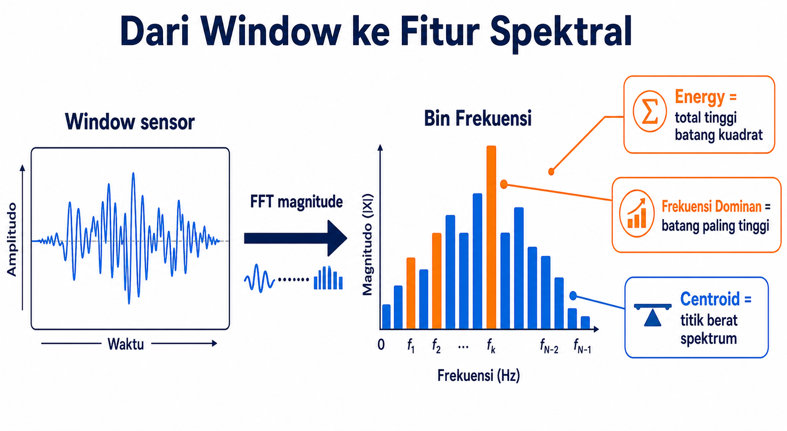

Gambar di atas menunjukkan ide utamanya. Di kiri ada sinyal dalam waktu. Di kanan ada batang-batang frekuensi. Dari batang frekuensi itu kita mengambil angka ringkasan seperti energy, frekuensi dominan, centroid, atau band energy.

### 5.1 Time-series

**Time-series** adalah data yang datang berurutan terhadap waktu.

Contoh getaran pompa:

| Waktu | Nilai getaran |
|---:|---:|
| 0 detik | 1.0 |
| 1 detik | 1.2 |
| 2 detik | 0.8 |
| 3 detik | 1.1 |

Urutan penting. Nilai pada detik 1 datang setelah detik 0. Nilai pada detik 2 datang setelah detik 1.

Bahasa bayinya: time-series seperti rekaman suara pompa. Kalau urutannya diacak, iramanya rusak.

### 5.2 Sample

**Sample** adalah satu titik pengukuran.

Kalau sensor membaca getaran setiap detik, maka tiap bacaan adalah satu sample.

Kita pakai simbol $N$ untuk jumlah sample dalam satu window.

Contoh window kecil:

```text
x[0], x[1], x[2], x[3]
```

Di sini:

| Simbol | Arti |
|---|---|
| $x$ | sinyal dalam satu window |
| `x[0]` | sample pertama |
| `x[1]` | sample kedua |
| $N$ | jumlah sample dalam window |

Kalau ada 4 sample, maka `N = 4`.

Jangan tertukar:

| Simbol | Arti |
|---|---|
| $n$ kecil | jumlah window training |
| $N$ besar | jumlah sample di dalam satu window |

### 5.3 Sampling rate $f_s$

**Sampling rate** adalah berapa kali sensor membaca data per detik.

Kita pakai simbol $f_s$ untuk sampling rate.

Contoh:

| $f_s$ | Arti |
|---:|---|
| 1 Hz | 1 sample per detik |
| 10 Hz | 10 sample per detik |
| 100 Hz | 100 sample per detik |

`Hz` berarti per detik.

Kalau `fs = 10 Hz`, sensor mengambil 10 sample dalam 1 detik.

Bahasa bayinya: $f_s$ adalah seberapa rajin sensor memotret kondisi pompa. `fs = 10 Hz` berarti sensor memotret 10 kali setiap detik.

### 5.4 Window dan durasi window

**Window** adalah potongan pendek dari time-series.

Misalnya sistem membaca 60 sample terakhir dari sensor pompa, lalu menganggapnya sebagai satu paket kecil untuk dianalisis.

Bahasa bayinya: window adalah satu potong roti dari roti panjang time-series.

Contoh:

```text
time-series panjang:  x0, x1, x2, x3, x4, x5, x6, x7, ...
window pertama:       x0, x1, x2, x3
window kedua:             x1, x2, x3, x4
window ketiga:                x2, x3, x4, x5
```

Durasi window dihitung dari jumlah sample dan sampling rate:

$$
\text{durasi window}=\frac{N}{f_s}
$$

Contoh:

$$
N=60\ \text{sample},\quad f_s=1\ \mathrm{Hz}
$$

$$
\text{durasi window}=\frac{60}{1}=60\ \text{detik}
$$

Contoh lain:

$$
N=100\ \text{sample},\quad f_s=10\ \mathrm{Hz}
$$

$$
\text{durasi window}=\frac{100}{10}=10\ \text{detik}
$$

Di proyek PDAM Pump Sentinel, window dipakai karena fault pompa sering terlihat dari pola beberapa detik atau beberapa puluh detik, bukan dari satu titik sensor saja.

### 5.5 Frekuensi sebagai irama pompa

**Frekuensi** berarti seberapa cepat sinyal berulang.

Kalau getaran naik turun satu kali per detik, frekuensinya `1 Hz`. Kalau naik turun lima kali per detik, frekuensinya `5 Hz`.

Bayangkan kamu mendengar suara pompa:

| Rasa suara atau getaran | Rasa frekuensi |
|---|---|
| pelan naik turun | frekuensi rendah |
| cepat bergetar | frekuensi tinggi |
| ada dengung kuat di satu nada | ada frekuensi dominan |

Pompa punya ritme normal. Fault seperti imbalance, cavitation, atau gangguan aliran bisa mengubah energi pada frekuensi tertentu. Karena itu fitur spektral berguna.

### 5.6 FFT sebagai ide, bukan hitungan besar

FFT adalah cara cepat untuk melihat isi frekuensi dari satu window sinyal.

Untuk belajar manual, kita tidak perlu menghitung FFT besar dari nol. Yang perlu dipahami adalah pertanyaan yang dijawab FFT.

```text
window sinyal waktu -> FFT -> daftar kekuatan pada beberapa frekuensi
```

FFT menjawab:

```text
di frekuensi mana irama pompa paling kuat?
```

Analogi pompa:

| Di dunia pompa | Di dunia FFT |
|---|---|
| suara pompa punya beberapa nada | sinyal punya beberapa frekuensi |
| satu nada terdengar paling keras | satu bin punya magnitude terbesar |
| nada rendah dan tinggi bisa berubah | energi band rendah dan tinggi bisa berubah |

Hasil FFT bisa berupa bilangan kompleks. Untuk fitur sederhana, kita sering memakai **magnitude**. Magnitude adalah besar kekuatan, tanpa arah kompleksnya.

### 5.7 Magnitude FFT

Kita pakai simbol $M[k]$ untuk magnitude FFT pada bin ke-$k$.

Sebelum memakainya, arti simbolnya:

| Simbol | Arti |
|---|---|
| $k$ | nomor bin frekuensi |
| $M[k]$ | besar atau kekuatan sinyal pada bin ke-k |
| $N$ | jumlah sample dalam window |
| $f_s$ | sampling rate |

Magnitude adalah angka non-negatif. Kalau $M[2]$ besar, berarti frekuensi pada bin 2 kuat.

Bahasa bayinya: bayangkan spektrum sebagai deretan gelas. Setiap gelas adalah frekuensi. Isi gelas adalah magnitude. Gelas yang paling penuh berarti frekuensi itu paling kuat.

### 5.8 Frequency bin

**Frequency bin** adalah kotak frekuensi hasil FFT.

Rumus frekuensi untuk bin ke-$k$:

$$
f_k = \frac{k f_s}{N}
$$

Sebelum rumus dipakai:

| Simbol | Arti |
|---|---|
| $f_k$ | frekuensi untuk bin ke-k |
| $k$ | nomor bin |
| $f_s$ | sampling rate |
| $N$ | jumlah sample dalam window |

Contoh kecil:

$$
f_s=8\ \mathrm{Hz},\quad N=8\ \text{sample}
$$

Maka jarak antar bin:

$$
\frac{f_s}{N}=\frac{8}{8}=1\ \mathrm{Hz}
$$

Frekuensi bin:

| $k$ | $f_k=kf_s/N$ |
|---:|---:|
| 0 | 0 Hz |
| 1 | 1 Hz |
| 2 | 2 Hz |
| 3 | 3 Hz |
| 4 | 4 Hz |

Bin $k=0$ disebut **DC bin**. DC bin sering menggambarkan rata-rata atau offset sinyal. Kalau kita ingin fokus pada osilasi getaran, DC bin sering diabaikan.

Bahasa bayinya: DC bin bukan irama naik turun. Ia lebih mirip posisi dasar sinyal. Untuk getaran, kita sering lebih tertarik pada irama, jadi DC bisa disisihkan.

### 5.9 Energy

**Energy** dalam fitur spektral biasanya dihitung dari magnitude yang dikuadratkan lalu dijumlahkan.

Untuk satu band frekuensi:

$$
E_{\text{band}}=\sum_{k\in\text{band}}M[k]^2
$$

Sebelum rumus dipakai:

| Simbol | Arti |
|---|---|
| $E_{\text{band}}$ | energi pada band frekuensi tertentu |
| $M[k]$ | magnitude FFT pada bin ke-k |
| `M[k]^2` | magnitude kuadrat |
| `k di dalam band` | bin yang dipilih untuk band itu |

Contoh:

| $k$ | Frekuensi | $M[k]$ |
|---:|---:|---:|
| 1 | 1 Hz | 2 |
| 2 | 2 Hz | 3 |
| 3 | 3 Hz | 1 |

Jika band yang kita pilih adalah 1 Hz sampai 3 Hz, energinya:

$$
E_{\text{band}}=2^2+3^2+1^2=4+9+1=14
$$

Bahasa pompa: energi band memberi tahu seberapa kuat getaran pompa pada rentang irama tertentu.

### 5.10 Dominant frequency

**Dominant frequency** adalah frekuensi dengan magnitude terbesar.

Kita tulis $f_{\text{dom}}$ untuk dominant frequency.

Contoh:

| $k$ | Frekuensi | $M[k]$ |
|---:|---:|---:|
| 1 | 1 Hz | 2 |
| 2 | 2 Hz | 3 |
| 3 | 3 Hz | 1 |

Magnitude terbesar adalah `3` pada $k=2$, frekuensinya `2 Hz`.

Jadi:

$$
f_{\text{dom}}=2\ \mathrm{Hz}
$$

Bahasa bayinya: cari batang paling tinggi pada grafik spektrum, lalu baca frekuensinya. Pada pompa, ini seperti nada yang paling keras terdengar dalam window itu.

### 5.11 Spectral centroid

**Spectral centroid** adalah titik tengah berbobot dari spektrum. Ia seperti pusat massa frekuensi.

Kita tulis $f_{\text{centroid}}$.

Rumus:

$$
f_{\text{centroid}}=\frac{\sum_k f_k M[k]}{\sum_k M[k]}
$$

Sebelum rumus dipakai:

| Simbol | Arti |
|---|---|
| $f_{\text{centroid}}$ | pusat frekuensi berbobot magnitude |
| $f_k$ | frekuensi bin ke-k |
| $M[k]$ | magnitude pada bin ke-k |
| `sum(f_k * M[k])` | jumlah frekuensi dikali kekuatannya |
| `sum(M[k])` | total magnitude |

Contoh:

| $k$ | $f_k$ | $M[k]$ | $f_kM[k]$ |
|---:|---:|---:|---:|
| 1 | 1 | 2 | 2 |
| 2 | 2 | 3 | 6 |
| 3 | 3 | 1 | 3 |

Hitung:

$$
\sum_k f_kM[k]=2+6+3=11
$$

$$
\sum_k M[k]=2+3+1=6
$$

$$
f_{\text{centroid}}=\frac{11}{6}=1.833\ \mathrm{Hz}
$$

Centroid `1.833 Hz` berarti pusat massa spektrum berada dekat 2 Hz. Kalau energi banyak pindah ke frekuensi tinggi, centroid bisa ikut naik.

### 5.12 Band energy

**Band energy** adalah energi pada rentang frekuensi tertentu.

Misalnya kita punya bin:

| $k$ | $f_k$ | $M[k]$ |
|---:|---:|---:|
| 1 | 1 Hz | 2 |
| 2 | 2 Hz | 3 |
| 3 | 3 Hz | 1 |
| 4 | 4 Hz | 4 |

Kita ingin energi band rendah 1 sampai 2 Hz:

$$
E_{\text{low}}=M[1]^2+M[2]^2=2^2+3^2=4+9=13
$$

Energi band tinggi 3 sampai 4 Hz:

$$
E_{\text{high}}=M[3]^2+M[4]^2=1^2+4^2=1+16=17
$$

Fitur seperti ini membantu model melihat apakah energi berpindah ke band tertentu.

Bahasa pompa: jika kondisi sehat biasanya kuat di band rendah, lalu window baru tiba-tiba kuat di band tinggi, model perlu melihat perubahan itu.

### 5.13 Kenapa FFT disederhanakan untuk hitung tangan

FFT penuh untuk window nyata bisa punya 60, 128, 256, atau lebih banyak sample. Menghitung FFT penuh dengan tangan akan sangat panjang dan tidak membantu tujuan utama catatan ini.

Karena itu, untuk belajar manual kita menyederhanakan:

| Bagian nyata | Versi latihan tangan |
|---|---|
| FFT banyak sample | magnitude FFT sudah diberikan |
| banyak bin frekuensi | 3 sampai 5 bin saja |
| banyak fitur spektral | 2 fitur saja |
| banyak window | 5 window normal |

Yang penting bukan hafal hitung FFT besar. Yang penting paham bahwa window sensor diubah menjadi angka ringkas seperti energi band dan frekuensi dominan. Angka ringkas itulah yang masuk PCA.

Kalau sudah paham bagian ini, kamu harus bisa:

| Kamu harus bisa | Penjelasan |
|---|---|
| menjelaskan window | potongan pendek time-series |
| menjelaskan sampling rate | jumlah sample per detik |
| menghitung durasi window | `N / fs` |
| menghitung frequency bin | `f_k = k * fs / N` |
| menjelaskan DC bin | bin 0 Hz, sering berarti offset |
| menjelaskan magnitude FFT | kekuatan sinyal pada bin frekuensi |
| menghitung energy | jumlah magnitude kuadrat |
| mencari dominant frequency | frekuensi dengan magnitude terbesar |
| menghitung centroid kecil | jumlah $fM$ dibagi jumlah $M$ |

## Bagian 6. Dari fitur spektral ke data PCA

Setelah satu window sensor diubah menjadi fitur spektral, PCA tidak lagi melihat deret sample mentah. PCA melihat tabel fitur.

Satu baris PCA berarti satu window.

```text
satu window sensor -> beberapa fitur spektral -> satu baris di tabel PCA
```

Contoh fitur yang akan dipakai dalam latihan utama:

| Nama fitur | Simbol | Arti sederhana |
|---|---|---|
| Energi band getaran | $E$ | seberapa kuat energi pada band frekuensi yang dipilih |
| Frekuensi dominan | $F$ | frekuensi yang magnitude-nya paling besar |

Kita sengaja hanya memakai dua fitur agar bisa menggambar dan menghitung dengan tangan.

Dalam proyek nyata, fitur bisa lebih banyak. Tetapi logika PCA T2/Q tetap sama. PCA selalu menerima tabel: baris adalah window, kolom adalah fitur.

### 6.1 Contoh ekstraksi fitur kecil

Misalkan satu window punya hasil magnitude FFT seperti ini:

| $k$ | $f_k$ | $M[k]$ |
|---:|---:|---:|
| 0 | 0 Hz | 10 |
| 1 | 10 Hz | 2 |
| 2 | 20 Hz | 3 |
| 3 | 30 Hz | 1 |

Kita abaikan $k=0$ karena itu DC bin.

Energi band 10 sampai 30 Hz:

$$
E=2^2+3^2+1^2=4+9+1=14
$$

Frekuensi dominan:

$$
\text{magnitude terbesar di } k=2
$$

$$
f_2=20\ \mathrm{Hz}
$$

$$
F=20\ \mathrm{Hz}
$$

Jadi satu window berubah dari deret sensor menjadi dua angka:

$$
x=[E,F]=[14,20]
$$

Di sini $x$ berarti vektor fitur mentah satu window.

### 6.2 Dari banyak window menjadi tabel PCA

Kalau kita punya lima window normal, tiap window diubah dengan cara yang sama.

| Window | Ringkasan dari spektrum | Baris fitur untuk PCA |
|---:|---|---|
| W1 | hitung $E$ dan $F$ dari FFT W1 | `[E(W1), F(W1)]` |
| W2 | hitung $E$ dan $F$ dari FFT W2 | `[E(W2), F(W2)]` |
| W3 | hitung $E$ dan $F$ dari FFT W3 | `[E(W3), F(W3)]` |
| W4 | hitung $E$ dan $F$ dari FFT W4 | `[E(W4), F(W4)]` |
| W5 | hitung $E$ dan $F$ dari FFT W5 | `[E(W5), F(W5)]` |

Tabel PCA mentahnya menjadi:

```text
X = [ E(W1)  F(W1) ]
    [ E(W2)  F(W2) ]
    [ E(W3)  F(W3) ]
    [ E(W4)  F(W4) ]
    [ E(W5)  F(W5) ]
```

Bahasa bayinya: FFT mengubah satu potong irama pompa menjadi beberapa angka. PCA mengumpulkan angka-angka itu dari banyak potong irama, lalu belajar pola normalnya.

### 6.3 Kenapa satu window menjadi satu baris

PCA membandingkan window dengan window lain. Karena itu satu window harus menjadi satu benda yang utuh.

| Bentuk | Arti |
|---|---|
| satu window sensor | satu kejadian pendek pada pompa |
| satu vektor fitur | ringkasan kejadian pendek itu |
| satu baris PCA | posisi kejadian itu di ruang fitur |

Jika W1 punya `E = 8` dan `F = 29`, maka baris W1 adalah:

```text
W1 = [8, 29]
```

Jika W5 punya `E = 12` dan `F = 32`, maka baris W5 adalah:

```text
W5 = [12, 32]
```

Nanti PCA melihat bahwa ketika $E$ naik dari 8 ke 12, $F$ juga cenderung naik dari 29 ke 32. Itulah pola normal yang akan menjadi garis PC1.

Kalau sudah paham bagian ini, kamu harus bisa menjelaskan bahwa PCA tidak menerima FFT mentah dalam latihan ini. PCA menerima fitur ringkas seperti $E$ dan $F$, satu window per baris.

## Bagian 7. Eigenvector dan eigenvalue dengan cara lembut

Bagian ini sering membuat orang berhenti. Kita buat sederhana.

### 7.1 Gagasan PCA sebagai mencari arah garis

Bayangkan titik normal dua fitur digambar di kertas:

```text
sumbu kiri-kanan: energi E
sumbu bawah-atas: frekuensi F
```

Kalau energi naik dan frekuensi juga naik, titik-titik normal akan membentuk awan miring dari kiri bawah ke kanan atas.

Setiap window adalah satu titik.

| Window | Setelah jadi fitur | Setelah digambar |
|---|---|---|
| W1 | `[E, F]` | satu titik |
| W2 | `[E, F]` | satu titik lain |
| W3 | `[E, F]` | satu titik lain lagi |

Bahasa bayinya: window bukan lagi deret panjang. Window sudah menjadi titik kecil di kertas. Kalau ada 5 window normal, ada 5 titik normal.

PCA bertanya:

```text
arah garis mana yang paling menjelaskan sebaran titik normal?
```

Arah garis itu adalah **eigenvector** utama. Dalam PCA, eigenvector utama disebut **loading PC1**.

Rumus pendek eigen yang sering muncul adalah:

$$
S p = \lambda p
$$

Bahasa bayinya: matrix hubungan $S$ bertemu arah $p$, lalu hasilnya tetap searah, hanya panjangnya berubah sebesar $\lambda$.

Cerita geometri PCA:

| Istilah | Bahasa gambar | Bahasa bayi |
|---|---|---|
| titik window | satu titik di kertas | satu kejadian pompa |
| PC1 | jalan utama atau garis utama | arah normal paling ramai |
| eigenvector | arah jalan | panah yang menunjukkan jalan menghadap ke mana |
| eigenvalue | sebaran di jalan itu | seberapa panjang titik normal menyebar di jalan |
| projection | bayangan titik ke jalan | jatuhkan titik ke jalan normal |
| reconstruction | gambar ulang dari bayangan | titik dibuat ulang dari posisi di jalan |
| residual | sisa jarak dari gambar ulang | bagian yang tidak cocok dengan jalan |

Analogi jalan:

```text
titik normal = mobil yang biasanya lewat dekat jalan utama
PC1          = jalan utama normal
T2           = mobil terlalu jauh tidak di sepanjang jalan itu?
Q            = mobil keluar tidak dari jalan itu?
```

Pertanyaan T2 dan Q harus diingat seperti ini:

| Skor | Pertanyaan bayi |
|---|---|
| T2 | jauh tidak di jalan normal? |
| Q/SPE | keluar tidak dari jalan normal? |

### 7.2 Eigenvector

**Eigenvector** adalah arah khusus yang tetap menjadi arah setelah matrix hubungan data bekerja padanya.

Untuk belajar manual, cukup pegang arti praktisnya:

```text
eigenvector PCA = arah pola utama data normal
```

Kalau PC1 adalah jalan utama, eigenvector adalah arah jalan itu. Ia memberi tahu: untuk bergerak di jalan normal, fitur mana naik dan fitur mana turun.

Pada contoh dua fitur:

| Bentuk arah | Arti |
|---|---|
| `[0.707, 0.707]` | bergerak ke energi tinggi dan frekuensi tinggi bersama |
| `[0.707, -0.707]` | bergerak ke energi tinggi tetapi frekuensi rendah |

Tanda plus atau minus penting. Dua plus berarti dua fitur berjalan searah. Satu plus dan satu minus berarti dua fitur berlawanan arah.

Kita akan pakai simbol $p_1$ untuk eigenvector PC1 atau loading PC1.

Di contoh dua fitur yang bergerak naik bersama, arah PC1 kira-kira:

$$
p_1=[0.707,0.707]
$$

Artinya PC1 memberi bobot sama ke energi dan frekuensi setelah scaling.

Kenapa `0.707`? Karena:

$$
0.707\ \text{dibulatkan dari}\ \frac{1}{\sqrt{2}}
$$

$$
\frac{1}{\sqrt{2}}=0.707106\ldots
$$

Vektor `[0.707, 0.707]` panjangnya 1:

$$
\sqrt{0.707^2+0.707^2}=\sqrt{0.500+0.500}=\sqrt{1.000}=1.000
$$

Di hitungan tangan kita menulis `0.707` agar tabel tidak terlalu panjang. Di kode proyek, simpan angka lebih presisi seperti `0.70710678`, bukan hanya tiga desimal.

### 7.3 Eigenvalue

**Eigenvalue** adalah angka yang memberi tahu seberapa besar variasi data pada arah eigenvector.

Kalau eigenvector adalah arah jalan, eigenvalue adalah ukuran ramainya penyebaran titik di jalan itu.

| Eigenvalue | Bahasa bayi |
|---:|---|
| besar | banyak variasi normal terjadi di arah ini |
| kecil | sedikit variasi normal terjadi di arah ini |

PCA biasanya menyimpan PC dengan eigenvalue besar karena arah itu menjelaskan kebiasaan normal paling banyak.

Kita akan pakai simbol $\lambda_1$ untuk eigenvalue PC1.

Arti praktisnya:

```text
lambda_1 besar berarti PC1 menjelaskan variasi normal yang besar
lambda_1 kecil berarti PC1 menjelaskan variasi normal yang kecil
```

Untuk matrix correlation dua fitur:

$$
S=\begin{bmatrix}1 & r \\ r & 1\end{bmatrix}
$$

Jika dua fitur berkorelasi positif kuat, PC1 punya:

$$
p_1=[0.707,0.707]
$$

$$
\lambda_1=1+r
$$

PC2, yang tegak lurus PC1, punya:

$$
p_2=[0.707,-0.707]
$$

$$
\lambda_2=1-r
$$

Di latihan utama, kita hanya menyimpan PC1. PC2 tidak dipakai untuk rekonstruksi. Justru karena PC2 tidak disimpan, Q/SPE bisa melihat sisa error.

Untuk dua fitur z-score, total variance kira-kira `2`, karena tiap fitur punya variance `1`.

Jika nanti `r = 0.971`, maka:

$$
\lambda_1=1+0.971=1.971
$$

$$
\text{bagian variance PC1}=\frac{\lambda_1}{2}=\frac{1.971}{2}=0.9855
$$

Jadi bagian PC1 sekitar 98.5 persen.

Artinya, dalam contoh dua fitur ini, PC1 menangkap hampir semua variasi normal. Sisa kecilnya berada di arah PC2.

### 7.4 Kasus mudah dua fitur

Ada tiga kasus mudah:

| Pola dua fitur | Arah PC1 kira-kira | Arti |
|---|---|---|
| dua fitur naik bersama | `[0.707, 0.707]` | garis kiri bawah ke kanan atas |
| satu naik, satu turun | `[0.707, -0.707]` | garis kiri atas ke kanan bawah |
| tidak berkorelasi | arah tidak dominan kuat | PCA tidak punya satu garis jelas |

Untuk contoh kita, energi dan frekuensi naik bersama. Jadi PC1 kita pakai:

$$
p_1=[0.707,0.707]
$$

### 7.5 Projection, reconstruction, dan residual dalam satu cerita

Nanti kita akan menghitung tiga benda ini:

```text
t      = projection atau bayangan titik ke PC1
z_hat  = reconstruction atau gambar ulang dari bayangan
e      = residual atau sisa yang tidak tergambar
```

Bayangkan titik window adalah bola kecil di dekat jalan PC1.

1. Projection menjatuhkan bayangan bola ke jalan.
2. Score $t$ memberi tahu posisi bayangan itu di jalan.
3. Reconstruction menggambar ulang bola dengan hanya memakai posisi bayangan di jalan.
4. Residual adalah jarak dari bola asli ke gambar ulangnya.

Kalau residual kecil, titik asli dekat jalan. Kalau residual besar, titik asli keluar dari jalan.

Inilah kenapa T2 dan Q berbeda:

| Situasi | T2 | Q |
|---|---|---|
| titik jauh di ujung jalan tetapi masih di jalan | tinggi | rendah |
| titik dekat tengah tetapi melenceng keluar jalan | bisa rendah | tinggi |
| titik jauh dan melenceng | tinggi | tinggi |

Untuk contoh $X_{\text{new}}$, energi tinggi tetapi frekuensi tidak ikut tinggi. Titiknya tidak mengikuti jalan energi dan frekuensi naik bersama. Jadi Q yang akan berteriak keras.

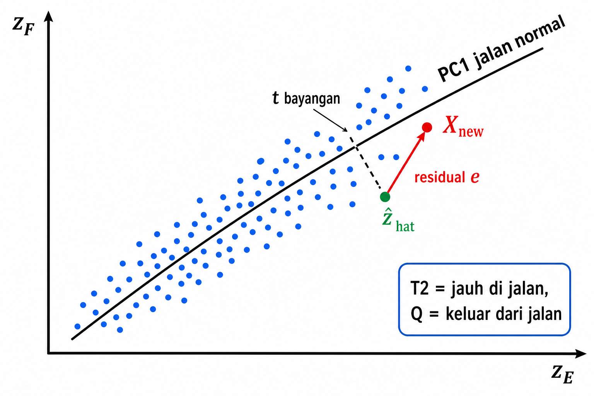

Pada gambar ini, titik biru adalah data normal. Garis miring adalah PC1, yaitu jalan normal. Titik merah adalah window baru. Bayangannya jatuh ke garis PC1, lalu PCA menggambar ulang titik dari bayangan itu. Jarak dari gambar ulang ke titik asli adalah residual. Residual besar membuat Q besar.

Kalau sudah paham bagian ini, kamu harus bisa:

| Kamu harus bisa | Penjelasan |
|---|---|
| menjelaskan eigenvector | arah pola utama data |
| menjelaskan eigenvalue | besar variasi pada arah itu |
| menjelaskan projection | bayangan titik ke garis PC1 |
| menjelaskan reconstruction | menggambar ulang titik dari bayangan PC1 |
| menjelaskan residual | sisa yang tidak bisa digambar ulang |
| mengenali kasus dua fitur naik bersama | PC1 kira-kira `[0.707, 0.707]` |
| menjelaskan kenapa 1 PC disimpan | agar latihan sederhana dan Q/SPE masih terlihat |

## Bagian 8. Notasi lengkap sebelum contoh utama

Sebelum masuk contoh angka panjang, kita rapikan simbol.

| Simbol | Dibaca | Arti |
|---|---|---|
| $n$ | en | jumlah window training normal |
| $p$ | pe | jumlah fitur |
| $N$ | en besar | jumlah sample dalam satu window sensor |
| $f_s$ | ef es | sampling rate, sample per detik |
| $k$ | ka | nomor frequency bin FFT |
| $f_k$ | ef ka | frekuensi pada bin ke-k |
| $M[k]$ | em ka | magnitude FFT pada bin ke-k |
| $E$ | e | fitur energi band |
| $F$ | ef | fitur frekuensi dominan |
| $x$ | eks | fitur mentah satu window |
| $\mu$ | miu | mean fitur dari training normal |
| $s$ | es | standar deviasi fitur dari training normal |
| $z$ | zet | fitur setelah z-score |
| $Z$ | zet besar | matrix z-score training |
| $S$ | es besar | matrix covariance atau correlation |
| $r$ | er | correlation antara dua fitur |
| $p_1$ | pe satu | loading vector PC1 |
| $\lambda_1$ | lambda satu | eigenvalue PC1 |
| $t$ | te | score PCA pada PC1 |
| $\hat z$ | zet topi | rekonstruksi z dari PC1 |
| $e$ | e kecil | residual, yaitu `z - z_hat` |
| $T^2$ | te dua | Hotelling T2 |
| $Q$ | kiu | Q statistic atau SPE |
| $\mathrm{SPE}$ | es pe e | squared prediction error |
| $\text{threshold}_{T^2}$ | ambang T2 | batas T2 normal |
| $\text{threshold}_Q$ | ambang Q | batas Q normal |

Catatan kecil: $Q$ dan $\mathrm{SPE}$ di catatan ini berarti hal yang sama, yaitu jumlah kuadrat residual.

Ringkasan makna simbol yang sering tertukar:

| Simbol | Jangan tertukar dengan | Cara mengingat |
|---|---|---|
| $n$ | $N$ | $n$ kecil untuk banyak window training |
| $N$ | $n$ | $N$ besar untuk banyak sample dalam window |
| $x$ | $z$ | $x$ masih mentah, $z$ sudah di-scaling |
| $t$ | $T^2$ | $t$ posisi di PC, $T^2$ skor jarak dari $t$ |
| $e$ | $E$ | $e$ kecil residual, $E$ besar fitur energi |
| $Q$ | `q` lain | $Q$ di sini sama dengan SPE |

Kalau sudah paham bagian ini, kamu harus bisa melihat rumus tanpa panik karena setiap simbol sudah punya nama.

## Bagian 9. Data latihan utama

Kita punya 5 window normal untuk training. Setiap window sudah diubah menjadi 2 fitur spektral.

| Window normal | $E$, energi band | $F$, frekuensi dominan |
|---:|---:|---:|
| W1 | 8 | 29 |
| W2 | 9 | 30 |
| W3 | 10 | 30 |
| W4 | 11 | 31 |
| W5 | 12 | 32 |

Kita lihat pola normalnya:

| Dari | Ke | Pola |
|---|---|---|
| W1 ke W5 | $E$ naik dari 8 ke 12 | energi makin besar |
| W1 ke W5 | $F$ naik dari 29 ke 32 | frekuensi dominan ikut naik |

Jadi kebiasaan normalnya kira-kira:

```text
kalau E naik, F juga cenderung naik
```

PCA akan belajar pola itu sebagai PC1.

## Bagian 10. Hitung mean dan standar deviasi training

Kita hitung statistik training untuk setiap fitur secara terpisah.

### 10.0 Kebijakan pembulatan angka di contoh ini

Supaya hitungan tangan tidak terlalu penuh, catatan ini memakai pembulatan.

| Jenis angka | Cara tulis di catatan |
|---|---|
| mean sederhana | tulis sesuai hasil, misalnya `10` atau `30.4` |
| standar deviasi | biasanya 3 desimal |
| z-score | 3 desimal |
| loading $p_1$ | 3 desimal, `0.707` |
| score, T2, Q | 3 desimal untuk tabel utama |
| residual kuadrat yang sangat kecil | kadang perlu 6 desimal agar tidak terlihat hilang |

Peringatan penting: pembulatan ini hanya untuk belajar manual. Kode proyek harus menyimpan presisi lebih banyak. Kalau kode hanya menyimpan tiga desimal, T2 dan Q bisa sedikit bergeser, terutama saat skor dekat threshold.

Jadi kalau kamu menghitung ulang dan mendapat angka beda tipis, jangan langsung panik. Cek dulu apakah bedanya berasal dari pembulatan.

### 10.1 Hitung mean $E$

Data $E$:

```text
8, 9, 10, 11, 12
```

Jumlah:

$$
\mathrm{sum}_E=8+9+10+11+12=50
$$

Jumlah window:

$$
n=5
$$

Mean:

$$
\mu_E=\frac{\mathrm{sum}_E}{n}=\frac{50}{5}=10
$$

### 10.2 Hitung standar deviasi $E$

Tabel deviation:

| Window | $E$ | $\mu_E$ | $d_E=E-\mu_E$ | $d_E^2$ |
|---:|---:|---:|---:|---:|
| W1 | 8 | 10 | -2 | 4 |
| W2 | 9 | 10 | -1 | 1 |
| W3 | 10 | 10 | 0 | 0 |
| W4 | 11 | 10 | 1 | 1 |
| W5 | 12 | 10 | 2 | 4 |

Jumlah kuadrat deviation:

$$
\sum d_E^2=4+1+0+1+4=10
$$

Sample variance:

$$
s_E^2=\frac{\sum d_E^2}{n-1}=\frac{10}{4}=2.5
$$

Standar deviasi:

$$
s_E=\sqrt{2.5}=1.581
$$

### 10.3 Hitung mean $F$

Data $F$:

```text
29, 30, 30, 31, 32
```

Jumlah:

$$
\mathrm{sum}_F=29+30+30+31+32=152
$$

Mean:

$$
\mu_F=\frac{\mathrm{sum}_F}{n}=\frac{152}{5}=30.4
$$

### 10.4 Hitung standar deviasi $F$

Tabel deviation:

| Window | $F$ | $\mu_F$ | $d_F=F-\mu_F$ | $d_F^2$ |
|---:|---:|---:|---:|---:|
| W1 | 29 | 30.4 | -1.4 | 1.96 |
| W2 | 30 | 30.4 | -0.4 | 0.16 |
| W3 | 30 | 30.4 | -0.4 | 0.16 |
| W4 | 31 | 30.4 | 0.6 | 0.36 |
| W5 | 32 | 30.4 | 1.6 | 2.56 |

Jumlah kuadrat deviation:

$$
\sum d_F^2=1.96+0.16+0.16+0.36+2.56=5.20
$$

Sample variance:

$$
s_F^2=\frac{\sum d_F^2}{n-1}=\frac{5.20}{4}=1.30
$$

Standar deviasi:

$$
s_F=\sqrt{1.30}=1.140
$$

### 10.5 Simpan statistik training

Statistik training yang harus disimpan:

| Fitur | Mean | Standar deviasi |
|---|---:|---:|
| E | 10 | 1.581 |
| F | 30.4 | 1.140 |

Angka ini nanti dipakai juga untuk window baru. Jangan dihitung ulang saat inference.

Kalau sudah paham bagian ini, kamu harus bisa:

| Kamu harus bisa | Hasil contoh |
|---|---:|
| mean E | 10 |
| standar deviasi E | 1.581 |
| mean F | 30.4 |
| standar deviasi F | 1.140 |

## Bagian 11. Ubah fitur mentah menjadi z-score

Rumus z-score untuk satu fitur:

$$
z_i = \frac{x_i - \mu}{s}
$$

Arti simbol:

| Simbol | Arti |
|---|---|
| $x$ | nilai fitur mentah |
| $\mu$ | mean fitur dari training normal |
| $s$ | standar deviasi fitur dari training normal |
| $z$ | nilai setelah scaling |

### 11.1 Z-score untuk E

Pakai:

$$
\mu_E=10,\quad s_E=1.581
$$

Hitung setiap window:

$$
z_E(W1)=\frac{8-10}{1.581}=\frac{-2}{1.581}=-1.265
$$

$$
z_E(W2)=\frac{9-10}{1.581}=\frac{-1}{1.581}=-0.632
$$

$$
z_E(W3)=\frac{10-10}{1.581}=\frac{0}{1.581}=0.000
$$

$$
z_E(W4)=\frac{11-10}{1.581}=\frac{1}{1.581}=0.632
$$

$$
z_E(W5)=\frac{12-10}{1.581}=\frac{2}{1.581}=1.265
$$

### 11.2 Z-score untuk F

Pakai:

$$
\mu_F=30.4,\quad s_F=1.140
$$

Hitung setiap window:

$$
z_F(W1)=\frac{29-30.4}{1.140}=\frac{-1.4}{1.140}=-1.228
$$

$$
z_F(W2)=\frac{30-30.4}{1.140}=\frac{-0.4}{1.140}=-0.351
$$

$$
z_F(W3)=\frac{30-30.4}{1.140}=\frac{-0.4}{1.140}=-0.351
$$

$$
z_F(W4)=\frac{31-30.4}{1.140}=\frac{0.6}{1.140}=0.526
$$

$$
z_F(W5)=\frac{32-30.4}{1.140}=\frac{1.6}{1.140}=1.403
$$

### 11.3 Tabel z-score training

| Window | $z_E$ | $z_F$ |
|---:|---:|---:|
| W1 | -1.265 | -1.228 |
| W2 | -0.632 | -0.351 |
| W3 | 0.000 | -0.351 |
| W4 | 0.632 | 0.526 |
| W5 | 1.265 | 1.403 |

Cara cek cepat:

| Cek | Harapan |
|---|---|
| rata-rata kolom z_E | mendekati 0 |
| rata-rata kolom z_F | mendekati 0 |
| sample variance z_E | mendekati 1 |
| sample variance z_F | mendekati 1 |

Kita pakai pembulatan tiga desimal. Karena dibulatkan, hasil cek tidak akan sempurna persis.

Contoh efek pembulatan:

```text
s_E asli kira-kira 1.581138...
di tabel ditulis 1.581
```

Jika memakai angka asli, z-score sedikit berbeda di digit keempat dan seterusnya. Untuk catatan tangan, itu boleh.

Kalau sudah paham bagian ini, kamu harus bisa menghitung z-score satu baris. Misalnya W1:

$$
E=8\ \text{menjadi}\ z_E=-1.265
$$

$$
F=29\ \text{menjadi}\ z_F=-1.228
$$

## Bagian 12. Hitung correlation matrix dari z-score

Karena data sudah di-z-score, kita bisa memakai correlation matrix.

Untuk dua fitur, bentuknya:

$$
S=\begin{bmatrix}1 & r \\ r & 1\end{bmatrix}
$$

Arti simbol:

| Simbol | Arti |
|---|---|
| $S$ | matrix correlation |
| $r$ | correlation antara z_E dan z_F |
| `1` | correlation fitur dengan dirinya sendiri |

Rumus $r$:

$$
r=\frac{\sum_{i=1}^{n}z_{E,i}z_{F,i}}{n-1}
$$

Arti simbol:

| Simbol | Arti |
|---|---|
| `z_E_i` | z-score E pada window ke-i |
| `z_F_i` | z-score F pada window ke-i |
| $n$ | jumlah window training |
| $r$ | correlation antara dua fitur |

### 12.1 Hitung perkalian tiap baris

| Window | $z_E$ | $z_F$ | z_E * z_F |
|---:|---:|---:|---:|
| W1 | -1.265 | -1.228 | 1.553 |
| W2 | -0.632 | -0.351 | 0.222 |
| W3 | 0.000 | -0.351 | 0.000 |
| W4 | 0.632 | 0.526 | 0.333 |
| W5 | 1.265 | 1.403 | 1.775 |

Jumlahkan kolom terakhir:

$$
\sum z_Ez_F=1.553+0.222+0.000+0.333+1.775=3.883
$$

Karena `n = 5`, maka `n - 1 = 4`.

$$
r=\frac{3.883}{4}=0.971
$$

Catatan pembulatan: jika memakai angka z-score yang lebih presisi dari standar deviasi asli, correlation yang lebih tepat sekitar:

$$
r=0.9707\ldots
$$

Di catatan ini kita tulis `0.971` agar hitungan tangan pendek.

Jadi matrix correlation:

$$
S=\begin{bmatrix}1 & 0.971 \\ 0.971 & 1\end{bmatrix}
$$

Interpretasi:

```text
E dan F sangat kuat naik turun bersama pada data normal
```

Kalau sudah paham bagian ini, kamu harus bisa:

| Kamu harus bisa | Hasil contoh |
|---|---:|
| menghitung `z_E * z_F` tiap window | lihat tabel |
| menjumlahkan hasil perkalian | 3.883 |
| membagi dengan $n-1$ | 0.971 |
| membaca arti $r$ | korelasi positif kuat |

## Bagian 13. Tentukan PC1 dan eigenvalue

Kita sudah punya:

$$
S=\begin{bmatrix}1 & 0.971 \\ 0.971 & 1\end{bmatrix}
$$

Untuk matrix dua fitur seperti ini, saat correlation $r$ positif kuat, PC1 adalah arah dua fitur naik bersama.

Kita pakai:

$$
p_1=[0.707,0.707]
$$

Catatan pembulatan:

$$
0.707\ \text{adalah pembulatan dari}\ \frac{1}{\sqrt{2}}
$$

$$
\frac{1}{\sqrt{2}}=0.707106\ldots
$$

Di kertas, `0.707` cukup. Di kode, gunakan angka loading yang keluar dari PCA dengan presisi penuh.

Arti $p_1$:

| Komponen | Arti |
|---|---|
| angka pertama `0.707` | bobot untuk z_E |
| angka kedua `0.707` | bobot untuk z_F |

Karena bobotnya sama-sama positif, PC1 membaca pola:

```text
E tinggi bersama F tinggi
E rendah bersama F rendah
```

Eigenvalue PC1:

$$
\lambda_1 = 1+r = 1+0.971 = 1.971
$$

Arti `lambda_1 = 1.971`: PC1 menjelaskan variasi besar pada data normal. Karena total variance pada dua fitur z-score adalah kira-kira `2`, maka PC1 menjelaskan hampir semuanya.

Dalam contoh dua fitur ini:

$$
\text{persentase variance PC1}=\frac{\lambda_1}{2}=\frac{1.971}{2}=0.9855
$$

Jadi persentasenya 98.55 persen.

Jadi kalimat pendeknya: PC1 menjelaskan sekitar 98.5 persen variasi dua fitur. Sisa sekitar 1.5 persen berada di arah PC2.

PC2 tidak kita simpan dalam contoh ini. Kalau PC2 disimpan juga, rekonstruksi dengan dua fitur dan dua PC bisa menjadi sempurna, lalu Q menjadi nol. Untuk belajar Q/SPE, kita sengaja menyimpan 1 PC saja.

Kalau sudah paham bagian ini, kamu harus bisa:

| Kamu harus bisa | Hasil contoh |
|---|---|
| menulis loading PC1 | `[0.707, 0.707]` |
| menjelaskan arah PC1 | dua fitur naik bersama |
| menghitung eigenvalue PC1 | `1 + 0.971 = 1.971` |

## Bagian 14. Proyeksi PCA, menghitung score $t$

Sekarang setiap window akan diproyeksikan ke PC1.

**Projection** berarti kita mencari bayangan titik pada arah PC1.

Score PCA pada PC1 kita tulis $t$.

Rumus:

$$
t = z p_1
$$

Arti simbol:

| Simbol | Arti |
|---|---|
| $t$ | score PCA pada PC1 |
| $z$ | vektor z-score satu window, bentuk `[z_E, z_F]` |
| $p_1$ | loading PC1, bentuk `[0.707, 0.707]` |
| `dot` | kalikan komponen sepasang lalu jumlahkan |

Karena ada dua fitur:

$$
t=z_E\cdot0.707+z_F\cdot0.707
$$

### 14.1 Hitung score W1

Untuk W1:

$$
z(W1)=[-1.265,-1.228]
$$

Hitung:

$$
t_{W1}=(-1.265)(0.707)+(-1.228)(0.707)=-0.894+(-0.868)=-1.762
$$

Arti `t_W1` negatif: W1 berada di sisi rendah dari pola normal, energi rendah dan frekuensi rendah.

### 14.2 Hitung score semua window

| Window | $z_E$ | $z_F$ | Perhitungan t | t |
|---:|---:|---:|---|---:|
| W1 | -1.265 | -1.228 | `-1.265*0.707 + -1.228*0.707` | -1.762 |
| W2 | -0.632 | -0.351 | `-0.632*0.707 + -0.351*0.707` | -0.695 |
| W3 | 0.000 | -0.351 | `0.000*0.707 + -0.351*0.707` | -0.248 |
| W4 | 0.632 | 0.526 | `0.632*0.707 + 0.526*0.707` | 0.819 |
| W5 | 1.265 | 1.403 | `1.265*0.707 + 1.403*0.707` | 1.886 |

Interpretasi score:

| Nilai t | Arti |
|---|---|
| negatif | sisi energi dan frekuensi rendah |
| mendekati nol | dekat pusat normal |
| positif | sisi energi dan frekuensi tinggi |
| sangat besar absolutnya | jauh di sepanjang pola PC1 |

Kalau sudah paham bagian ini, kamu harus bisa menghitung satu $t$ dengan dot product.

## Bagian 15. Rekonstruksi dari PC1

Setelah kita tahu score $t$, kita bisa menggambar ulang atau merekonstruksi posisi window memakai PC1 saja.

Kita tulis hasil rekonstruksi sebagai $\hat z$.

Rumus untuk 1 PC:

$$
\hat z = t p_1^\top
$$

Arti simbol:

| Simbol | Arti |
|---|---|
| $\hat z$ | z-score hasil rekonstruksi PCA |
| $t$ | score PCA pada PC1 |
| $p_1$ | loading PC1 |

Karena `p1 = [0.707, 0.707]`, maka:

$$
\hat z_E=t\cdot0.707
$$

$$
\hat z_F=t\cdot0.707
$$

### 15.1 Rekonstruksi W1

Untuk W1:

$$
t_{W1}=-1.762,\quad p_1=[0.707,0.707]
$$

Hitung:

$$
\hat z_{W1}=-1.762[0.707,0.707]=[-1.246,-1.246]
$$

PCA menggambar ulang W1 sebagai titik yang tepat berada di garis PC1.

### 15.2 Residual

**Residual** adalah sisa yang tidak bisa dijelaskan oleh PC1.

Kita tulis residual sebagai $e$.

Rumus:

$$
e=z-\hat z
$$

Arti simbol:

| Simbol | Arti |
|---|---|
| $e$ | residual |
| $z$ | z-score asli window |
| $\hat z$ | z-score rekonstruksi dari PC1 |

Untuk W1:

$$
z_{W1}=[-1.265,-1.228],\quad \hat z_{W1}=[-1.246,-1.246]
$$

$$
e_{W1}=z_{W1}-\hat z_{W1}=[-1.265,-1.228]-[-1.246,-1.246]=[-0.019,0.018]
$$

Residual W1 kecil. Artinya W1 cocok dengan garis PC1.

### 15.3 Rekonstruksi dan residual semua window

| Window | t | z_hat_E | z_hat_F | e_E = z_E - z_hat_E | e_F = z_F - z_hat_F |
|---:|---:|---:|---:|---:|---:|
| W1 | -1.762 | -1.246 | -1.246 | -0.019 | 0.018 |
| W2 | -0.695 | -0.491 | -0.491 | -0.141 | 0.140 |
| W3 | -0.248 | -0.175 | -0.175 | 0.175 | -0.176 |
| W4 | 0.819 | 0.579 | 0.579 | 0.053 | -0.053 |
| W5 | 1.886 | 1.333 | 1.333 | -0.068 | 0.070 |

Kalau sudah paham bagian ini, kamu harus bisa:

| Kamu harus bisa | Contoh |
|---|---|
| menghitung $\hat z$ | `-1.762 * [0.707,0.707]` |
| menghitung residual | `z - z_hat` |
| menjelaskan residual kecil | window cocok dengan pola PC1 |

## Bagian 16. Hotelling T2

### Visual atlas: T2 sebagai jarak sepanjang pola normal

Sebelum masuk rumus, pakai satu gambar dulu. Pola normal pompa kita gambarkan sebagai sebuah **jalan**. T2 cuma satu pertanyaan sederhana: titik ini sudah melaju sejauh apa **di sepanjang jalan**, tetapi masih di atas aspal?

#### 1. Lihat petanya

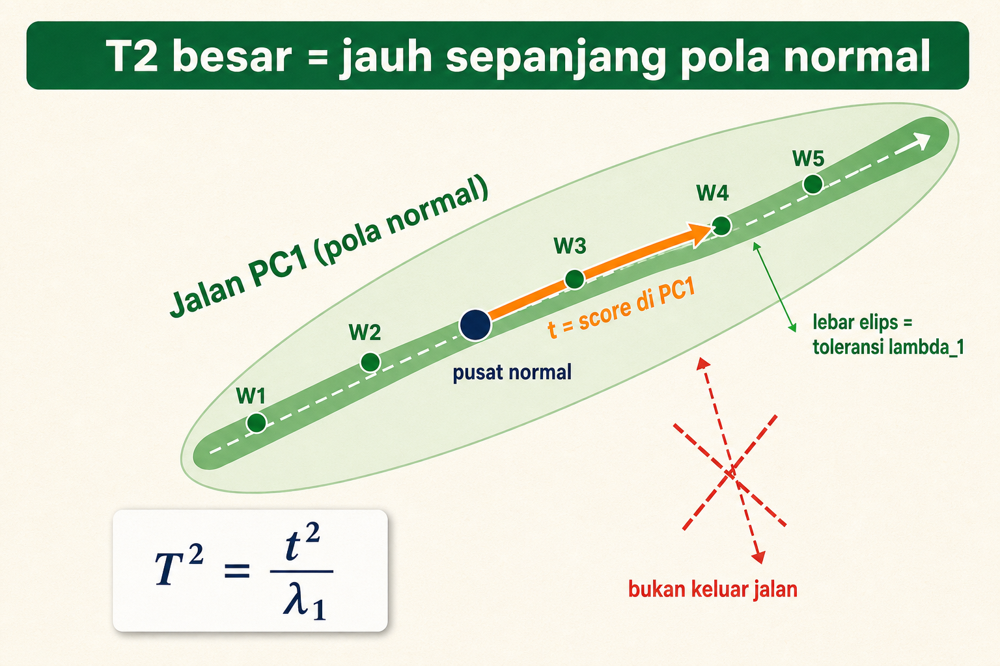

Jalan hijau adalah **PC1**, arah pola normal. Bulatan gelap di tengah adalah **pusat normal**, kebiasaan rata-rata pompa. Lima titik W1 sampai W5 adalah window training yang semuanya duduk rapi di atas jalan.

#### 2. Elips toleransi

Elips tipis yang membungkus jalan itu adalah **toleransi**. Lebarnya diatur oleh $\lambda_1$, yaitu eigenvalue PC1. Kalau arah ini memang biasa berubah banyak, elipsnya lebar, jadi jarak jauh di arah itu belum langsung dianggap aneh.

#### 3. T2 = melaju di jalan

Panah oranye berjalan **searah jalan**, dari pusat normal ke titik window. Panjang langkah itulah yang diukur T2. Makin jauh titik meluncur ke ujung jalan, makin besar T2. Ingat: T2 besar belum tentu rusak, titiknya masih di atas aspal.

#### 4. Bukan keluar jalan

Tanda silang merah kecil mengingatkan: T2 tidak mengukur seberapa jauh titik **keluar** dari jalan. Itu tugas Q nanti. T2 murni jarak sepanjang jalan.

#### 5. Jembatan ke rumus

Cerita jalan ini persis rumus di bawah:

$$
T^2=\frac{t^2}{\lambda_1}
$$

$t$ adalah seberapa jauh titik di jalan (score PC1), dikuadratkan supaya arah maju atau mundur sama saja, lalu dibagi $\lambda_1$ sebagai lebar toleransi.

#### 6. Hubungkan ke angka window

Lihat tabel di bawah. W5 punya $t=1.886$, paling jauh dari pusat, jadi $T^2=1.805$ paling besar. W3 hampir di pusat ($t=-0.248$), jadi $T^2=0.031$ paling kecil. Semua tetap di atas jalan, hanya beda jauhnya melaju.

#### 7. Self check

Tutup gambar, jawab cepat:

1. Jalan hijau melambangkan apa?
2. Panah oranye mengukur jarak ke arah mana?
3. Kenapa kita bagi dengan $\lambda_1$?
4. T2 besar selalu berarti rusak? Kenapa tidak?

Kalau keempatnya lancar, lanjut ke hitungan angka di bawah.

Hotelling T2 mengukur seberapa jauh window berada di subspace PCA yang disimpan.

Karena kita hanya menyimpan 1 PC, rumusnya sederhana:

$$
T^2=\frac{t^2}{\lambda_1}
$$

Arti simbol:

| Simbol | Arti |
|---|---|
| $T^2$ | skor Hotelling T2 |
| $t$ | score PCA pada PC1 |
| `t^2` | score dikuadratkan |
| $\lambda_1$ | eigenvalue PC1 |

Kenapa dibagi $\lambda_1$? Karena PC yang variasi normalnya besar diberi toleransi lebih besar. Kalau arah itu memang biasa berubah banyak, jarak di arah itu tidak langsung dianggap aneh.

### 16.1 T2 untuk W1

Untuk W1:

$$
t_{W1}=-1.762,\quad \lambda_1=1.971
$$

Hitung:

$$
T^2_{W1}=\frac{(-1.762)^2}{1.971}=\frac{3.105}{1.971}=1.575
$$

### 16.2 T2 semua window training

| Window | $t$ | $t^2$ | $T^2=t^2/1.971$ |
|---:|---:|---:|---:|
| W1 | -1.762 | 3.105 | 1.575 |
| W2 | -0.695 | 0.483 | 0.245 |
| W3 | -0.248 | 0.062 | 0.031 |
| W4 | 0.819 | 0.671 | 0.340 |
| W5 | 1.886 | 3.557 | 1.805 |

Interpretasi:

| $T^2$ | Arti sederhana |
|---|---|
| kecil | dekat pusat pola normal |
| besar | jauh di sepanjang arah normal |

W5 punya T2 paling besar karena ia paling jauh di sisi energi dan frekuensi tinggi, tetapi masih mengikuti pola normal naik bersama.

Kalau sudah paham bagian ini, kamu harus bisa menghitung T2 dari satu nilai $t$.

## Bagian 17. Q atau SPE

### Visual atlas: Q/SPE sebagai sisa gambar ulang PCA

Masih di jalan yang sama. Kalau T2 mengukur maju di jalan, Q mengukur hal lain: seberapa jauh titik **melenceng keluar** dari jalan. Q adalah sisa yang tidak bisa digambar ulang oleh PC1.

#### 1. Lihat petanya

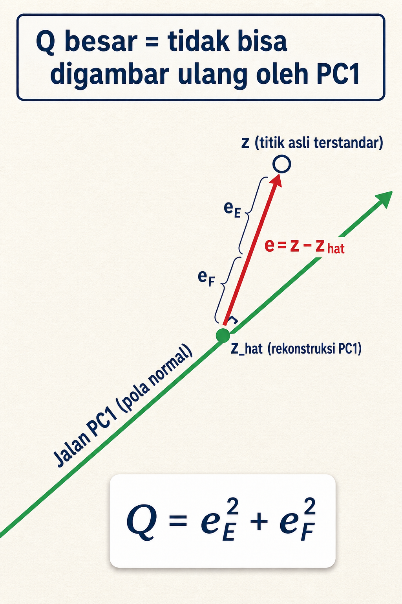

Titik kosong $z$ adalah window asli setelah distandardisasi. Titik di jalan, $\hat z$, adalah usaha PCA menggambar ulang $z$ hanya dengan PC1.

#### 2. PCA mencoba menggambar ulang

PCA tidak menyimpan titik asli. Ia hanya boleh menaruh titik **di jalan**. Maka ia memilih titik terdekat di jalan, yaitu $\hat z$, sebagai tebakan terbaiknya untuk $z$.

#### 3. Q = sisa yang gagal digambar

Panah merah dari $\hat z$ ke $z$ adalah **residual** $e=z-\hat z$. Itu bagian yang tidak tertangkap PC1. Sudut siku kecil menandai bahwa residual diukur **tegak lurus keluar** jalan, bukan sepanjang jalan.

#### 4. Dua komponen residual

Panah merah punya dua bagian, $e_E$ dan $e_F$, yaitu sisa di fitur E dan fitur F. Keduanya dikuadratkan supaya tidak saling menghapus, lalu dijumlahkan.

#### 5. Jembatan ke rumus

Gambar ini persis rumus di bawah:

$$
Q=e_E^2+e_F^2
$$

Q besar berarti panah merah panjang, titik jauh dari jalan, hubungan antar fitur sudah tidak cocok dengan pola normal.

#### 6. Hubungkan ke angka window

Untuk window training, panah merahnya pendek. Contoh W1 punya $e_E=-0.019$ dan $e_F=0.018$, jadi $Q=0.001$, hampir menempel jalan. Itu sebabnya semua $Q$ training kecil di tabel bawah.

#### 7. Self check

Tutup gambar, jawab cepat:

1. Apa beda $z$ dan $\hat z$?
2. Panah merah mengukur jarak ke arah mana?
3. Kenapa residual dikuadratkan sebelum dijumlah?
4. Q besar artinya apa tentang hubungan E dan F?

Kalau lancar, lanjut ke hitungan residual di bawah.

Q atau SPE mengukur sisa error rekonstruksi.

Kita pakai rumus:

$$
Q=\mathrm{SPE}=e_E^2+e_F^2
$$

Arti simbol:

| Simbol | Arti |
|---|---|
| $Q$ | Q statistic, sama dengan SPE di catatan ini |
| $\mathrm{SPE}$ | squared prediction error |
| $e_E$ | residual fitur E |
| $e_F$ | residual fitur F |
| $e_E^2$ | residual E dikuadratkan |
| $e_F^2$ | residual F dikuadratkan |

Bahasa bayinya: lihat sisa error di setiap fitur, kuadratkan supaya tidak saling hapus, lalu jumlahkan.

### 17.1 Q untuk W1

Residual W1:

$$
e_E=-0.019,\quad e_F=0.018
$$

Hitung:

$$
Q_{W1}=(-0.019)^2+(0.018)^2=0.000361+0.000324=0.000685
$$

Dibulatkan:

$$
Q_{W1}=0.001
$$

### 17.2 Q semua window training

| Window | $e_E$ | $e_F$ | $e_E^2$ | $e_F^2$ | $Q/\mathrm{SPE}$ |
|---:|---:|---:|---:|---:|---:|
| W1 | -0.019 | 0.018 | 0.000 | 0.000 | 0.001 |
| W2 | -0.141 | 0.140 | 0.020 | 0.020 | 0.040 |
| W3 | 0.175 | -0.176 | 0.031 | 0.031 | 0.062 |
| W4 | 0.053 | -0.053 | 0.003 | 0.003 | 0.006 |
| W5 | -0.068 | 0.070 | 0.005 | 0.005 | 0.010 |

Tabel di atas membulatkan $e_E^2$ dan $e_F^2$ ke tiga desimal. Untuk angka sangat kecil, ini bisa membingungkan karena terlihat seperti `0.000`, padahal bukan nol.

Contoh W1 dengan enam desimal:

| Komponen | Nilai residual | Kuadrat enam desimal |
|---|---:|---:|
| $e_E$ | -0.019 | 0.000361 |
| $e_F$ | 0.018 | 0.000324 |
| jumlah |  | 0.000685 |

Jadi $Q_{W1}$ kecil, bukan hilang. Saat dibulatkan tiga desimal, `0.000685` menjadi kira-kira `0.001`.

Interpretasi:

| $Q$ | Arti sederhana |
|---|---|
| kecil | window bisa digambar ulang oleh PC1 dengan baik |
| besar | ada pola yang tidak cocok dengan PC1 |

Jika energi naik tetapi frekuensi tidak ikut naik, titik bisa jauh dari garis PC1. Q akan besar.

Kalau sudah paham bagian ini, kamu harus bisa menghitung Q dari residual.

## Bagian 18. Threshold atau ambang batas

### Visual atlas: threshold sebagai pagar normal

Skor T2 dan Q sudah selesai dihitung, tetapi angka mentah belum bisa memutuskan apa-apa. Kita butuh **pagar**. Threshold adalah pagar di sekeliling kebiasaan normal pompa. Window yang masih di dalam pagar dianggap normal. Window yang melompati pagar baru dicurigai.

#### 1. Lihat petanya

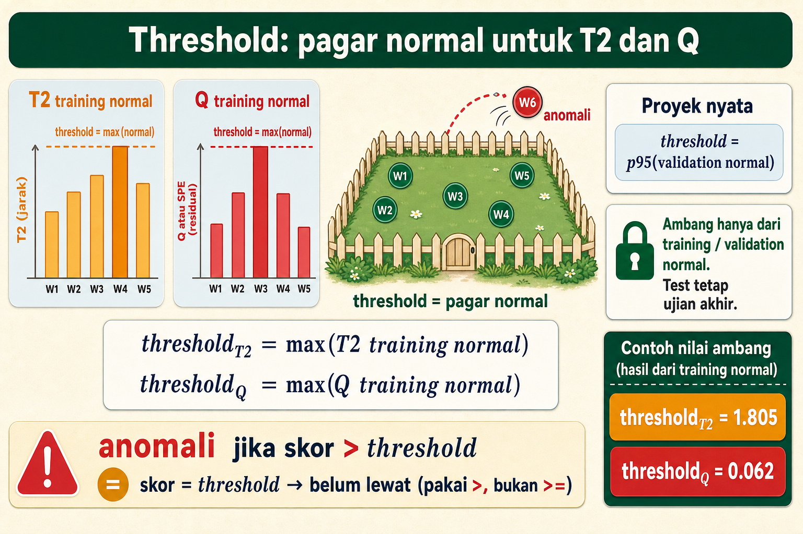

Di kiri ada dua diagram batang. Batang oranye adalah skor T2 lima window normal W1 sampai W5. Batang merah adalah skor Q lima window normal yang sama. Di kanan ada halaman bergaris pagar: titik normal duduk tenang di dalam, satu titik merah melompat keluar dan diberi label anomali.

#### 2. Tinggi pagar sama dengan skor normal tertinggi

Untuk latihan tangan, pagar dipasang setinggi batang paling tinggi. Garis putus-putus `threshold = max(normal)` menempel di puncak batang tertinggi. Artinya semua window normal masih tertutup pagar, dan apa pun yang lebih tinggi dari itu dianggap melewati batas.

#### 3. Pagar versi proyek nyata

Kartu `Proyek nyata` mengingatkan bahwa `max` itu rapuh. Satu skor normal yang kebetulan besar bisa membuat pagar terlalu tinggi. Maka proyek nyata sering memakai `threshold = p95(validation normal)`, yaitu batas yang masih meloloskan sekitar 95 persen skor normal.

#### 4. Aturan anti-bocor

Kartu bergembok adalah aturan paling penting: ambang hanya boleh dihitung dari training atau validation normal. Test tetap menjadi ujian akhir. Kalau threshold diintip dari test, evaluasi bocor dan model terlihat lebih pintar dari aslinya.

#### 5. Garis keputusan dan kasus tepi

Strip keputusan menulis `anomali jika skor > threshold`. Perhatikan tandanya: kita pakai `>`, bukan `>=`. Jadi kalau skor persis sama dengan threshold, di catatan ini ia belum dianggap melewati pagar. Pilih satu aturan sejak awal lalu pakai konsisten.

#### 6. Jembatan ke rumus dan angka

Cerita pagar ini persis rumus di bawah:

$$
\text{threshold}_{T^2}=\max(T^2\ \text{training normal})=1.805
$$

$$
\text{threshold}_Q=\max(Q\ \text{training normal})=0.062
$$

Angka `1.805` datang dari T2 terbesar, yaitu W5. Angka `0.062` datang dari Q terbesar, yaitu W3. Keduanya bisa kamu cek pada tabel training di bawah.

#### 7. Self check

Tutup gambar, jawab cepat:

1. Kenapa kita butuh pagar sebelum memutuskan anomali?
2. Tinggi pagar manual diambil dari nilai apa?
3. Kenapa proyek nyata lebih suka p95 validation daripada max?
4. Kalau skor persis sama dengan threshold, lewat atau tidak di catatan ini?

Kalau keempatnya lancar, lanjut ke hitungan ambang di bawah.

Skor T2 dan Q baru berguna kalau kita punya batas.

Kita akan pakai threshold empiris sederhana dari data normal training. Untuk latihan tangan, cara paling mudah adalah mengambil nilai maksimum dari skor normal training.

$$
\text{threshold}_{T^2}=\max(T^2\ \text{training normal})
$$

$$
\text{threshold}_Q=\max(Q\ \text{training normal})
$$

Arti simbol:

| Simbol | Arti |
|---|---|
| $\text{threshold}_{T^2}$ | batas T2 yang dianggap masih normal |
| $\text{threshold}_Q$ | batas Q yang dianggap masih normal |
| `max` | nilai terbesar |

### 18.1 Ambang T2

T2 training:

| Window | T2 |
|---:|---:|
| W1 | 1.575 |
| W2 | 0.245 |
| W3 | 0.031 |
| W4 | 0.340 |
| W5 | 1.805 |

Nilai terbesar:

$$
\text{threshold}_{T^2}=1.805
$$

### 18.2 Ambang Q

Q training:

| Window | Q |
|---:|---:|
| W1 | 0.001 |
| W2 | 0.040 |
| W3 | 0.062 |
| W4 | 0.006 |
| W5 | 0.010 |

Nilai terbesar:

$$
\text{threshold}_Q=0.062
$$

### 18.3 Catatan threshold untuk proyek nyata

Untuk belajar manual, `max(training normal)` cukup mudah.

Untuk proyek nyata, threshold lebih baik dikalibrasi dari validation normal, misalnya:

$$
\text{threshold}_{T^2}=p95(T^2\ \text{validation normal})
$$

$$
\text{threshold}_Q=p95(Q\ \text{validation normal})
$$

Di sini $p95$ berarti nilai yang kira-kira lebih besar dari 95 persen data normal. Kalau ada 100 skor normal, sekitar 95 skor berada di bawah p95.

Aturan anti-bocor:

| Aturan | Kenapa |
|---|---|
| jangan fit scaler pada validation/test | normalisasi harus berasal dari training normal |
| jangan pilih threshold dari test | test harus tetap menjadi ujian akhir |
| jangan pakai label anomaly sebagai fitur | model akan curang |
| simpan threshold bersama model | inference harus memakai batas yang sama |

Catatan operator perbandingan: di catatan ini keputusan memakai tanda $>$.

$$
\text{anomali jika skor}>\text{threshold}
$$

Bukan:

$$
\text{anomali jika skor}\ge\text{threshold}
$$

Artinya, kalau skor persis sama dengan threshold, ia belum dianggap melewati batas pada aturan catatan ini. Dalam proyek nyata, pilih satu aturan sejak awal, tulis di metodologi, lalu pakai konsisten di training, evaluasi, dan inference.

Kalau sudah paham bagian ini, kamu harus bisa:

| Kamu harus bisa | Hasil contoh |
|---|---:|
| memilih threshold_T2 manual | 1.805 |
| memilih threshold_Q manual | 0.062 |
| menjelaskan p95 | batas yang meloloskan sekitar 95 persen normal |

## Bagian 19. Window inference baru

### Visual atlas: keputusan inference dari T2 dan Q

Bagian ini menghitung satu window baru dari awal sampai vonis. Sebelum tenggelam di angka, lihat alur keputusannya sebagai satu jalur dengan dua cabang alarm.

#### 1. Lihat alurnya

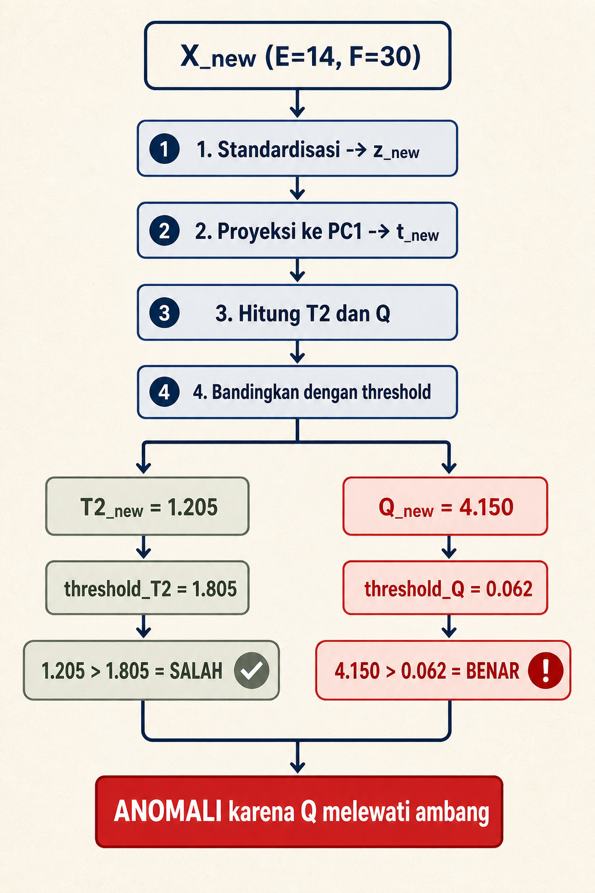

Mulai dari atas: window baru `X_new` dengan E=14 dan F=30 turun melewati empat langkah, lalu pecah jadi dua cabang.

#### 2. Empat langkah persiapan

Urutannya selalu sama: standardisasi jadi $z_{\text{new}}$, proyeksi ke PC1 jadi $t_{\text{new}}$, hitung T2 dan Q, baru bandingkan dengan threshold. Jangan menghitung mean atau std baru, pakai milik training.

#### 3. Cabang T2 (kiri)

Cabang kiri tenang. $T^2_{\text{new}}=1.205$ dibandingkan $\text{threshold}_{T^2}=1.805$. Karena $1.205>1.805$ adalah **SALAH**, alarm T2 tidak bunyi. Titik belum terlalu jauh melaju di jalan.

#### 4. Cabang Q (kanan)

Cabang kanan merah. $Q_{\text{new}}=4.150$ dibandingkan $\text{threshold}_Q=0.062$. Karena $4.150>0.062$ adalah **BENAR**, alarm Q bunyi keras. Titik melenceng jauh keluar jalan.

#### 5. Jembatan ke rumus

Aturannya satu OR:

$$
\mathrm{is\_anomaly}=(T^2_{\text{new}}>\text{threshold}_{T^2})\ \mathrm{OR}\ (Q_{\text{new}}>\text{threshold}_Q)
$$

Cukup satu cabang benar untuk memicu anomali. Di sini Q yang menangkapnya.

#### 6. Vonis akhir

Kotak merah bawah: **anomali karena Q melewati ambang**. T2 sendirian akan meloloskan window ini. Q yang menyelamatkan deteksi. Inilah kenapa kita butuh dua skor, bukan satu.

#### 7. Self check

Tutup gambar, jawab cepat:

1. Empat langkah sebelum membandingkan threshold, apa saja urutannya?
2. Cabang mana yang SALAH, cabang mana yang BENAR?
3. Kenapa aturan OR cukup satu cabang benar?
4. Kalau hanya pakai T2, apa yang terjadi pada window ini?

Kalau lancar, ikuti hitungan langkah demi langkah di bawah.

Sekarang model sudah punya semua bekal:

| Benda | Nilai |
|---|---:|
| `mu_E` | 10 |
| `s_E` | 1.581 |
| `mu_F` | 30.4 |
| `s_F` | 1.140 |
| $p_1$ | `[0.707, 0.707]` |
| $\lambda_1$ | 1.971 |
| $\text{threshold}_{T^2}$ | 1.805 |
| $\text{threshold}_Q$ | 0.062 |

Window baru punya fitur spektral:

| Window baru | E | F |
|---|---:|---:|
| X_new | 14 | 30 |

Secara rasa, ini mencurigakan. Energi band tinggi, tetapi frekuensi dominan tidak ikut naik. Pada data normal, energi dan frekuensi cenderung naik bersama.

Sekarang kita hitung dengan prosedur PCA T2/Q.

### 19.1 Standardisasi window baru

Pakai mean dan standar deviasi training. Jangan hitung baru.

Untuk E:

$$
z_E=\frac{E_{\text{new}}-\mu_E}{s_E}=\frac{14-10}{1.581}=\frac{4}{1.581}=2.530
$$

Untuk F:

$$
z_F=\frac{F_{\text{new}}-\mu_F}{s_F}=\frac{30-30.4}{1.140}=\frac{-0.4}{1.140}=-0.351
$$

Jadi:

$$
z_{\text{new}}=[2.530,-0.351]
$$

Arti z-score ini:

| Fitur | z-score | Arti |
|---|---:|---|
| E | 2.530 | energi jauh di atas rata-rata normal |
| F | -0.351 | frekuensi sedikit di bawah rata-rata normal |

Ini sudah memberi tanda: E tinggi, F tidak ikut tinggi.

### 19.2 Proyeksi window baru ke PC1

Rumus:

$$
t_{\text{new}}=z_{\text{new}}p_1
$$

Dengan angka:

$$
t_{\text{new}}=(2.530)(0.707)+(-0.351)(0.707)=1.789+(-0.248)=1.541
$$

Arti `t_new = 1.541`: window baru berada di sisi tinggi PC1, tetapi belum tentu terlalu ekstrem.

### 19.3 Hitung T2 window baru

Rumus:

$$
T^2_{\text{new}}=\frac{t_{\text{new}}^2}{\lambda_1}
$$

Hitung:

$$
T^2_{\text{new}}=\frac{(1.541)^2}{1.971}=\frac{2.375}{1.971}=1.205
$$

Bandingkan dengan threshold:

$$
T^2_{\text{new}}=1.205,\quad \text{threshold}_{T^2}=1.805
$$

$$
1.205>1.805\ \text{adalah False}
$$

Dari T2 saja, window baru belum melewati batas ekstrem di sepanjang PC1.

### 19.4 Rekonstruksi window baru

Rumus:

$$
\hat z_{\text{new}}=t_{\text{new}}p_1^\top
$$

Hitung:

$$
\hat z_{\text{new}}=1.541[0.707,0.707]=[1.090,1.090]
$$

PCA mencoba menggambar ulang window baru sebagai titik di garis normal PC1. Karena PC1 menganggap E dan F naik bersama, rekonstruksi membuat dua komponen sama-sama tinggi.

### 19.5 Residual window baru

Rumus:

$$
e_{\text{new}}=z_{\text{new}}-\hat z_{\text{new}}
$$

Hitung:

$$
e_{\text{new}}=[2.530,-0.351]-[1.090,1.090]=[2.530-1.090,-0.351-1.090]=[1.440,-1.441]
$$

Residual besar. PCA ingin menggambar ulang E dan F sama-sama tinggi, tetapi data asli punya E tinggi dan F rendah. Selisihnya besar.

### 19.6 Hitung Q/SPE window baru

Rumus:

$$
Q_{\text{new}}=e_E^2+e_F^2
$$

Hitung:

$$
Q_{\text{new}}=(1.440)^2+(-1.441)^2=2.074+2.076=4.150
$$

Bandingkan dengan threshold:

$$
Q_{\text{new}}=4.150,\quad \text{threshold}_Q=0.062
$$

$$
4.150>0.062\ \text{adalah True}
$$

Q melewati ambang dengan sangat besar.

### 19.7 Keputusan akhir

Aturan:

$$
\mathrm{is\_anomaly}=(T^2_{\text{new}}>\text{threshold}_{T^2})\ \mathrm{OR}\ (Q_{\text{new}}>\text{threshold}_Q)
$$

Kita memakai $>$, bukan $\ge$. Jadi kata "melewati threshold" berarti lebih besar dari threshold, bukan sama dengan threshold.

Masukkan angka:

$$
\mathrm{is\_anomaly}=(1.205>1.805)\ \mathrm{OR}\ (4.150>0.062)=\mathrm{False}\ \mathrm{OR}\ \mathrm{True}=\mathrm{True}
$$

Jadi window baru diklasifikasikan sebagai anomali.

### 19.8 Skor gabungan sederhana

Kadang kita ingin satu angka ringkas. Kita bisa pakai:

$$
\text{score}=\max\left(\frac{T^2_{\text{new}}}{\text{threshold}_{T^2}},\frac{Q_{\text{new}}}{\text{threshold}_Q}\right)
$$

Arti simbol:

| Simbol | Arti |
|---|---|
| $\text{score}$ | skor gabungan relatif terhadap threshold |
| `max` | ambil nilai terbesar |
| `T2_new / threshold_T2` | seberapa dekat T2 ke ambang |
| `Q_new / threshold_Q` | seberapa dekat Q ke ambang |

Hitung:

$$
\frac{T^2_{\text{new}}}{\text{threshold}_{T^2}}=\frac{1.205}{1.805}=0.668
$$

$$
\frac{Q_{\text{new}}}{\text{threshold}_Q}=\frac{4.150}{0.062}=66.935
$$

$$
\text{score}=\max(0.668,66.935)=66.935
$$

Karena `score > 1`, window anomali. Penyebab utamanya Q/SPE, bukan T2.

Bahasa operatornya:

```text
Window ini tidak terlalu ekstrem di sepanjang pola normal utama, tetapi hubungan antar fitur rusak. Energi band tinggi, frekuensi dominan tidak ikut naik seperti pola normal.
```

Kalau sudah paham bagian ini, kamu harus bisa menghitung inference dari awal sampai keputusan akhir.

## Bagian 20. Membaca kombinasi T2 dan Q

### Visual atlas: T2 dan Q sebagai peta jalan PC1

Sebelum membaca angka, lihat dulu gambarnya. Bagian ini memakai satu cerita sederhana: pola normal adalah sebuah **jalan**. T2 dan Q cuma dua cara mengukur posisi satu titik terhadap jalan itu.

#### 1. Road scene

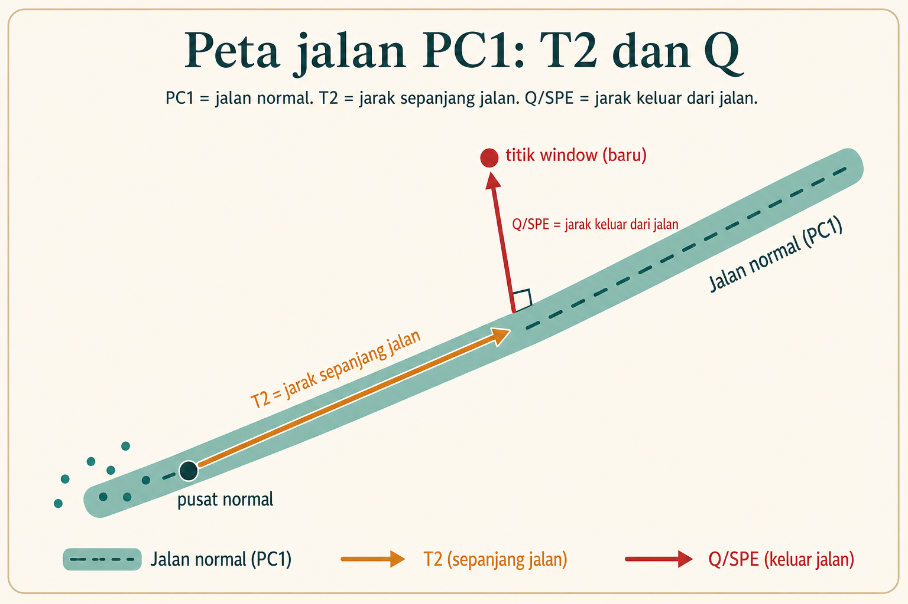

Lihat jalan hijau di gambar. Jalan itu adalah **PC1**, yaitu pola normal pompa. Titik-titik kecil di pangkal jalan adalah window-window normal. Bulatan gelap bernama **pusat normal** adalah titik tengah kebiasaan pompa. Semua window sehat berkumpul dekat jalan ini.

#### 2. T2 = jarak sepanjang jalan

Panah oranye berjalan **searah jalan**. Itulah **T2**. T2 menjawab pertanyaan bayi: titik ini sudah berjalan sejauh apa dari pusat normal, tetapi masih di atas jalan? Kalau titik meluncur jauh ke ujung jalan, T2 membesar. Catatan penting: T2 besar belum tentu rusak. Titiknya masih di atas aspal, hanya posisinya jauh.

#### 3. Q/SPE = jarak keluar dari jalan

Panah merah keluar **tegak lurus dari jalan**, menuju titik window baru. Itulah **Q** atau **SPE**. Q menjawab pertanyaan bayi: titik ini melenceng berapa jauh keluar dari jalan? Sudut siku kecil di kaki panah merah mengingatkan bahwa Q diukur lurus keluar jalan, bukan sepanjang jalan. Q besar berarti hubungan antar fitur sudah tidak cocok lagi dengan pola normal.

#### 4. Dua arah yang berbeda

Tahan dua gambar mental ini: T2 = **maju di jalan**, Q = **keluar dari jalan**. Dua arah ini tegak lurus, jadi satu titik bisa punya T2 kecil tetapi Q besar, atau sebaliknya. Karena arahnya beda, satu skor saja tidak cukup untuk membaca window.

#### 5. Empat kasus di peta

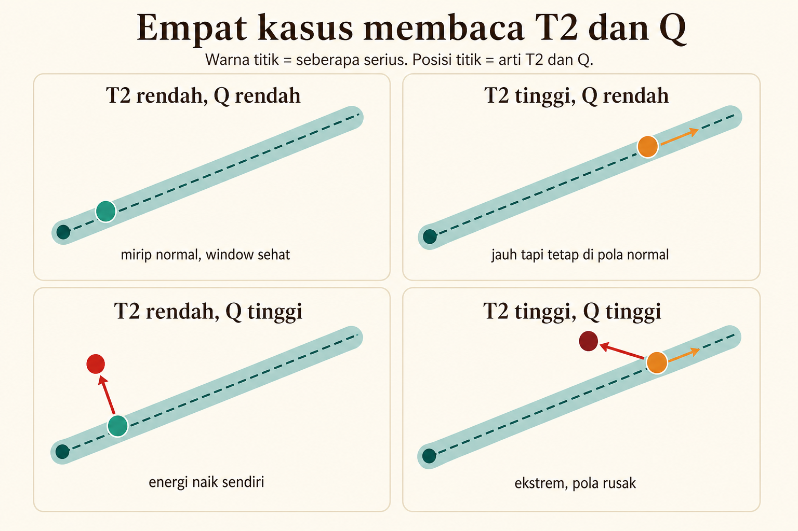

Gambar kedua memecah cerita menjadi empat panel. Jalannya sama di semua panel, yang berubah hanya posisi dan warna titik:

1. **T2 rendah, Q rendah** (titik hijau di jalan, dekat pusat): mirip normal, window sehat.
2. **T2 tinggi, Q rendah** (titik oranye jauh tetapi tetap di jalan): jauh tetapi masih mengikuti pola normal, cek apakah beban operasi memang tinggi.
3. **T2 rendah, Q tinggi** (titik merah keluar dari jalan dekat pusat): tidak cocok dengan pola normal, energi naik sendiri, cek hubungan antar fitur atau fault awal.
4. **T2 tinggi, Q tinggi** (titik merah tua jauh dan keluar jalan): ekstrem dan pola rusak, dua alarm sepakat, cek lebih serius.

Empat panel ini sama persis dengan tabel kombinasi di bawah. Pakai gambar dulu, baru baca tabel.

#### 6. Hubungkan ke contoh $X_{\text{new}}$

Contoh window baru kita berada di panel ketiga: **T2 rendah, Q tinggi**. Titiknya tidak jauh meluncur di jalan ($T^2$ belum lewat threshold), tetapi melenceng jauh keluar jalan ($Q$ jauh di atas threshold). Maka keputusannya anomali **karena Q, bukan karena T2**. Aturan $T^2$ OR $Q$ menangkapnya justru lewat Q.

#### 7. Self check

Tutup gambar, lalu jawab cepat:

1. Jalan hijau di gambar melambangkan apa? (pola normal / PC1)
2. Panah oranye dan panah merah, mana T2 dan mana Q?
3. Titik dengan T2 kecil tetapi Q besar ada di panel mana, dan apa artinya?
4. Kenapa kita tidak boleh memakai T2 saja untuk contoh $X_{\text{new}}$?

Kalau keempatnya bisa kamu jawab tanpa melihat gambar, lanjut ke detail angka di bawah.

T2 dan Q memberi dua sudut pandang. Jangan memilih salah satu saja saat membaca PCA T2/Q.

Ingat cerita jalan:

| Skor | Pertanyaan bayi | Gambar mental |
|---|---|---|
| T2 | jauh tidak di jalan normal? | posisi jauh di sepanjang jalan PC1 |
| Q/SPE | keluar tidak dari jalan normal? | posisi melenceng dari jalan PC1 |

Tabel kombinasi:

| Kondisi | Arti praktis | Contoh rasa pada pompa | Tindakan membaca |
|---|---|---|---|
| T2 rendah, Q rendah | mirip normal | window sehat | tidak ada tanda kuat |
| T2 tinggi, Q rendah | jauh tetapi masih mengikuti pola normal | energi dan frekuensi sama-sama naik | cek apakah beban operasi memang tinggi |
| T2 rendah, Q tinggi | tidak cocok dengan pola normal | energi naik sendiri, frekuensi tidak ikut | cek hubungan antar fitur, sensor, atau fault awal |
| T2 tinggi, Q tinggi | ekstrem dan pola rusak | fault besar mengubah level dan struktur spektral | cek lebih serius karena dua alarm sepakat |

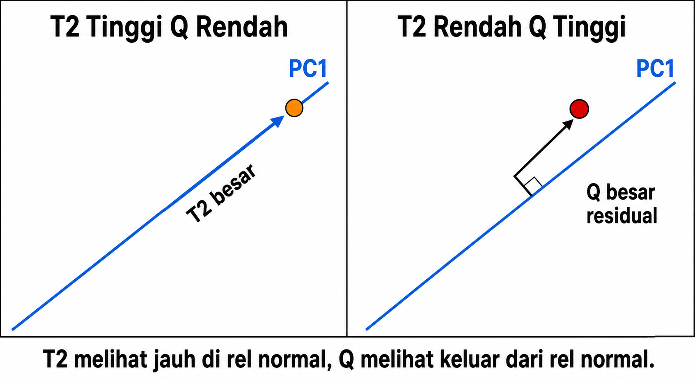

Pakai gambar ini sebagai pengingat cepat: T2 membesar saat titik berjalan jauh di rel normal. Q membesar saat titik keluar dari rel normal.

Mengapa dua skor perlu dipakai?

Jika hanya memakai T2, window baru pada contoh bisa lolos karena T2 tidak melewati threshold. Padahal Q sangat besar. Jika hanya memakai Q, kejadian yang sangat ekstrem tetapi masih berada di garis normal bisa kurang terlihat.

Jadi aturan $T^2$ OR $Q$ membuat detector peka terhadap dua bentuk keanehan:

1. jauh di arah normal,
2. keluar dari arah normal.

Untuk $X_{\text{new}}$, ceritanya begini:

| Bacaan | Nilai | Arti |
|---|---:|---|
| $T^2_{\text{new}}$ | 1.205 | belum lebih besar dari 1.805 |
| $Q_{\text{new}}$ | 4.150 | jauh lebih besar dari 0.062 |
| keputusan | anomali | Q melewati threshold |

Bahasa operatornya:

```text
Window tidak terlalu jauh di sepanjang jalan normal utama.
Tetapi window keluar jauh dari jalan normal itu.
Energi band tinggi, frekuensi dominan tidak ikut tinggi.
```

Kalau sudah paham bagian ini, kamu harus bisa menjelaskan kenapa contoh $X_{\text{new}}$ anomali karena Q, bukan karena T2.

## Bagian 21. Bentuk umum kalau PC lebih dari satu

### Visual atlas: banyak PC sebagai beberapa jalan normal

Sejauh ini kita hanya punya satu jalan normal, yaitu PC1. Tetapi proyek nyata bisa menyimpan beberapa jalan sekaligus. Bayangkan sebuah persimpangan: dari satu pusat normal memancar beberapa jalan, PC1, PC2, sampai PCA. Window punya bayangan di tiap jalan.

#### 1. Lihat petanya

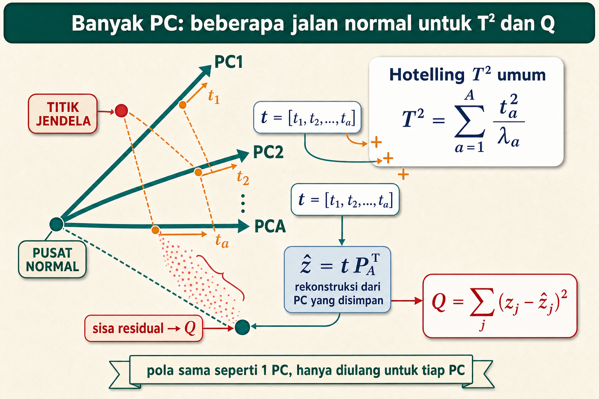

Dari bulatan pusat normal memancar beberapa jalan teal: PC1, PC2, sampai PCA. Titik window di samping menjatuhkan bayangan oranye ke tiap jalan, menghasilkan skor `t1`, `t2`, sampai `tA`.

#### 2. Beberapa jalan, beberapa bayangan

Kalau 1 PC berarti satu jalan, banyak PC berarti banyak jalan normal yang disimpan. Karena itu skor bukan lagi satu angka, tetapi satu vektor:

$$
t=[t_1,t_2,\ldots,t_A]
$$

Tiap $t_a$ adalah posisi bayangan window pada jalan ke-a.

#### 3. T2 sebagai jumlah kontribusi tiap jalan

Kartu `Hotelling T2 umum` menjumlahkan kontribusi semua jalan:

$$
T^2=\sum_{a=1}^{A}\frac{t_a^2}{\lambda_a}
$$

Tiap skor dikuadratkan, dibagi eigenvalue jalannya sendiri, lalu semua dijumlahkan. Untuk 1 PC, penjumlahan ini hanya punya satu suku, yaitu $t^2/\lambda_1$ yang sudah kita pakai.

#### 4. Rekonstruksi dari semua jalan

Window digambar ulang memakai semua PC yang disimpan:

$$
\hat z=tP_A^\top
$$

Di sini $P_A$ adalah kumpulan loading dari PC yang disimpan. Makin banyak jalan disimpan, makin mirip gambar ulang dengan titik asli.

#### 5. Q sebagai sisa yang tetap keluar

Awan merah pada gambar adalah residual, yaitu sisa yang tetap tidak tergambar walau semua jalan dipakai. Q tetap bertanya hal yang sama:

$$
Q=\sum_{j=1}^{p}(z_j-\hat z_j)^2
$$

#### 6. Hubungkan ke jalur utama

Pita bawah gambar berbunyi: pola sama seperti 1 PC, hanya diulang untuk tiap PC. Jadi jalur utama kita tetap aman. Kuasai dulu 2 fitur dan 1 PC, lalu multi-PC hanya pengulangan pola yang sama.

#### 7. Self check

Tutup gambar, jawab cepat:

1. Kalau ada A buah PC, skor window berbentuk apa?
2. Bagaimana T2 umum menjumlahkan kontribusi tiap PC?
3. Kenapa 1 PC hanyalah kasus khusus dari rumus umum?
4. Q multi-PC masih menanyakan hal yang sama atau berbeda?

Kalau lancar, lanjut ke penjelasan bentuk umum di bawah.

Bagian ini hanya pengantar. Jalur utama kita tetap 2 fitur dan 1 PC.

Tetapi di proyek nyata, PCA bisa menyimpan lebih dari satu PC. Misalnya ada banyak fitur spektral dan model menyimpan 3 PC.

Kalau PCA menyimpan $A$ principal component, score menjadi beberapa angka:

$$
t=[t_1,t_2,\ldots,t_A]
$$

Arti simbol:

| Simbol | Arti |
|---|---|
| $A$ | jumlah PC yang disimpan |
| $t_1$ | score pada PC1 |
| $t_2$ | score pada PC2 |
| $t_A$ | score pada PC ke-A |

Bahasa bayinya: kalau 1 PC berarti satu jalan utama, banyak PC berarti beberapa jalan arah normal yang disimpan. Window punya bayangan di tiap jalan.

Hotelling T2 umum:

$$
T^2=\sum_{a=1}^{A}\frac{t_a^2}{\lambda_a}
$$

Arti praktisnya: setiap score dikuadratkan, lalu dibagi eigenvalue PC masing-masing, lalu dijumlahkan.

Tabel langkah T2 multi-PC:

| PC | Score | Eigenvalue | Bagian T2 |
|---:|---:|---:|---:|
| 1 | $t_1$ | $\lambda_1$ | `t1^2 / lambda_1` |
| 2 | $t_2$ | $\lambda_2$ | `t2^2 / lambda_2` |
| A | $t_A$ | $\lambda_A$ | `tA^2 / lambda_A` |

Rekonstruksi umum:

$$
\hat z=tP_A^\top
$$

Arti simbol:

| Simbol | Arti |
|---|---|
| $P_A$ | matrix loading dari PC yang disimpan |
| $P_A^\top$ | transpose dari matrix loading |
| $\hat z$ | rekonstruksi dari PC yang disimpan |

Q/SPE umum:

$$
Q=\mathrm{SPE}=\sum_{j=1}^{p}(z_j-\hat z_j)^2
$$

Arti simbol:

| Simbol | Arti |
|---|---|
| $j$ | nomor fitur |
| $z_j$ | z-score asli fitur ke-j |
| $\hat z_j$ | rekonstruksi fitur ke-j |

Bahasa bayinya: walaupun PC lebih dari satu, Q tetap bertanya hal yang sama. Setelah window digambar ulang dari semua PC yang disimpan, masih ada sisa tidak?

Untuk belajar kertas, jangan mulai dari multi-PC. Kuasai 2 fitur dan 1 PC dulu. Setelah itu, multi-PC hanya pengulangan pola yang sama.

Kalau sudah paham bagian ini, kamu harus bisa melihat bahwa rumus multi-PC hanya mengulang pola 1 PC beberapa kali.

## Bagian 22. Worksheet lengkap training normal

### Visual atlas: worksheet training sebagai jalur kerja

Bagian ini panjang, jadi gampang tersesat. Pakai satu gambar dulu sebagai peta. Worksheet training adalah sebuah **jalur kerja**, seperti ban berjalan di pabrik: data normal masuk di ujung depan, lalu melewati stasiun demi stasiun sampai keluar menjadi threshold.

#### 1. Lihat jalurnya

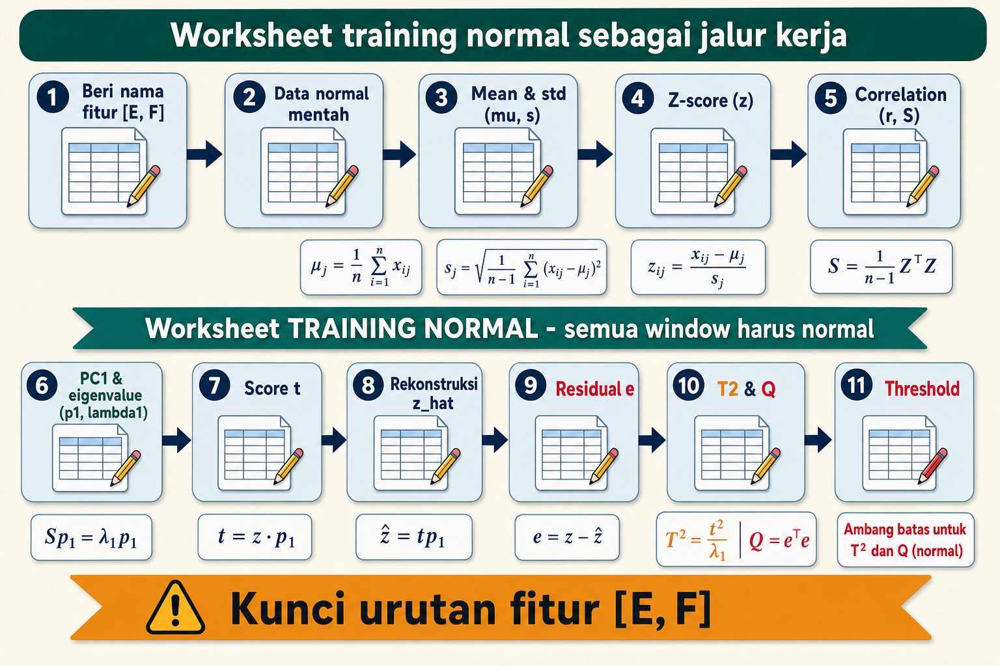

Ada sebelas stasiun bernomor, mengular dari kiri ke kanan. Pita teal di tengah menegaskan: ini worksheet training normal, jadi semua window harus normal.

#### 2. Bagian depan jalur

Stasiun 1 dan 2 menyiapkan bahan: beri nama fitur `[E, F]` dengan jelas, lalu tulis data normal mentah. Tanpa nama dan urutan fitur yang rapi, stasiun berikutnya bisa salah baca.

#### 3. Bagian adil dan hubungan

Stasiun 3 sampai 5 membuat fitur adil lalu membaca hubungannya: hitung mean dan standar deviasi, ubah menjadi z-score, lalu hitung correlation. Di sinilah fitur beda satuan dibuat sebanding.

#### 4. Bagian PCA dan skor

Stasiun 6 dan 7 mencari jalan normal: tentukan PC1 dan eigenvalue, lalu proyeksikan tiap window menjadi score `t`. Jalan normal lahir di sini.

#### 5. Bagian sisa dan skor akhir

Stasiun 8 sampai 10 menghitung sisa dan skor: gambar ulang `z_hat`, hitung residual `e`, lalu hitung T2 dan Q untuk tiap window normal.

#### 6. Jembatan ke rumus dan pagar

Stasiun 11 memasang pagar dari skor normal. Rumus inti sepanjang jalur:

$$
z=\frac{x-\mu}{s},\quad t=zp_1,\quad T^2=\frac{t^2}{\lambda_1},\quad Q=\sum_j e_j^2
$$

Pita oranye di bawah adalah peringatan keras: kunci urutan fitur `[E, F]`. Kalau urutan berubah, semua stasiun setelahnya ikut salah.

#### 7. Self check

Tutup gambar, jawab cepat:

1. Kenapa worksheet ini hanya boleh diisi window normal?
2. Stasiun mana yang membuat fitur beda satuan jadi sebanding?
3. Di stasiun mana jalan normal PC1 lahir?
4. Kenapa urutan fitur `[E, F]` wajib dikunci?

Kalau lancar, lanjut mengisi worksheet di bawah.

Salin bagian ini ke kertas kalau ingin latihan dari data lain. Worksheet ini sengaja panjang agar kamu tidak perlu menebak kolom apa yang harus ditulis.

### 22.1 Template penamaan fitur

Sebelum hitung angka, beri nama fitur dengan jelas.

| Nomor fitur | Nama fitur manusia | Simbol pendek | Satuan | Asal dari spektrum | DC dipakai? |
|---:|---|---|---|---|---|
| 1 |  |  |  |  | ya atau tidak |
| 2 |  |  |  |  | ya atau tidak |

Contoh untuk catatan ini:

| Nomor fitur | Nama fitur manusia | Simbol pendek | Satuan | Asal dari spektrum | DC dipakai? |
|---:|---|---|---|---|---|
| 1 | energi band getaran | $E$ | unit energi | jumlah `M[k]^2` pada band pilihan | tidak |
| 2 | frekuensi dominan | $F$ | Hz | frekuensi dengan magnitude terbesar | tidak |

Kenapa penamaan fitur perlu rapi? Karena salah urutan fitur membuat PCA salah baca. Kalau training memakai urutan `[E, F]`, inference juga harus memakai urutan `[E, F]`.

### 22.2 Data fitur mentah

| Window | Fitur 1 | Fitur 2 |
|---:|---:|---:|
| W1 |  |  |
| W2 |  |  |
| W3 |  |  |
| W4 |  |  |
| W5 |  |  |

Catatan sebelum lanjut:

| Cek | Jawaban |
|---|---|
| $n$ jumlah window training |  |
| semua window normal? |  |
| urutan fitur sudah tetap? |  |
| satuan fitur sudah jelas? |  |

### 22.3 Mean dan standar deviasi fitur 1

| Window | x | x - mu | (x - mu)^2 |
|---:|---:|---:|---:|
| W1 |  |  |  |
| W2 |  |  |  |
| W3 |  |  |  |
| W4 |  |  |  |
| W5 |  |  |  |
| Jumlah |  |  |  |

$$
\mu_1=\frac{\sum x}{n}=\underline{\hspace{3cm}}
$$

$$
s_1^2=\frac{\sum(x-\mu_1)^2}{n-1}=\underline{\hspace{3cm}}
$$

$$
s_1=\sqrt{s_1^2}=\underline{\hspace{3cm}}
$$

### 22.4 Mean dan standar deviasi fitur 2

| Window | x | x - mu | (x - mu)^2 |
|---:|---:|---:|---:|
| W1 |  |  |  |
| W2 |  |  |  |
| W3 |  |  |  |
| W4 |  |  |  |
| W5 |  |  |  |
| Jumlah |  |  |  |

$$
\mu_2=\frac{\sum x}{n}=\underline{\hspace{3cm}}
$$

$$
s_2^2=\frac{\sum(x-\mu_2)^2}{n-1}=\underline{\hspace{3cm}}
$$

$$
s_2=\sqrt{s_2^2}=\underline{\hspace{3cm}}
$$

### 22.5 Z-score training

| Window |  x1 | z1 = (x1 - mu_1) / s_1 |  x2 | z2 = (x2 - mu_2) / s_2 |
| -----: | --: | ---------------------: | --: | ---------------------: |
|     W1 |     |                        |     |                        |
|     W2 |     |                        |     |                        |
|     W3 |     |                        |     |                        |
|     W4 |     |                        |     |                        |
|     W5 |     |                        |     |                        |

### 22.6 Cek z-score

Isi setelah tabel z-score selesai.

| Cek | Rumus kecil | Hasil | Harapan |
|---|---|---:|---|
| mean z1 | `sum(z1) / n` |  | mendekati 0 |
| mean z2 | `sum(z2) / n` |  | mendekati 0 |
| sample variance z1 | `sum(z1^2) / (n - 1)` |  | mendekati 1 |
| sample variance z2 | `sum(z2^2) / (n - 1)` |  | mendekati 1 |

Kalau hasil tidak mendekati harapan, biasanya ada salah hitung mean, standar deviasi, atau pembulatan terlalu kasar.

### 22.7 Correlation

| Window | z1 | z2 | z1 * z2 |
|---:|---:|---:|---:|
| W1 |  |  |  |
| W2 |  |  |  |
| W3 |  |  |  |
| W4 |  |  |  |
| W5 |  |  |  |
| Jumlah |  |  |  |

$$
r=\frac{\sum z_1z_2}{n-1}=\underline{\hspace{3cm}}
$$

$$
S=\begin{bmatrix}1 & r \\ r & 1\end{bmatrix}=\underline{\hspace{3cm}}
$$

Interpretasi tanda:

| Jika $r$ | Tulis interpretasi |
|---|---|
| positif | dua fitur cenderung naik bersama |
| negatif | satu fitur naik saat fitur lain turun |
| dekat nol | tidak ada arah garis linear yang kuat |

### 22.8 PC1

$$
p_1=[\underline{\hspace{1.5cm}},\underline{\hspace{1.5cm}}]
$$

$$
\lambda_1=\underline{\hspace{3cm}}
$$

$$
\text{variance PC1 dalam kasus dua fitur}=\frac{\lambda_1}{2}=\underline{\hspace{3cm}}
$$

Untuk kasus dua fitur naik bersama, biasanya mulai dengan:

$$
p_1=[0.707,0.707]
$$

$$
\lambda_1=1+r
$$

Untuk kasus satu fitur naik dan satu turun, arah yang masuk akal bisa:

$$
p_1=[0.707,-0.707]
$$

$$
\lambda_1=1+|r|
$$

Pilih arah sesuai tanda hubungan. Jangan pakai arah naik bersama kalau correlation jelas negatif.

### 22.9 Score, rekonstruksi, residual, T2, Q

| Window | z1 | z2 | t | z_hat_1 | z_hat_2 | e1 | e2 | e1^2 | e2^2 | T2 | Q |
|---:|---:|---:|---:|---:|---:|---:|---:|---:|---:|---:|---:|
| W1 |  |  |  |  |  |  |  |  |  |  |  |
| W2 |  |  |  |  |  |  |  |  |  |  |  |
| W3 |  |  |  |  |  |  |  |  |  |  |  |
| W4 |  |  |  |  |  |  |  |  |  |  |  |
| W5 |  |  |  |  |  |  |  |  |  |  |  |

Rumus yang dipakai:

$$
t=zp_1
$$

$$
\hat z=tp_1^\top
$$

$$
e=z-\hat z
$$

$$
T^2=\frac{t^2}{\lambda_1}
$$

$$
Q=e_1^2+e_2^2
$$

### 22.10 Threshold

$$
\text{threshold}_{T^2}=\max(T^2\ \text{training normal})=\underline{\hspace{3cm}}
$$

$$
\text{threshold}_Q=\max(Q\ \text{training normal})=\underline{\hspace{3cm}}
$$

Catatan tanda:

$$
\text{anomali jika skor}>\text{threshold}
$$

Kalau skor sama persis dengan threshold, aturan catatan ini belum menyebutnya melewati threshold.

## Bagian 23. Worksheet lengkap inference window baru

Gunakan worksheet ini setelah model PCA manual selesai dihitung. Jangan menghitung mean, standar deviasi, PC1, eigenvalue, atau threshold dari window baru.

### 23.1 Salin parameter training

Isi tabel ini sebelum menghitung inference.

| Parameter | Nilai training yang disalin | Dari bagian mana |
|---|---:|---|
| $\mu_1$ |  | mean fitur 1 |
| $s_1$ |  | standar deviasi fitur 1 |
| $\mu_2$ |  | mean fitur 2 |
| $s_2$ |  | standar deviasi fitur 2 |
| $p_{1,1}$ |  | komponen pertama PC1 |
| $p_{1,2}$ |  | komponen kedua PC1 |
| $\lambda_1$ |  | eigenvalue PC1 |
| $\text{threshold}_{T^2}$ |  | ambang T2 |
| $\text{threshold}_Q$ |  | ambang Q |
| urutan fitur |  | contoh `[E, F]` |

Checklist sebelum lanjut:

| Cek | Ya atau tidak |
|---|---|
| parameter disalin dari training normal |  |
| urutan fitur inference sama dengan training |  |
| tanda keputusan memakai $>$ |  |
| pembulatan dicatat |  |

### 23.2 Fitur mentah window baru

| Window | Fitur 1 | Fitur 2 | Catatan rasa awal |
|---|---:|---:|---|
| X_new |  |  |  |

### 23.3 Z-score pakai statistik training

$$
z_{1,\text{new}}=\frac{x_{1,\text{new}}-\mu_1}{s_1}=\underline{\hspace{3cm}}
$$

$$
z_{2,\text{new}}=\frac{x_{2,\text{new}}-\mu_2}{s_2}=\underline{\hspace{3cm}}
$$

$$
z_{\text{new}}=[\underline{\hspace{1.5cm}},\underline{\hspace{1.5cm}}]
$$

Tabel arti z-score:

| Fitur | z-score | Arti bayi |
|---|---:|---|
| fitur 1 |  |  |
| fitur 2 |  |  |

### 23.4 Projection

$$
t_{\text{new}}=z_{\text{new}}p_1=z_{1,\text{new}}p_{1,1}+z_{2,\text{new}}p_{1,2}=\underline{\hspace{3cm}}
$$

Arti $t_{\text{new}}$:

| Jika $t_{\text{new}}$ | Rasa |
|---|---|
| negatif besar | jauh di sisi rendah PC1 |
| dekat nol | dekat pusat PC1 |
| positif besar | jauh di sisi tinggi PC1 |

### 23.5 T2

$$
T^2_{\text{new}}=\frac{t_{\text{new}}^2}{\lambda_1}=\underline{\hspace{3cm}}
$$

Bandingkan:

$$
T^2_{\text{new}}>\text{threshold}_{T^2}\ ?
$$

Isi:

| Nilai | Angka |
|---|---:|
| $T^2_{\text{new}}$ |  |
| $\text{threshold}_{T^2}$ |  |
| $T^2_{\text{new}}>\text{threshold}_{T^2}$ | True atau False |

### 23.6 Reconstruction dan residual

$$
\hat z_{\text{new}}=t_{\text{new}}p_1^\top=[\underline{\hspace{1.5cm}},\underline{\hspace{1.5cm}}]
$$

$$
e_{\text{new}}=z_{\text{new}}-\hat z_{\text{new}}=[\underline{\hspace{1.5cm}},\underline{\hspace{1.5cm}}]
$$

Tabel residual:

| Fitur | z asli | z_hat | residual e | e^2 |
|---|---:|---:|---:|---:|
| fitur 1 |  |  |  |  |
| fitur 2 |  |  |  |  |

### 23.7 Q/SPE

$$
Q_{\text{new}}=e_{1,\text{new}}^2+e_{2,\text{new}}^2=\underline{\hspace{3cm}}
$$

Bandingkan:

$$
Q_{\text{new}}>\text{threshold}_Q\ ?
$$

Isi:

| Nilai | Angka |
|---|---:|
| $Q_{\text{new}}$ |  |
| $\text{threshold}_Q$ |  |
| $Q_{\text{new}}>\text{threshold}_Q$ | True atau False |

### 23.8 Decision table dengan score_T2 dan score_Q

Selain keputusan True atau False, tulis skor relatifnya.

$$
\text{score}_{T^2}=\frac{T^2_{\text{new}}}{\text{threshold}_{T^2}}
$$

$$
\text{score}_Q=\frac{Q_{\text{new}}}{\text{threshold}_Q}
$$

$$
\text{score}=\max(\text{score}_{T^2},\text{score}_Q)
$$

| Nilai | Rumus | Hasil | Arti |
|---|---|---:|---|
| $\text{score}_{T^2}$ | `T2_new / threshold_T2` |  | lebih dari 1 berarti T2 lewat |
| $\text{score}_Q$ | `Q_new / threshold_Q` |  | lebih dari 1 berarti Q lewat |
| $\text{score}$ | `max(score_T2, score_Q)` |  | skor ringkas paling besar |

Keputusan akhir:

| Pertanyaan | Jawaban |
|---|---|
| `T2_new > threshold_T2`? |  |
| `Q_new > threshold_Q`? |  |
| $\mathrm{is\_anomaly}$? |  |
| penyebab utama | T2 atau Q |
| kalimat alasan |  |

Tulis alasan singkat:

```text
Window ini normal atau anomali karena:
```

## Bagian 24. Kesalahan umum dan cara memperbaikinya

Gunakan bagian ini seperti tabel diagnosa. Cari gejala yang mirip dengan hasil hitunganmu.

| Kesalahan | Gejala | Cara memperbaiki |
|---|---|---|
| Mean dihitung dari semua data, termasuk window baru | skor terlihat terlalu jinak | hitung mean hanya dari training normal |
| Standar deviasi dihitung ulang saat inference | window baru menormalisasi dirinya sendiri | pakai standar deviasi training |
| Lupa scaling | fitur angka besar mendominasi PCA | hitung z-score dulu |
| Memakai $n$ untuk sample variance | standar deviasi sedikit berbeda | untuk latihan sample pakai $n-1$ |
| Menukar urutan fitur | hasil dot product terasa aneh | samakan urutan training dan inference |
| Salah tanda $p_1$ | score $t$ berbalik tanda | cek apakah fitur naik bersama atau berlawanan |
| Salah tanda residual | Q tetap sama jika hanya tanda terbalik, tetapi kontribusi fitur bisa salah | pakai `e = z - z_hat` secara konsisten |
| Q dijumlahkan tanpa kuadrat | residual positif dan negatif saling hapus | pakai jumlah kuadrat residual |
| Memakai semua PC pada contoh dua fitur | Q menjadi nol atau sangat kecil | simpan 1 PC untuk latihan Q/SPE |
| Lupa membagi T2 dengan eigenvalue | T2 terlalu besar atau tidak sebanding | pakai `T2 = t^2 / lambda_1` |
| Threshold diambil dari test set | evaluasi bocor | threshold dari training normal atau validation normal |
| Memakai $\ge$ padahal metodologi menulis $>$ | keputusan beda saat skor sama dengan threshold | pilih satu aturan dan tulis konsisten |
| Pembulatan terlalu cepat | hasil akhir beda cukup besar | simpan angka antara dengan lebih banyak digit |
| Mengira `0.000` berarti nol persis | Q kecil terlihat hilang | tulis enam desimal untuk residual kuadrat kecil |
| Mengira SKAB adalah data PDAM nyata | laporan menjadi salah konteks | tulis SKAB sebagai surrogate water circulation testbed |
| Menganggap dominant frequency selalu cukup | informasi energi band bisa hilang | pakai beberapa fitur spektral saat proyek nyata |
| Memasukkan DC bin tanpa sadar | fitur bisa lebih membaca offset daripada osilasi | putuskan sejak awal DC dipakai atau diabaikan |

Tabel diagnosa cepat:

| Yang terasa salah | Cek pertama | Cek kedua |
|---|---|---|
| semua z-score besar | mean atau standar deviasi salah | satuan fitur tertukar |
| correlation lebih dari 1 | pembagi salah | z-score tidak memakai sample std |
| panjang $p_1$ bukan 1 | angka loading salah | pembulatan terlalu kasar |
| T2 negatif | ada rumus salah | T2 harus dari kuadrat |
| Q negatif | ada rumus salah | Q harus dari kuadrat residual |
| Q training semua nol | mungkin semua PC dipakai | cek jumlah PC yang disimpan |
| inference terlalu normal | scaler dihitung ulang | threshold bocor dari test |

## Bagian 25. Cara mengecek jawaban sendiri

Gunakan daftar ini setelah selesai menghitung. Tutup rumus utama sebentar, lalu cek dari hasilmu sendiri.

### 25.1 Cek training

| Cek | Harusnya | Status |
|---|---|---|
| mean z-score tiap fitur | mendekati 0 |  |
| sample variance z-score tiap fitur | mendekati 1 |  |
| panjang $p_1$ | mendekati 1 |  |
| $\lambda_1$ untuk kasus `[1 r; r 1]` | `1 + r` jika $r$ positif |  |
| variance PC1 | `lambda_1 / 2` untuk dua fitur |  |
| T2 tidak negatif | selalu benar karena pakai kuadrat |  |
| Q tidak negatif | selalu benar karena pakai kuadrat residual |  |
| threshold_T2 | sama dengan nilai T2 training terbesar jika pakai max |  |
| threshold_Q | sama dengan nilai Q training terbesar jika pakai max |  |

### 25.2 Cek inference

| Cek | Harusnya | Status |
|---|---|---|
| z-score window baru | pakai mean dan standar deviasi training |  |
| $t_{\text{new}}$ | hasil dot product `z_new dot p1` |  |
| `z_hat_new` | sejajar dengan PC1 |  |
| residual | `z_new - z_hat_new` |  |
| T2 decision | pakai `T2_new > threshold_T2` |  |
| Q decision | pakai `Q_new > threshold_Q` |  |
| keputusan | memakai OR antara T2 dan Q |  |
| score gabungan | lebih dari 1 jika salah satu skor lewat |  |

### 25.3 Uji tutup catatan

Tutup catatan ini, lalu jawab dari ingatan. Buka lagi untuk memeriksa.

| Pertanyaan | Jawabanmu |
|---|---|
| Apa arti $n$? |  |
| Apa arti $N$? |  |
| Kenapa varians sample memakai $n-1$? |  |
| Apa arti z-score `2`? |  |
| Apa arti vector `[E, F]`? |  |
| Apa itu dot product? |  |
| Apa arti $r$ positif? |  |
| Apa arti `p1 = [0.707, 0.707]`? |  |
| Apa arti $\lambda_1$ besar? |  |
| Apa beda T2 dan Q? |  |
| Kenapa window $X_{\text{new}}$ anomali? |  |
| Kenapa SKAB tidak boleh disebut data PDAM nyata? |  |

Kunci pendek:

| Pertanyaan | Jawaban pendek |
|---|---|
| $n$ | jumlah window training |
| $N$ | jumlah sample dalam window |
| $n-1$ | pembagi sample variance |
| z-score `2` | dua standar deviasi di atas mean training |
| vector `[E, F]` | kotak berurutan, energi lalu frekuensi |
| dot product | kali pasangan lalu jumlah |
| $r$ positif | dua fitur naik turun bersama |
| `p1 = [0.707, 0.707]` | arah energi dan frekuensi naik bersama |
| $\lambda_1$ besar | variasi normal besar di arah PC1 |
| T2 | jauh tidak di jalan normal |
| Q | keluar tidak dari jalan normal |
| $X_{\text{new}}$ | Q besar karena E tinggi tetapi F tidak ikut tinggi |
| SKAB | surrogate water circulation testbed |

## Bagian 26. Intuisi gambar tanpa menggambar rumit

Untuk dua fitur, bayangkan bidang datar.

```text
z_F
 ^
 |
 |          titik normal tinggi
 |        /
 |      /     garis PC1
 |    /
 |  / titik normal rendah
 +----------------------> z_E
```

Garis PC1 miring karena energi dan frekuensi naik bersama.

T2 melihat jarak sepanjang garis. Q melihat jarak tegak lurus dari garis.

### 26.1 Titik normal

Window normal rendah seperti W1 berada di kiri bawah. Window normal tinggi seperti W5 berada di kanan atas. Keduanya masih dekat garis.

```text
rendah bersama -> dekat garis
tinggi bersama -> dekat garis
```

Karena masih dekat garis, Q kecil. Kalau titik berada jauh di ujung garis, T2 bisa lebih besar, tetapi Q tetap kecil.

### 26.2 Titik $X_{\text{new}}$

Contoh window baru $X_{\text{new}}$:

```text
E tinggi, F tidak tinggi
```

Titiknya berada jauh ke kanan, tetapi tidak naik mengikuti garis. Ia jauh dari garis PC1. Karena itu Q besar.

Gambar rasa:

```text
z_F
 ^
 |
 |          garis PC1 naik
 |        /
 |      /
 |    /                 X_new ada kanan tetapi rendah
 |  /                         x
 +----------------------> z_E
```

Bahasa pompa:

```text
normal: energi naik, frekuensi ikut naik
X_new : energi naik, frekuensi tidak ikut
```

Model tidak hanya melihat energi tinggi. Model melihat hubungan normal antar fitur rusak.

### 26.3 Cara menjelaskan ke orang non teknis

Kalimat satu napas:

```text
PCA belajar jalan normal dari window sehat. T2 mengecek apakah window terlalu jauh di jalan itu. Q mengecek apakah window keluar dari jalan itu. Pada contoh ini, window keluar dari jalan karena energi naik tanpa frekuensi ikut naik.
```

Kalau sudah paham bagian ini, kamu harus bisa menjelaskan PCA T2/Q dengan gambar garis sederhana.

## Bagian 27. Ringkasan angka contoh utama

Sebelum membaca tabel ringkasan, ingat kebijakan pembulatan:

```text
angka tabel = angka latihan tangan yang dibulatkan
angka kode  = sebaiknya disimpan dengan presisi lebih banyak
```

Nilai `p1 = [0.707, 0.707]` adalah bentuk pendek dari `[1/sqrt(2), 1/sqrt(2)]`. Nilai `r = 0.971` adalah bentuk pendek dari sekitar `0.9707`. Perbedaan kecil di digit belakang tidak mengubah cerita utama contoh ini.

### 27.1 Training normal

| Window | $E$ | $F$ | $z_E$ | $z_F$ | $t$ | $T^2$ | $Q$ |
|---:|---:|---:|---:|---:|---:|---:|---:|
| W1 | 8 | 29 | -1.265 | -1.228 | -1.762 | 1.575 | 0.001 |
| W2 | 9 | 30 | -0.632 | -0.351 | -0.695 | 0.245 | 0.040 |
| W3 | 10 | 30 | 0.000 | -0.351 | -0.248 | 0.031 | 0.062 |
| W4 | 11 | 31 | 0.632 | 0.526 | 0.819 | 0.340 | 0.006 |
| W5 | 12 | 32 | 1.265 | 1.403 | 1.886 | 1.805 | 0.010 |

Catatan Q kecil:

| Window | Q tiga desimal | Cara membaca |
|---:|---:|---|
| W1 | 0.001 | sangat kecil, bukan nol persis |
| W3 | 0.062 | Q training terbesar di contoh ini |
| W5 | 0.010 | kecil dibanding $Q_{\text{new}}$ |

### 27.2 Parameter yang disimpan

| Nama | Nilai |
|---|---:|
| `mu_E` | 10 |
| `s_E` | 1.581 |
| `mu_F` | 30.4 |
| `s_F` | 1.140 |
| $r$ | 0.971 |
| $p_1$ | `[0.707, 0.707]` |
| $\lambda_1$ | 1.971 |
| variance PC1 | sekitar 98.5 persen dari total dua fitur |
| $\text{threshold}_{T^2}$ | 1.805 |
| $\text{threshold}_Q$ | 0.062 |

Parameter ini harus dibawa ke inference. Jangan dihitung ulang dari window baru.

### 27.3 Inference

| Window | $E$ | $F$ | $z_E$ | $z_F$ | $t$ | $T^2$ | $Q$ | Keputusan |
|---|---:|---:|---:|---:|---:|---:|---:|---|
| X_new | 14 | 30 | 2.530 | -0.351 | 1.541 | 1.205 | 4.150 | anomali |

Decision table:

| Skor | Nilai | Threshold | Lewat? | Score relatif |
|---|---:|---:|---|---:|
| $T^2$ | 1.205 | 1.805 | False | 0.668 |
| $Q$ | 4.150 | 0.062 | True | 66.935 |

Alasan:

$$
T^2_{\text{new}}\le\text{threshold}_{T^2}
$$

$$
Q_{\text{new}}>\text{threshold}_Q
$$

Karena keputusan memakai OR, window adalah anomali.

### 27.4 Catatan presisi untuk laporan

Jika menulis laporan, boleh memakai angka tiga desimal untuk tabel utama. Tetapi tulis satu catatan seperti ini:

```text
Angka pada contoh manual dibulatkan untuk keterbacaan. Implementasi numerik menyimpan presisi floating point penuh sehingga hasil threshold dan skor tidak bergantung pada pembulatan tabel.
```

Catatan ini mencegah pembaca bingung saat mereka menghitung ulang dengan kalkulator dan mendapat digit belakang yang sedikit berbeda.

## Bagian 28. Cheat sheet terakhir

### 28.1 Urutan lengkap dari sensor sampai keputusan

```text
1. ambil time-series sensor pompa
2. potong menjadi window
3. catat N dan f_s
4. durasi window = N / f_s
5. hitung atau terima magnitude FFT M[k]
6. ubah bin menjadi frekuensi f_k = k f_s / N
7. abaikan atau pakai DC bin sesuai keputusan fitur
8. hitung fitur spektral, misalnya E_band dan f_dom
9. satu window menjadi satu baris fitur
10. hitung mean dan standar deviasi dari training normal
11. ubah fitur menjadi z-score dengan penggaris training
12. hitung correlation matrix S
13. tentukan PC1 p_1 dan eigenvalue lambda_1
14. proyeksikan window ke PC1 untuk mendapat t
15. hitung T2 = t^2 / lambda_1
16. rekonstruksi z_hat = t p_1
17. hitung residual e = z - z_hat
18. hitung Q = sum(e_j^2)
19. bandingkan T2 dan Q dengan threshold memakai tanda >
20. putuskan normal atau anomali dengan aturan OR
```

### 28.2 Fitur spektral

$$
\text{durasi window}=\frac{N}{f_s}
$$

$$
f_k=\frac{kf_s}{N}
$$

$$
E_{\text{band}}=\sum_{k\in\text{band}}M[k]^2
$$

$$
f_{\text{dom}}=f_k\ \text{dengan}\ M[k]\ \text{terbesar}
$$

$$
f_{\text{centroid}}=\frac{\sum_k f_kM[k]}{\sum_k M[k]}
$$

### 28.3 Scaling

$$
\mu=\frac{1}{n}\sum_{i=1}^{n}x_i
$$

$$
s=\sqrt{\frac{\sum_{i=1}^{n}(x_i-\mu)^2}{n-1}}
$$

$$
z_i=\frac{x_i-\mu}{s}
$$

Ingat:

```text
mu dan s inference = mu dan s training normal
```

### 28.4 Correlation dua fitur z-score

$$
r=\frac{\sum_{i=1}^{n}z_{1,i}z_{2,i}}{n-1}
$$

$$
S=\begin{bmatrix}1 & r \\ r & 1\end{bmatrix}
$$

| $r$ | Arti |
|---:|---|
| positif | dua fitur naik bersama |
| negatif | satu fitur naik, satu turun |
| dekat nol | tidak ada garis utama yang jelas |

### 28.5 PCA 1 PC untuk dua fitur naik bersama

$$
p_1=[0.707,0.707]
$$

$$
\lambda_1=1+r
$$

$$
t=zp_1
$$

$$
\hat z=tp_1^\top
$$

$$
e=z-\hat z
$$

Catatan:

$$
0.707=\frac{1}{\sqrt{2}}\ \text{yang dibulatkan}
$$

### 28.6 T2 dan Q

$$
T^2=\frac{t^2}{\lambda_1}
$$

$$
Q=\sum_{j=1}^{p}e_j^2
$$

Untuk dua fitur:

$$
Q=e_1^2+e_2^2
$$

### 28.7 Threshold dan keputusan

$$
\text{threshold}_{T^2}=\max(T^2\ \text{normal})\ \text{atau}\ p95(T^2\ \text{validation normal})
$$

$$
\text{threshold}_Q=\max(Q\ \text{normal})\ \text{atau}\ p95(Q\ \text{validation normal})
$$

$$
\mathrm{is\_anomaly}=(T^2>\text{threshold}_{T^2})\ \mathrm{OR}\ (Q>\text{threshold}_Q)
$$

$$
\text{score}_{T^2}=\frac{T^2}{\text{threshold}_{T^2}}
$$

$$
\text{score}_Q=\frac{Q}{\text{threshold}_Q}
$$

$$
\text{score}=\max(\text{score}_{T^2},\text{score}_Q)
$$

Tanda perbandingan di catatan ini:

```text
pakai >
bukan >=
```

### 28.8 Arti cepat

| Skor | Kalau tinggi berarti | Pertanyaan bayi |
|---|---|---|
| T2 | window ekstrem di arah pola normal PCA | jauh tidak di jalan normal? |
| Q/SPE | window sulit direkonstruksi oleh pola normal PCA | keluar tidak dari jalan normal? |

### 28.9 Kalimat siap pakai untuk laporan

PCA T2/Q spectral pada PDAM Pump Sentinel membaca window telemetry yang sudah diringkas menjadi fitur spektral. Fitur tersebut di-scaling memakai statistik normal training, lalu diproyeksikan ke subspace PCA. Hotelling T2 mengukur jarak window di arah principal component yang disimpan, sedangkan Q atau SPE mengukur jumlah kuadrat residual yang tidak bisa direkonstruksi oleh PCA. Window dianggap anomali jika T2 atau Q lebih besar dari threshold yang dikalibrasi dari data normal. Pada proyek ini, SKAB dipakai sebagai surrogate water circulation testbed untuk pembelajaran dan demo akademik, bukan sebagai data operasional PDAM nyata.

## Bagian 29. Latihan mandiri kecil

Kalau ingin memastikan kamu benar-benar paham, coba latihan ini di kertas. Jangan buka jawaban dari contoh utama saat mengerjakan.

### 29.1 Data latihan

Data normal baru:

| Window | E | F |
|---:|---:|---:|
| W1 | 6 | 20 |
| W2 | 7 | 21 |
| W3 | 8 | 22 |
| W4 | 9 | 22 |
| W5 | 10 | 24 |

Window baru:

| Window | E | F |
|---|---:|---:|
| X_new | 11 | 21 |

Petunjuk rasa: $X_{\text{new}}$ punya energi tinggi tetapi frekuensi tidak ikut tinggi. Kalau pola normalnya naik bersama, Q kemungkinan akan menjadi sinyal penting.

### 29.2 Tabel kerja mean dan standar deviasi

| Fitur | sum | n | mean | sum kuadrat deviation | variance sample | std sample |
|---|---:|---:|---:|---:|---:|---:|
| E |  | 5 |  |  |  |  |
| F |  | 5 |  |  |  |  |

### 29.3 Tabel kerja z-score

| Window | $E$ | $z_E$ | $F$ | $z_F$ |
|---:|---:|---:|---:|---:|
| W1 | 6 |  | 20 |  |
| W2 | 7 |  | 21 |  |
| W3 | 8 |  | 22 |  |
| W4 | 9 |  | 22 |  |
| W5 | 10 |  | 24 |  |

### 29.4 Tabel kerja correlation

| Window | $z_E$ | $z_F$ | z_E * z_F |
|---:|---:|---:|---:|
| W1 |  |  |  |
| W2 |  |  |  |
| W3 |  |  |  |
| W4 |  |  |  |
| W5 |  |  |  |
| Jumlah |  |  |  |

```text
r =
p1 =
lambda_1 =
```

### 29.5 Tabel kerja training PCA

| Window | $z_E$ | $z_F$ | t | z_hat_E | z_hat_F | e_E | e_F | T2 | Q |
|---:|---:|---:|---:|---:|---:|---:|---:|---:|---:|
| W1 |  |  |  |  |  |  |  |  |  |
| W2 |  |  |  |  |  |  |  |  |  |
| W3 |  |  |  |  |  |  |  |  |  |
| W4 |  |  |  |  |  |  |  |  |  |
| W5 |  |  |  |  |  |  |  |  |  |

```text
threshold_T2 =
threshold_Q =
```

### 29.6 Tabel kerja inference

| Langkah | Hasil |
|---|---:|
| `z_E_new` |  |
| `z_F_new` |  |
| $t_{\text{new}}$ |  |
| $T^2_{\text{new}}$ |  |
| `z_hat_E_new` |  |
| `z_hat_F_new` |  |
| `e_E_new` |  |
| `e_F_new` |  |
| $Q_{\text{new}}$ |  |
| $\text{score}_{T^2}$ |  |
| $\text{score}_Q$ |  |
| $\text{score}$ |  |

Keputusan:

| Pertanyaan | Jawaban |
|---|---|
| `T2_new > threshold_T2`? |  |
| `Q_new > threshold_Q`? |  |
| Normal atau anomali? |  |
| Penyebab utama T2 atau Q? |  |
| Satu kalimat alasan |  |

### 29.7 Latihan konsep tanpa angka

Isi dengan $T^2$, $Q$, atau `T2 dan Q`.

| Situasi | Skor yang kemungkinan naik |
|---|---|
| Window jauh di sepanjang pola normal |  |
| Window keluar dari pola normal |  |
| Energi dan frekuensi sama-sama sangat tinggi, masih searah |  |
| Energi tinggi tetapi frekuensi rendah |  |
| Titik dekat pusat dan dekat garis |  |

## Bagian 30. Penutup

PCA T2/Q terlihat seperti model matematika besar, tetapi hitungan manualnya bisa dipahami sebagai rangkaian langkah kecil.

Mulai dari data normal, kita hitung rata-rata dan standar deviasi. Fitur diskalakan supaya adil. Hubungan antar fitur dibaca melalui correlation. PCA memilih arah variasi utama. Window diproyeksikan ke arah itu untuk mendapatkan score $t$. T2 melihat apakah score itu ekstrem. Rekonstruksi menggambar ulang window dari PC yang disimpan. Residual adalah sisa gambar yang tidak cocok. Q/SPE menjumlahkan kuadrat sisa itu.

Untuk PDAM Pump Sentinel, cara berpikir ini membantu menjelaskan detector ke manusia. Model tidak sekadar berkata anomali. Model bisa dibaca sebagai dua pertanyaan sederhana:

```text
T2: jauh tidak di jalan normal?
Q : keluar tidak dari jalan normal?
```

Kalau kamu bisa menghitung contoh kecil ini di kertas, kamu sudah memegang inti PCA T2/Q spectral. Kode proyek hanya melakukan langkah yang sama dengan lebih banyak window, lebih banyak fitur, dan presisi angka yang lebih tinggi.

Pelan-pelan saja. PCA bukan sulap. PCA hanya cara rapi untuk membaca kebiasaan normal pompa, lalu menandai window yang terlalu jauh atau keluar dari kebiasaan itu.
